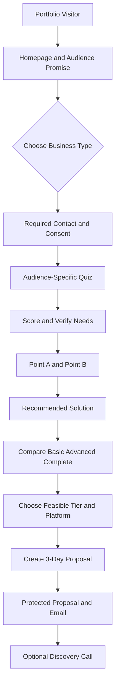
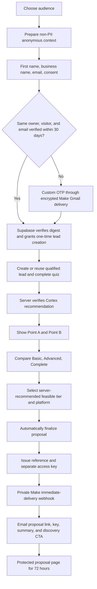
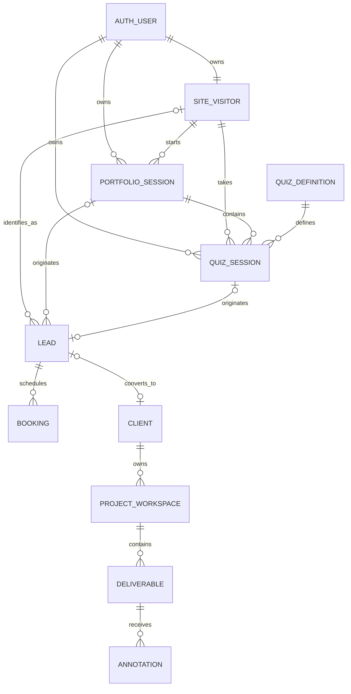

# Elysha Works Portfolio-First Master Blueprint

**Owner:** Elysha Dumpit  
**Brand:** `< elysha works />`  
**Current priority:** Implement and verify the contact-qualified quiz, 72-hour protected proposal, Supabase backend, and Make follow-up workflow while Firebase Hosting remains the frontend host.
**Future modules:** Client Portal, Admin Portal, Visual Annotator, and CRM.

---

## 1. Project Objective

Build a conversion-focused Elysha Works portfolio that helps three specific audiences identify what their business needs, receive a client-specific Point A-to-Point B recommendation with transparent fixed pricing, compare feasible packages, access a protected three-day proposal, and optionally book a strategy call.

The first live release includes the public portfolio, contact-qualified quiz, immediate result, protected proposal shell, project filtering, analytics, lead/booking attribution, and proposal follow-up orchestration. Firebase Hosting remains responsible for the existing deployment, custom domain, and SSL. A dedicated Elysha Works Supabase project provides PostgreSQL, Anonymous Auth, Row Level Security (RLS), database functions, Edge Functions, and storage when required. Its relational model uses stable identifiers and reserved connection points so future modules can be attached without rebuilding the portfolio.

Existing Firebase projects, Firestore databases, applications, `firebase.json`, and hosting targets are outside this change and remain untouched. Client custom applications must use their own separate Supabase projects, credentials, storage, and data; they must never share the Elysha Works internal Supabase database.

### Primary audiences

1. **Coaches & Educators** — coaches, tutors, course creators, trainers.
2. **Service-Based Businesses** — consultants, clinics, salons, agencies, and professional service providers.
3. **Custom-Order Businesses** — cake shops, custom-product sellers, and businesses that receive orders through messages.

### Core positioning

> I help coaches, educators, service-based businesses, and custom-order brands turn inquiries into booked clients, enrolled students, and organized customers through websites, funnels, automation, and custom systems.

### Primary conversion goal

Convert relevant visitors into qualified leads and strategy-call bookings by turning an owned quiz session into a time-limited, personalized proposal with transparent package comparisons.

### Important experience rule

The approved quiz is a **verified-email contact-qualified assessment**. After choosing an audience and before Question 1, the visitor supplies a first name, last name, business name, email address, and explicit proposal-email consent. A Supabase Edge Function generates a six-digit custom OTP, stores only its HMAC digest, and asks inactive Make/Gmail delivery infrastructure to send the encrypted code. Supabase verifies the submitted code and remains the only verification authority. A non-PII owned anonymous quiz context may be prepared in the background, but the visitor must verify the email before any qualified lead is created. Unverified contact PII stays only in React component memory and never enters local storage, URLs, analytics, or logs. The contact step explains that Elysha Works will email the proposal and up to three proposal-related follow-ups unless booking or a stop request ends the sequence.

The authoritative journey is:

```text
Audience → Anonymous owned context → Contact + inline custom OTP → Verified qualified lead → Quiz → Point A → Point B → Recommended solution
→ Basic vs Advanced vs Complete → 72-hour proposal → Discovery call
```

The protected proposal is available for exactly 72 hours from successful initial email delivery. This is a proposal-access and same-browser recovery limit, not a promise to delete business, consent, booking, or CRM records after three days.

The pre-assessment contact screen uses the heading **“Where should we send your proposal?”** and explains that the personalized proposal is securely available for 72 hours. It asks the visitor to book a discovery call inside that window so Elysha and the client can discuss the roadmap, answer questions, and agree on the best next step before access expires.

---

## 2. Portfolio System Map



### Portfolio page order


1. Hero
2. Projects
3. Founder / About Elysha
4. Testimonial
5. FAQ
6. Final CTA
7. Footer

### Quiz page

1. Choose audience type card.
2. Submit first name, last name, business name, email address, and required proposal/follow-up consent.
3. Verify the email inline with the custom six-digit OTP before the qualified lead is created.
4. Complete the multi-step quiz without navigation or page reload.
5. Review the personalized Point A, Point B, recommended solution, and Basic/Advanced/Complete comparison.
6. Receive the server-verified roadmap while the recommended feasible tier/platform is automatically finalized and emailed.
7. Confirm the success message, or retry email delivery without losing the visible roadmap.
8. Open the protected proposal from the emailed reference link by entering the separate access key.
9. Optionally compare the three packages, review platform feasibility, and book a discovery call.
10. Use the footer links for Back to portfolio, Privacy, and Terms.

---

## 3. Vision — View and Interface

### 3.1 Navbar

- Do not place a navbar over the hero. The existing hero remains the complete first-screen composition.
- When the Projects section reaches the top of the viewport, reveal a compact sticky navbar and keep it visible through the rest of the homepage.
- Place the Elysha Works logo on the left.
- Place the links **Projects**, **About**, and **FAQ** on the right with a gold **Get My Roadmap** CTA that opens `/quiz`.
- Use a dark, slightly translucent surface and a restrained gold-tinted divider so the navbar remains legible without competing with the page.
- Indicate the active homepage section while scrolling.
- Hide the sticky navbar again when the visitor scrolls back into the hero.
- On mobile, show the logo, the roadmap CTA, and an accessible menu button.
- The quiz page uses a simpler always-visible header with the logo and a safe **Back to portfolio** action.

### 3.2 Hero

The current approved hero is the visual source of truth and must not be redesigned while the remaining homepage sections are rebuilt.

**Eyebrow:** For coaches, educators, service businesses & custom order brands

**Headline:** Before investing in a website, funnel, or automation, discover exactly what your business needs to grow.

**Supporting copy:** In just 2 minutes, you'll receive a personalized roadmap showing the best solution for your goals.

**Trust line:** Strategy-first guidance for growing businesses.

**Benefits:** Personalized recommendations; Clear next steps; No sales pressure; 100% Free.

**Primary CTA:** Get My Personalized Roadmap

**Secondary CTA:** See how the assessment works

Both hero actions open the separate `/quiz` journey without reloading the homepage. The hero continues using the established Inter typography, black atmospheric background, white text, `#FFD369` gold accents, restrained glow, and fluid responsive sizing.

### 3.3 Audience Selector

The audience selector belongs on `/quiz`, not on the homepage. It is the first decision in the separate quiz journey.

Show the three audience cards immediately beneath a compact **Which best describes your business?** heading. Do not place a separate assessment-instructions panel before the cards. Turnstile initializes independently in the background and must not disable or delay audience selection; the contact submission can wait for the security token when required for a new anonymous sign-in.

Show three selectable cards:

| Audience | Short description | Result-focused label |
|---|---|---|
| Coaches & Educators | Sell expertise, enroll students, and deliver a smoother learning journey. | Book and Enroll |
| Service-Based Businesses | Turn inquiries into appointments and reduce repetitive admin work. | Attract and Book |
| Custom-Order Businesses | Simplify custom orders, payments, updates, and customer tracking. | Order and Organize |

Selecting a card:

1. Stores the chosen `audience_key`.
2. Loads the matching question set.
3. Activates the matching project filter.
4. Personalizes result copy and package inclusions.

### 3.4 Quiz Interface

- After audience selection and before Question 1, show four required fields in this order: **first name**, **last name**, **business name**, and **email address**.
- Require a consent checkbox using the approved `proposal_followup_v1` copy before continuing. The copy explains the initial proposal email and up to three proposal-related follow-ups unless the visitor books or stops them.
- Place **Verify Email** beside the email field. Keep the name, business, consent, and email controls mounted while the six-digit code panel expands below; do not navigate to a separate verification page.
- Generate the six-digit OTP in `request-email-otp`, store only its HMAC digest in the private Supabase schema, and deliver its authenticated AES-256-GCM envelope through the inactive Make/Gmail scenario. Use a **10-minute OTP expiry** and a **60-second resend** interval. Never store the plaintext OTP.
- A verified email is required before lead creation. `begin_custom_verified_qualified_quiz` consumes the short-lived challenge grant and derives the canonical email from the private challenge; the browser cannot supply or override it.
- Trim all values, normalize email to lowercase, keep form values after a backend error, and show a retry action.
- Do not store contact fields in local storage, URLs, analytics, or client logs.
- One question per screen.
- Six audience-specific questions followed by two universal platform/support questions.
- Progress indicator, e.g. `Question 2 of 8`.
- Back button without losing answers.
- Auto-save locally after every answer.
- Resume the active session after refresh when possible.
- Detect an unfinished quiz when the visitor returns using the same browser and device.
- Show a resume prompt with **Resume Quiz**, **Start Over**, and **Not Now** actions.
- Display the saved progress in the prompt, such as `Question 3 of 8`.
- Keep unfinished sessions recoverable for 72 hours from the latest accepted activity.
- Clear single-select and multi-select states.

#### Returning Visitor Resume Prompt

Suggested interface copy:

> **Welcome back!**  
> You have an unfinished business system assessment at Question 3 of 8. Would you like to continue where you left off?

- **Resume Quiz** — restores the selected audience, saved answers, and last incomplete step.
- **Start Over** — closes the old attempt and creates a new quiz session.
- **Not Now** — dismisses the prompt without deleting the saved session.

The prompt should appear only when the saved session:

- belongs to the anonymous visitor ID stored in the current browser;
- has a status of `in_progress`;
- has at least one completed answer;
- has activity within the last 72 hours; and
- does not already have a completed result.

Same-device recognition is not guaranteed after browser data is cleared, in private/incognito mode, when cookies or local storage are blocked, or when the visitor changes devices or browsers. Cross-device recovery can later be offered through an optional email resume link, but it is outside the first release.

### 3.5 Result and Protected Proposal Interface

The immediate result and protected proposal use this client-facing 21-section order:

1. Business snapshot and client identity.
2. Point A and Point B in one responsive row.
3. Recommended path.
4. Core business problem.
5. Missing system or operational gap.
6. Recommended customer journey.
7. Recommended platform with reasons and alternatives.
8. Recommended package with capacity-based reasons.
9. Proposed pages or application screens.
10. Proposed automations.
11. Payment options and included setup count.
12. Domain and professional-email responsibility.
13. USD source investment plus indicative local equivalent when available.
14. Included package scope.
15. Optional enhancements and the relevant Complete advantage.
16. Ongoing third-party costs paid directly by the client.
17. Client requirements and assets.
18. Responsibilities and ownership table.
19. Elysha Works project payment schedule: 50% deposit and 50% before launch/handover.
20. Clear path from Point A to Point B.
21. Audience-matched related work, followed by the discovery-call CTA and proposal disclaimer.

Pricing note:

> Your result is a planning recommendation based on your answers. Final scope is confirmed during the strategy call before any proposal or payment.

The visitor first receives a server-verified draft. Changing a feasible tier/platform updates the selected estimate and comparison without rewriting the original Cortex recommendation. Unsupported Systeme.io or HighLevel choices are disabled with a specific explanation when inventory, production stages, specialized permissions, or non-standard operational workflows require a Custom App.

After calculation, trusted finalization runs automatically with the server-recommended feasible tier/platform. It recalculates the answers and catalog prices, records the recommendation and selected option separately, issues a proposal reference plus a separate 10-character access key, and requests the initial email through Make. The result page remains visible during delivery. A success dialog confirms that the protected proposal and access details were emailed and that access lasts 72 hours; a delivery failure opens a retry dialog without discarding the roadmap. There is no separate **Create My 3-Day Proposal** action and no PDF attachment. The raw access key is never placed in the URL, database, analytics, browser storage, or source control.

The static Firebase-hosted route is `/proposal/?ref=<uuid>`. It reveals no client or proposal data until the correct access key is verified through a Supabase Edge Function. Unknown, incorrect, expired, revoked, and temporarily locked proposals return the same generic unavailable response. Five consecutive failures lock verification for 15 minutes; successful access may be cached in `sessionStorage` for the current tab only and never beyond expiry.

### 3.6 Projects

Projects are tagged by one or more audiences. Before the quiz, the section may show all selected projects. After audience selection, it defaults to the matching audience.

Each project card contains:

- Project name and client/business type.
- Audience tag.
- Problem.
- Solution built.
- Platforms or tools used.
- Outcome or intended business improvement.
- Case-study link or preview.

Do not invent performance metrics. Use honest project context, including beta or concept status where applicable.

### 3.7 Founder Section

**Heading:** Strategy first. Then the right system.  
**Suggested copy:**

> I’m Elysha Dumpit, the founder of Elysha Works. I design websites, funnels, automations, and custom systems around the way a business actually attracts, serves, and supports its customers. My goal is not to add more tools. It is to create a clearer journey—from first inquiry to an organized client experience.

Include a restrained **Book a strategy call** link to the existing `/booking/` flow.

### 3.8 Testimonial

- Design one complete testimonial-style section for the first release.
- Until an authentic quote is approved, show clearly labeled placeholder copy such as **Client testimonial will be added after review and approval.**
- Do not invent a client name, business, quotation, outcome, or performance claim.
- Replace the placeholder with one strong real testimonial when permission and final wording are available.
- Provide context about what was delivered when the real testimonial is added.
- Do not use a large empty carousel while proof is still growing.

### 3.9 FAQ

1. What does Elysha Works build?
2. Which businesses do you work with?
3. How does the system qualifier work?
4. Is the recommendation free?
5. Are the displayed prices final?
6. Can you work with WordPress, Shopify, Systeme.io, or GoHighLevel?
7. Do you also build custom portals and business systems?
8. What happens after I book a strategy call?

### 3.10 Footer

- `< elysha works />`
- Positioning line.
- Navigation.
- Facebook, Instagram, and LinkedIn.
- Privacy notice and terms.
- Final CTA: **Find Your Best-Fit System**.

---

## 4. Audience-Specific Quiz Flow

### 4.0 Canonical Business Systems Assessment V2 — approved September 23, 2026

This section is the implementation source for the live quiz and supersedes the historical eight-question copy retained below for migration context. The runtime source of truth is `supabase/functions/_shared/quiz-engine/questions.ts`; all three audiences use **11 questions** in the same decision architecture:

| Question | Decision purpose | Package effect |
|---|---|---|
| Q1 Business model | Identifies how the business currently sells or delivers | Technical scope |
| Q2 Desired outcome / Point B | Defines the outcome the client wants | Technical scope |
| Q3 Current journey / Point A | Maps the current customer path | Technical scope |
| Q4 Primary bottlenecks | Select up to two breakdowns | Technical scope |
| Q5 Demand health | Diagnoses whether awareness or conversion is the immediate issue | Copy only; never lowers or inflates package |
| Q6 Customer requirements | Defines what customers must be able to do | Technical scope |
| Q7 Post-conversion requirements | Defines what happens after booking, enrollment, or order | Technical scope |
| Q8 Operational scope | Identifies breadth, roles, integrations, and hard requirements | Technical scope and platform guardrails |
| Q9 Timeline | Records readiness | Lead readiness only; no price inflation |
| Q10 Platform preference | Records Systeme.io, HighLevel, Custom App, other, or unsure | Soft preference only |
| Q11 Audience add-ons | Captures optional implementation help | Included, priced from catalog, or scope review |

#### Coaches and educators

- **Q1 models:** one-to-one coaching/consulting, group or cohort, online course, membership/community, workshop/live training, or a combination.
- **Q2 Point B:** qualified calls, student enrollment, offer sales, better delivery, retention, or a scalable education system.
- **Q3 Point A:** social/DM, unclear website, weak funnel, manual booking/checkout, disconnected platforms, or an existing structured system that needs improvement.
- **Q4 bottlenecks (maximum two):** lead volume, conversion, follow-up, payment/enrollment friction, onboarding, access, retention, or disconnected tools.
- **Q6 customer requirements:** learn, apply, book, pay/enroll, choose a payment plan, receive follow-up, onboard, access course/resources/community, or use a portal.
- **Q7 after conversion:** confirmation, payment-plan setup, welcome, intake, scheduling, course/resources/community access, progress, assignments, certificates, or renewal.
- **Q8 scope:** multiple offers, access levels, subscriptions, cohorts, instructors, progress, community, assessments, behavior-based follow-up, migration, or integrations.
- **Q11 add-ons:** copy, application, webinar funnel, advanced booking, payment plan, course/migration, membership, cohort, onboarding/reactivation, assessments, resources, Zoom/calendar, data migration, or none.

#### Service-based businesses

- **Q1 models:** appointment, consultation, project, retainer, field service, or multiple services/staff/locations.
- **Q2 Point B:** inquiries, bookings, fewer no-shows, organized delivery, repeat business/reactivation, or a scalable client system.
- **Q3 Point A:** social/phone/DM, website plus manual communication, booking plus manual follow-up, form plus manual steps, disconnected tools, or an existing structured system.
- **Q4 bottlenecks (maximum two):** offer clarity, booking conversion, qualification, admin, payment, scattered client data, status visibility, or retention.
- **Q6 customer requirements:** learn, inquire, qualify, book, pay, receive reminders, complete intake, track next steps, access resources, or use a portal.
- **Q7 after conversion:** intake, payment, estimate/proposal, contract, reminders, documents, staff assignment, status, follow-up, review request, rebooking, recurring reminders, or portal access.
- **Q8 scope:** multiple services, team members, locations, lead assignment, appointment types, resources, documents/contracts, payments, pipelines, access levels, recurring clients, integrations, or compliance.
- **Q11 add-ons:** copy, booking, staff/resource scheduling, estimate, contract, payment, intake, reminders, rebooking, reviews, reactivation, migration, portal, reporting, or none.

#### Custom-order businesses

- **Q1 models:** personalized, made-to-order, quote-based, event packages, wholesale/B2B, or several order types.
- **Q2 Point B:** inquiries, easier customization, fewer errors, organized quote-to-delivery operations, more completed orders, or scalable order management.
- **Q3 Point A:** manual messages, form plus messages, online order plus manual customization, store plus split operations, disconnected tools, or an existing structured system.
- **Q4 bottlenecks (maximum two):** option confusion, incomplete requirements, slow quotes, payment confirmation, scattered details, approvals, production visibility, customer updates, or inventory.
- **Q6 customer requirements:** browse, customize, upload, request quote/order, pay deposit/full amount, approve, receive updates, track, or reorder.
- **Q7 after conversion:** details/uploads, quote, deposit, proof, approval, revisions, production, inventory, balance, pickup/delivery, updates, tracking, or reorder history.
- **Q8 scope:** options/add-ons, dynamic pricing, deposits/balances, proofs, revisions, production stages, inventory, employees, permissions, delivery calculations, branches, wholesale, reports, integrations, or portal.
- **Q11 add-ons:** copy/images/catalog, product options, conditional pricing, quote, payments, uploads, approvals/revisions, production board, portal, delivery, delivery-fee calculation, history, inventory, roles, integrations, migration, or none.

#### Universal Q5, Q9, and Q10 choices

- **Demand health:** steady demand with drop-off, inconsistent inquiries, referral/social-led, traffic with low action, or early awareness.
- **Timeline:** ready now, within 30 days, within one to two months, or researching.
- **Platform preference:** recommend the best option, Systeme.io, HighLevel, Custom App, another existing platform, or unsure.

The Cortex uses Q1–Q4 and Q6–Q8 for technical scope. Q5 and Q9 are diagnostic only. Q10 is a soft preference. Q11 is resolved against package inclusions before any add-on price is applied. Inventory, dynamic pricing/delivery calculations, specialized permissions, or a connected proof/revision/approval/production workflow force the Custom App route and disable unsupported platform variants with an explanation.

The assessment begins with verified identity, then a searchable business-country selector. USD is the source currency. A server-side quote may display an indicative local equivalent with currency and timestamp metadata; if the quote is unavailable, the interface safely displays USD without blocking the assessment.

#### Historical V1 question copy — superseded

The remaining Q1–Q8 text in this section documents the previous release only. It is not the implementation source for new sessions and must not be used to calculate V2 proposals.

Historical V1 measured the following six dimensions:

1. Primary goal.
2. Current setup.
3. Main bottleneck.
4. Required workflow or capabilities.
5. Operational complexity.
6. Timeline/readiness.

### 4.1 Coaches & Educators

**Q1. What result matters most right now?**

- Book more discovery or coaching calls.
- Enroll more students in a course or program.
- Sell a workshop, membership, or digital offer.
- Give learners an organized place to access materials.

**Q2. How do people currently discover and join your offer?**

- Mostly through social media and direct messages.
- Through a website, but the path is unclear.
- Through a landing page or funnel that needs improvement.
- I have multiple tools, but they are disconnected.

**Q3. Where does the journey usually get stuck?**

- Not enough qualified inquiries.
- People ask questions but do not book or enroll.
- Follow-up is inconsistent or manual.
- Onboarding and content access are disorganized.

**Q4. What should the new system handle?** *(multi-select)*

- Offer or program page.
- Lead capture.
- Discovery-call booking.
- Enrollment and payment.
- Email follow-up.
- Student onboarding or portal.
- Progress or resource access.

**Q5. How complex is your offer setup?**

- One offer and one clear action.
- Multiple offers or audience segments.
- A program with enrollment, onboarding, and content access.
- A custom learning or client experience with integrations.

**Q6. When do you want to begin?**

- Ready now.
- Within 30 days.
- Within 1–2 months.
- Researching for later.

### 4.2 Service-Based Businesses

**Q1. What result matters most right now?**

- Receive more qualified inquiries.
- Book more appointments or consultations.
- Reduce no-shows and repetitive follow-up.
- Organize client intake and service delivery.

**Q2. How do clients currently contact or book you?**

- Social media, calls, or direct messages.
- A basic website and manual follow-up.
- A booking tool that is not connected to the rest of the workflow.
- Several tools and spreadsheets that do not work together.

**Q3. Where does the process usually break down?**

- Visitors do not understand the offer.
- Inquiries do not consistently become bookings.
- Intake, reminders, and follow-up take too much time.
- Client information and project status are difficult to track.

**Q4. What should the new system handle?** *(multi-select)*

- Professional service website.
- Lead qualification form.
- Appointment booking.
- Automated reminders and follow-up.
- Client intake and onboarding.
- CRM pipeline.
- Client portal or dashboard.

**Q5. How complex is your service workflow?**

- One service and a simple booking flow.
- Several services, locations, or team members.
- Multi-step intake, approval, or onboarding.
- Custom operations, permissions, or integrations.

**Q6. When do you want to begin?**

- Ready now.
- Within 30 days.
- Within 1–2 months.
- Researching for later.

### 4.3 Custom-Order Businesses

**Q1. What result matters most right now?**

- Receive more custom orders.
- Make ordering easier for customers.
- Reduce repetitive questions and order mistakes.
- Organize orders, payments, and customer updates.

**Q2. How do customers currently place orders?**

- Mostly through social media or messaging.
- Through a form, but confirmation is manual.
- Through an online store that does not support the full custom-order process.
- Through several disconnected tools or spreadsheets.

**Q3. Where does the process usually get stuck?**

- Customers do not know what options to choose.
- Quotes, deposits, and payment confirmation take too long.
- Order details are incomplete or scattered across messages.
- Production status, delivery, and customer updates are difficult to track.

**Q4. What should the new system handle?** *(multi-select)*

- Product or service catalog.
- Customization options.
- Quote or order request.
- Checkout, deposit, or payment instructions.
- Automated confirmation and updates.
- Order-management dashboard.
- Customer history or CRM.
- Inventory or production tracking.

**Q5. How complex is your order workflow?**

- A few products and simple options.
- Many options, add-ons, or pricing combinations.
- Deposits, approvals, production stages, and delivery coordination.
- Custom operations, staff roles, inventory, or integrations.

**Q6. When do you want to begin?**

- Ready now.
- Within 30 days.
- Within 1–2 months.
- Researching for later.

### 4.4 Universal Platform and Support Questions

These questions appear after the six audience-specific questions.

**Q7. Do you already have a preferred platform?**

- Systeme.io.
- GoHighLevel.
- I want a custom-built app.
- I am not sure—recommend the best fit for me.

Platform preference is considered, but it does not override technical fit. If the requested workflow cannot be supported properly by the chosen platform, the result explains why another route is recommended.

**Q8. What additional support do you need for this project?** *(multi-select)*

- Conversion copywriting.
- Image sourcing and selection.
- Image editing and optimization.
- Brand styling or mini visual direction.
- Additional pages or funnel steps.
- Appointment booking setup.
- Checkout or payment integration.
- Email or SMS follow-up automation.
- CRM or pipeline setup.
- Client/student onboarding.
- Client/student portal.
- Order-management workflow.
- Dashboard or reporting.
- Inventory or production tracking.
- Third-party integration.
- Data/content migration.
- I will provide final copy, images, and brand assets.

---

## 5. Offer Model and Dynamic Pricing

### 5.0 Approved Three-Tier Presentation and 72-Hour Proposal Delivery

**Status:** Owner-approved for implementation on September 22, 2026. These rules replace the public seven-card presentation while preserving the seven existing stable catalog keys underneath. Implementation approval does not bypass the target-specific Supabase migration approval, security testing, secret handling, inactive Make verification, or Firebase deployment checks.

#### Recommended approach

Keep the seven approved `package_catalog.offer_key` records and their existing prices. Group them into three public comparison tiers instead of renaming or deleting catalog records. This avoids a destructive database migration, preserves historical result snapshots, and provides the simpler Basic/Advanced/Complete choice requested for the quiz result.

| Public tier | Systeme.io | HighLevel | Custom App | Public promise |
|---|---|---|---|---|
| **Basic** | `platform_launch` — **$1,500** | `platform_launch` — **$1,500** | `custom_starter` — **$3,000** | A complete working version of the visitor's primary journey or core workflow |
| **Advanced** | `platform_growth` — **$2,500** | `platform_growth` — **$2,500** | `custom_foundation` — **$5,000** | A more connected journey with qualification, automation, and operational visibility |
| **Complete** | `platform_scale` — **$4,000** | `platform_scale` — **$4,000** | `custom_growth` — **$7,500** | The broadest standard implementation with advanced automation, roles, portals, or dashboards where supported |

Systeme.io and HighLevel retain the same one-time build price when the tier and implementation effort are equivalent. Their different subscription costs are paid directly by the client and are disclosed separately after platform selection, not used to distort the Elysha Works build price. Custom App pricing is higher because it includes a custom interface, isolated Supabase backend, authentication, permissions, and business logic.

`custom_complete` remains a stable catalog record at **$10,000+**, but it is not displayed as a fourth public tier. It appears as **Complete — Custom Scope Review** when inventory, production tracking, advanced permissions, multiple operational departments, complex approvals, or specialized business rules exceed the standard `custom_growth` boundary.

#### Tier inclusion boundaries

Every tier must deliver a functional core outcome. Higher tiers add breadth, automation, capacity, and operational depth; they must not manufacture a broken Basic option merely to force an upgrade.

| Stable offer | Pages/screens | Automations | Payment setups |
|---|---:|---:|---:|
| `platform_launch` | 5 | 3 | 1 |
| `platform_growth` | 8 | 7 | 2 |
| `platform_scale` | 12 | 12 | 3 |
| `custom_starter` | 6 | 3 | 1 |
| `custom_foundation` | 10 | 7 | 2 |
| `custom_growth` | 15 | 12 | 3 |
| `custom_complete` | Confirmed during discovery | Confirmed during discovery | Confirmed during discovery |

| Tier and route | Approved inclusion summary |
|---|---|
| **Basic — Systeme.io or HighLevel** | One offer/audience/action; compact conversion website or landing journey; responsive setup; one lead/application/inquiry form; confirmation page; one basic booking or checkout connection where relevant; confirmation plus up to three follow-up emails; basic tags/segmentation and analytics; one revision round; launch testing and handover |
| **Basic — Custom App** | One focused module; responsive custom interface; isolated Supabase setup; authentication for one primary user type; one core create/view/edit/status workflow; simple admin view; search/filtering; one basic notification; one revision round; testing, deployment, handover, and 30-day technical support |
| **Advanced — Systeme.io or HighLevel** | Everything applicable in Basic; multi-step journey of up to five primary pages/steps; lead qualification; booking/checkout/enrollment/deposit connection; core CRM pipeline; up to seven automated emails/messages; basic onboarding; segmentation; up to two standard integrations; two revision rounds; testing and recorded handover/training |
| **Advanced — Custom App** | Everything applicable in Basic; detailed workflow/data planning; one primary user type plus admin; up to two connected core workflows; operational admin dashboard; file/image upload; expanded record management; up to two standard integrations; activity history and email notifications; two revision rounds; testing, handover, and 30-day technical support |
| **Complete — Systeme.io or HighLevel** | Everything applicable in Advanced; up to two offers/audience paths; advanced pipeline and conditional platform-native workflows; up to twelve nurture messages; platform-native onboarding/member area where available; up to four standard integrations; basic reporting; supported team access; two revision rounds; end-to-end QA, training, and 30-day support |
| **Complete — Custom App** | Everything applicable in Advanced; up to three permission-based user roles; one portal; multiple connected workflows; advanced admin dashboard; file/document management; operational reporting; up to three standard integrations; automated workflow triggers; audit-friendly activity history; two revision rounds; training and 60-day technical support |
| **Complete — Custom Scope Review** | `custom_complete` at $10,000+ for advanced roles, multiple portals/departments, inventory, production/order/delivery operations, complex approvals/calculations, expanded integrations, advanced reporting, migration planning, extended QA, phased rollout, three revision rounds, and 90-day support |

#### Result-page selection rules

1. The Cortex still determines the primary solution, technically recommended platform, recommended tier, answer-based explanation, and relevant add-ons.
2. The result page shows all three public tiers together so the visitor can compare the advantage of Advanced and Complete against a working Basic option.
3. Each tier exposes only feasible platform choices. A visitor may choose another feasible platform, but preference never overrides a technical incompatibility.
4. Requirements such as inventory, production stages, specialized permissions, or non-standard operational workflows disable Systeme.io and HighLevel and explain why Custom App is required.
5. Selecting a platform recalculates the tier's base offer key, base price, included capabilities, priced add-ons, and scope-review items from the catalog and Cortex rules.
6. Only add-ons supported by the visitor's audience and answers are shown. Included capabilities are labeled **Included**, not displayed as zero-dollar add-ons, and never charged twice.
7. The final on-page and protected proposal snapshots record both the recommendation and the visitor's choice, including audience, tier, platform, stable offer key, inclusions, add-ons, estimate, explanation, and Cortex/catalog versions.

#### Approved no-reload journey



#### Make scenarios and Gmail delivery

The browser never calls Make directly. Supabase Edge Functions send signed minimum-data requests to Make and retain authority over ownership, proposal state, expiry, booking suppression, follow-up eligibility, and cold-lead transitions.

**Scenario OTP — Transactional email verification:** when Supabase cannot safely reuse a verification for the same anonymous owner and owned visitor, the custom webhook receives only the signed AES-256-GCM envelope from `request-email-otp`, rejects stale/tampered/duplicate deliveries, reserves the delivery UUID, decrypts through Make's advanced encrypted keychain, and sends the 10-minute code through the authorized Gmail OAuth connection. A successful owner-scoped reuse never calls Make. Its Data Store contains only delivery ID, creation time, and status. The complete contract and dual-secret rotation procedure live in `docs/make-email-otp-scenario.md`.

**Scenario A — Immediate proposal delivery:** a private custom webhook receives an idempotent request from `finalize-proposal`, validates the shared secret and payload, sends the client first name/business name, Point A → Point B summary, proposal reference URL, separate access key, exact expiration, signed stop link, and discovery-call CTA through an authorized Gmail connection. The Make Data Store may track only processing/sent/failed idempotency state; it must never store the raw access key. A confirmed send is acknowledged to Supabase before the 72-hour clock begins.

**Scenario B — Scheduled follow-up:** every 15 minutes, Make calls the authenticated `make-proposal-followups` Edge Function to claim due work, revalidates immediately before Gmail send, and acknowledges the outcome with the claim UUID. Make never receives the Supabase `service_role` key.

| Offset from successful initial email | Action |
|---|---|
| +24 hours | Follow-up 1: restate Point A → Point B and invite proposal review |
| +48 hours | Follow-up 2: explain the recommended tier/platform and value of the next tier |
| +72 hours | Follow-up 3: final reminder and exact proposal-expiration notice |
| +96 hours | No email; mark the lead cold if no booking activity or stop request exists |

Any booking record for the lead stops the automated sequence. `scheduled` and `completed` are successful stops; `cancelled` and `no_show` also stop automation and require manual follow-up. A booking click without a booking record does not stop the sequence. The final +72 message is an expiration notice and must not promise continuing access because the 15-minute schedule window may deliver it shortly after exact expiry.

Every automated message includes the signed stop link. A valid stop request clears future due work but does not delete the lead or required business/legal history. No PDF is generated or attached.

Gmail authentication stays in the Make OAuth connection. Make webhook URLs/secrets, Gmail tokens, proposal hash pepper, stop-signing secret, and Supabase server credentials belong only in provider secret stores or ignored server-side development files. No `NEXT_PUBLIC_` variable may contain them.

#### Approved decisions

The owner approved the following direction for implementation planning:

- The three public tier names: Basic, Advanced, and Complete.
- The seven-key grouping and existing prices shown in the matrix.
- Systeme.io and HighLevel using the same build price for equivalent scope.
- `custom_complete` appearing as a $10,000+ escalation inside Complete rather than as a fourth card.
- The platform-specific inclusion summaries and feasibility guardrails.
- Initial and scheduled proposal emails through two Make scenarios and a connected Gmail account, with no PDF.
- The +24/+48/+72 follow-up sequence, booking/stop suppression, and +96 cold transition.

The qualifier uses two build routes. Systeme.io and GoHighLevel share the same project pricing when the requested setup and implementation effort are equivalent. Their recurring subscriptions are paid separately by the client. Custom App pricing is higher because it includes custom interface, database, authentication, and business logic.

### 5.1 Route A — Platform-Based Systems

The Cortex selects either Systeme.io or GoHighLevel according to platform fit. Price is based on scope, not on the platform brand.

#### Launch System — Base Price $1,500

Best for one offer, one audience, and one primary conversion action.

Included:

- Strategy and conversion-path planning for one offer.
- One landing page or compact conversion website of up to five core sections.
- Responsive desktop, tablet, and mobile setup.
- One lead form, application form, or inquiry form.
- One thank-you or confirmation page.
- One basic booking or checkout connection.
- One confirmation email and one basic follow-up sequence of up to three emails.
- Basic tags, contact fields, and simple segmentation.
- Basic analytics and conversion-event setup.
- Domain connection guidance.
- One revision round.
- Launch testing and handover.

#### Growth System — Base Price $2,500

Best for a connected lead-to-booking, enrollment, or order journey.

Included:

- Everything in Launch System where applicable.
- Multi-step funnel or conversion website of up to five primary pages/steps.
- Lead qualification or application flow.
- Booking, checkout, enrollment, or deposit connection.
- CRM pipeline with core stages.
- Automated confirmation, reminders, and follow-up sequence of up to seven emails/messages.
- Basic onboarding workflow.
- Audience or offer segmentation.
- Up to two standard third-party integrations.
- Funnel and pipeline testing.
- Two revision rounds.
- Recorded handover or training session.

#### Scale System — Base Price $4,000

Best for multiple offers, connected pipelines, and advanced platform-native automation.

Included:

- Everything in Growth System where applicable.
- Up to two offers, funnels, or audience paths.
- Advanced pipeline stages and opportunity automation.
- Conditional workflows using the selected platform's native capabilities.
- Extended email/SMS nurture of up to twelve messages.
- Client/student onboarding area using platform-native features where available.
- Up to four standard integrations.
- Basic reporting dashboard using available platform data.
- Team access and permissions supported by the client's subscription.
- End-to-end quality assurance.
- Two revision rounds.
- Training and 30-day post-launch technical support.

Platform boundary: features must remain within supported Systeme.io or GoHighLevel functionality. Requirements such as unique operational dashboards, advanced inventory, highly custom permissions, or specialized business logic trigger the Custom App route.

### 5.2 Route B — Custom Apps

Client Custom Apps use **Next.js, React, TypeScript, Tailwind CSS, and Supabase**. Each client application receives its own isolated Supabase project for its database, authentication, file storage, and backend services. The Elysha Works portfolio uses a separate internal Supabase project for its qualifier, CRM-connected analytics, pricing catalog, and future modules; client data and Elysha Works internal data must never be mixed. Firebase remains responsible only for hosting the existing portfolio frontend, custom domain, SSL, and deployment.

#### Custom Starter — Base Price $3,000

Best for a focused minimum viable product with one clear internal or customer-facing workflow.

Included:

- Discovery session and simplified workflow map.
- Custom responsive interface for one focused module.
- Supabase project, database, and basic security setup.
- Authentication for one primary user type.
- One core create, view, edit, and status workflow.
- Simple admin management view.
- Basic form validation and record search/filtering.
- One basic notification or confirmation workflow.
- Deployment and environment configuration.
- One revision round.
- Testing, handover, and 30-day technical support.

Boundary: Custom Starter does not include multiple portals, advanced role permissions, inventory, complex reporting, or several integrations.

#### Custom Foundation — Base Price $5,000

Best for a production-ready custom app with a connected admin and user experience.

Included:

- Everything in Custom Starter where applicable.
- Detailed workflow and data-model planning.
- Supabase database, authentication, storage, and access policies.
- Secure authentication for one primary user type plus admin.
- Up to two connected core workflows.
- Custom admin dashboard with operational status tracking.
- File or image upload capability.
- Expanded search, filtering, and record-management functions.
- Up to two standard third-party integrations.
- Basic analytics and activity history.
- Email notifications or workflow confirmations.
- Two revision rounds.
- Testing, handover, and 30-day technical support.

#### Custom Growth — Base Price $7,500

Best for several connected workflows, portals, roles, and dashboards.

Included:

- Everything in Custom Foundation where applicable.
- Up to three user roles with permission-based views.
- Client, student, customer, employee, or partner portal.
- Multiple connected business workflows.
- Advanced admin dashboard and status tracking.
- File upload or document-management capability.
- Search, filtering, and operational reporting.
- Up to three standard third-party integrations.
- Automated notifications and workflow triggers.
- Audit-friendly activity history for important actions.
- Supabase row-level security policies for each supported role.
- Two revision rounds.
- Training and 60-day technical support.

#### Complete Custom System — Base Price $10,000+

Best for complex operations, multiple departments, inventory, delivery, or specialized business rules.

Included:

- Everything in Custom Growth where applicable.
- Advanced roles and permission structure.
- Multiple portals or department-specific workspaces.
- Inventory, production, order, delivery, or resource-management modules as scoped.
- Custom approvals and multi-stage workflows.
- Advanced reporting and management dashboards.
- Complex calculations or business rules.
- Expanded integration requirements.
- Data migration plan where required.
- Advanced Supabase data relationships, storage policies, and server-side functions as required.
- Security review and extended quality assurance.
- Phased rollout plan.
- Three revision rounds.
- Training and 90-day technical support.

The final Complete Custom System price is confirmed after a strategy and technical scope review.

### 5.3 Add-On Catalog

Quiz selections add only the items that are not already included in the recommended base offer. The Cortex must prevent double charging.

| Add-on | Starting price | Pricing unit |
|---|---:|---|
| Conversion copywriting | $500 | Up to five core pages/steps |
| Additional copywriting | $150 | Per additional page/step |
| Image sourcing and selection | $200 | Per project set |
| Image editing and optimization | $300 | Up to 20 images |
| Mini brand direction | $400 | Colors, type, and basic visual guide |
| Additional landing/page step | $250 | Per standard page/step |
| Advanced booking setup | $350 | Per booking workflow |
| Checkout/payment integration | $400 | Per standard gateway/flow |
| Additional email automation | $300 | Per sequence of up to five emails |
| SMS automation setup | $350 | Per workflow; usage billed separately |
| Additional CRM pipeline | $500 | Per pipeline |
| Advanced onboarding workflow | $500 | Per workflow |
| Platform-native membership/course area | $750 | Per area/program |
| Basic custom portal module | $1,500 | Per module; Custom App route |
| Custom dashboard/reporting module | $1,500 | Per module; Custom App route |
| Custom order-management module | $2,000 | Per module; Custom App route |
| Inventory/production module | $2,500 | Starting price; Custom App route |
| Standard third-party integration | $350 | Per integration |
| Complex/custom API integration | $750+ | Per integration after review |
| Content or data migration | $500+ | Based on volume and cleanup |
| Additional revision round | $300 | Per round |

### 5.4 Costs Paid Separately by the Client

- Systeme.io or GoHighLevel subscription.
- Domain registration and renewal.
- Email/SMS sending usage.
- Payment-gateway transaction charges.
- Premium plugins, APIs, or third-party subscriptions.
- Supabase, deployment, storage, email, or usage costs beyond included free tiers.

### 5.5 Transparent Estimate

```text
estimated_project_investment =
recommended_base_offer
+ non_included_selected_addons
+ complexity_or_custom_integration_adjustments
+ urgency_adjustment_if_applicable
```

The result shows each part separately: build route, platform, base offer, included features, add-ons, adjustments, one-time estimated project investment, and separate recurring costs.

All prices and inclusions are stored in the Supabase `package_catalog` and `addon_catalog` tables and must not be hard-coded across multiple interface components. Public reads expose only active catalog records; pricing changes require authorized admin access.

---

## 6. Cortex — Recommendation Logic

### 6.1 Core principle

The Cortex first determines what system is needed, then recommends the best build route and platform, selects the correct base offer, adds only non-included requested capabilities, and produces a transparent planning estimate.

### 6.2 Scoring dimensions

Each answer contributes points to three diagnostic dimensions:

- `acquisition_need` — visibility, lead generation, booking, or enrollment.
- `automation_need` — follow-up, reminders, confirmations, or repetitive work.
- `system_complexity` — portals, dashboards, roles, operations, integrations.

Each answer also contributes to five solution scores:

- `website_score` — professional presence, credibility, content, navigation, and general discovery.
- `funnel_score` — lead generation, applications, booking, enrollment, checkout, and conversion paths.
- `automation_score` — confirmations, reminders, nurture, follow-up, and repetitive workflow reduction.
- `crm_score` — contact records, pipelines, follow-up status, customer tracking, and sales operations.
- `custom_app_score` — portals, dashboards, multiple roles, inventory, custom orders, approvals, and unique business rules.

Platform-fit scores are calculated separately:

- `systeme_fit` — simple funnels, email sequences, course delivery, and straightforward sales journeys.
- `ghl_fit` — booking, CRM pipelines, lead nurture, SMS, and service-business follow-up.
- `custom_build_fit` — custom roles, portals, dashboards, inventory, unique operations, and specialized logic requiring a Supabase-based app.

Each answer uses:

- `0` — no match.
- `1` — supporting match; the solution may help but is not central.
- `2` — strong match; the answer clearly supports the solution.
- `3` — direct/critical match; the requirement depends on this solution.

Example: “I need more qualified leads and want them to book a call” can add `+3` to Funnel, `+2` to Automation, `+1` to Website, and `+1` to CRM. “I need staff roles, inventory, approvals, and a production dashboard” adds `+3` to Custom App and `+3` to Custom Build Fit.

### 6.3 Build-route and offer selection

1. Score all answers against Website, Funnel, Automation, CRM, and Custom App.
2. Select the highest qualifying score as the **Primary Recommended Solution**.
3. Preserve other strong scores as **Supporting Components** instead of discarding them.
4. Use acquisition, automation, and complexity scores to explain the diagnosis.
5. Compare `systeme_fit`, `ghl_fit`, and `custom_build_fit` to select the best delivery platform.
6. Consider the visitor's platform preference without allowing it to override technical feasibility.
7. Choose **Platform-Based System** when the solution can be delivered reliably using Systeme.io or GoHighLevel.
8. Choose **Custom App with Supabase** when requirements include custom dashboards, portals, advanced roles, inventory, specialized operations, or business logic that platform-native tools cannot support properly.
9. Select the base offer: Platform Launch, Growth, or Scale; or Custom Starter, Foundation, Growth, or Complete.
10. Compare selected capabilities with the base inclusion list.
11. Add prices only for requested capabilities not already included.
12. Generate the recommendation, explanation, transparent estimate, and separate recurring-cost notice.

### 6.4 Solution recommendation rules

- Highest solution score becomes the primary recommendation when it exceeds the minimum qualification threshold.
- Scores within two points of the highest score become supporting components when they directly support the customer journey.
- A Website result focuses on presence, credibility, navigation, and content.
- A Funnel result focuses on one conversion journey such as lead capture, application, booking, enrollment, or checkout.
- An Automation result must be paired with the workflow it automates; it is not presented as an isolated collection of automations.
- A CRM result focuses on pipeline, lead/customer records, follow-up status, and relationship management.
- A Custom App result requires at least one genuine custom-operational signal such as roles, portal, dashboard, inventory, custom order states, approvals, or specialized business rules.
- When Funnel and Website scores are close, the primary business goal breaks the tie: credibility/information favors Website; conversion/action favors Funnel.
- When CRM and Automation scores are close, pipeline visibility favors CRM; repetitive actions and communication favor Automation.
- When Custom App scores highly, the result must state which requirements cannot be handled cleanly by Systeme.io or GoHighLevel.

### 6.5 Example combined recommendations

```text
Primary Solution: Enrollment Funnel
Supporting Components: Booking + Follow-Up Automation
Recommended Platform: Systeme.io
Recommended Offer: Platform Growth
```

```text
Primary Solution: Lead-to-Client System
Supporting Components: CRM + Booking + Follow-Up Automation
Recommended Platform: GoHighLevel
Recommended Offer: Platform Growth or Scale
```

```text
Primary Solution: Custom Order Management App
Supporting Components: Customer Portal + Payment Tracking + Operations Dashboard
Recommended Platform: Custom App using Supabase
Recommended Offer: Custom Growth
```

### 6.6 Guardrails

- Do not recommend a Custom App merely because it has a higher price; the recommendation must be justified by requirements.
- Do not force a platform build when core requirements exceed platform-native capabilities.
- Systeme.io and GoHighLevel use the same build price when scope and implementation effort are equal.
- Prevent double charging when an add-on is already included in the selected base offer.
- High-complexity answers must not return Launch System, Custom Starter, or Custom Foundation when the workflow requires advanced roles or modules.
- “Researching for later” affects lead readiness, not the package level.
- A result is a planning recommendation, not a binding quotation.

### 6.7 Generated recommendation output

```text
cortex_version
audience_key
recommended_build_route
recommended_platform
recommended_offer_key
primary_solution_type
supporting_solution_types[]
recommended_solution_title
diagnosis_summary
recommendation_reason
included_capabilities[]
selected_addons[]
priced_addons[]
future_phase_suggestions[]
acquisition_need_score
automation_need_score
system_complexity_score
website_score
funnel_score
automation_score
crm_score
custom_app_score
systeme_fit_score
ghl_fit_score
custom_build_fit_score
readiness_level
base_price_usd
addon_total_usd
adjustment_total_usd
estimated_project_investment_usd
estimated_recurring_costs[]
```

### 6.8 Approved local Cortex version and aggregation rules

New sessions use `business-systems-cortex-2026.09-v2`, question set `business-systems-assessment-2026.09-v2`, catalog `business-systems-catalog-2026.09-v2`, and roadmap schema `premium-roadmap-2026.09-v1`. Historical snapshots retain their original version keys and are never silently recalculated. The browser and Edge Function use the same portable engine; the Edge Function remains authoritative for proposal drafts, prices, and issuance.

Each visible answer option has a stable key and one or more signal tags. The interface never derives business logic by parsing display copy. Signal tags add integer vectors to the diagnostic, solution, and platform-fit dimensions defined in Section 6.2.

Rules:

1. Score Q1–Q5 and the system-related selections in Q8.
2. Q6 sets readiness only.
3. Q7 adds `+2` to the selected platform-fit score. It does not add a genuine custom-operation signal and cannot override feasibility.
4. For a single question, sum all selected signal vectors and cap each individual scoring dimension at `3`. Custom and critical flags are preserved even when a numeric dimension is capped.
5. The maximum raw score for any diagnostic or solution dimension is therefore `18`: five audience questions plus Q8, each capped at `3`.
6. A solution must score at least `4` to qualify.
7. The highest qualifying solution is primary. Other qualified solutions within two raw points are supporting components when they support the same customer journey.
8. Store raw integer scores for transparency. The UI may also show normalized percentages, but package and tie-break decisions use the raw scores and explicit rules below.
9. Calculation must be deterministic: identical question-set version, Cortex version, catalog version, and answers produce identical output.
10. Keep an explanation trace of the option keys, signal tags, score contributions, flags, and ordered rules that affected the result.

### 6.9 Signal-weight dictionary

Vector notation:

- Diagnostic: `acquisition / automation / complexity`
- Solution: `website / funnel / automation / crm / custom_app`
- Platform: `systeme / ghl / custom_build`

Only the following reviewed signals may be used by `cortex-local-v0.1`:

| Signal tag | Diagnostic vector | Solution vector | Platform vector | Flag or interpretation |
|---|---|---|---|---|
| `credibility` | `2 / 0 / 0` | `3 / 1 / 0 / 0 / 0` | `1 / 1 / 0` | Presence, clarity, and trust |
| `lead_generation` | `3 / 0 / 0` | `1 / 3 / 0 / 1 / 0` | `2 / 2 / 0` | Inquiry or lead acquisition |
| `booking` | `2 / 1 / 0` | `0 / 3 / 2 / 1 / 0` | `1 / 3 / 0` | Call or appointment conversion |
| `enrollment` | `2 / 1 / 1` | `0 / 3 / 2 / 1 / 0` | `3 / 1 / 0` | Program or student enrollment |
| `checkout` | `2 / 1 / 1` | `0 / 3 / 2 / 0 / 0` | `3 / 1 / 0` | Payment or deposit journey |
| `follow_up` | `1 / 3 / 0` | `0 / 1 / 3 / 2 / 0` | `2 / 3 / 0` | Reminders, nurture, or repeated communication |
| `pipeline` | `0 / 1 / 1` | `0 / 0 / 1 / 3 / 0` | `0 / 3 / 1` | Lead/customer stages and visibility |
| `onboarding` | `0 / 2 / 1` | `0 / 0 / 2 / 1 / 1` | `2 / 2 / 1` | Intake and post-conversion setup |
| `course_delivery` | `0 / 1 / 2` | `1 / 0 / 1 / 0 / 2` | `3 / 0 / 2` | Learner resources or simple membership delivery |
| `disconnected_tools` | `0 / 3 / 2` | `0 / 0 / 3 / 2 / 1` | `1 / 2 / 2` | Tools or spreadsheets do not work together |
| `multiple_offers` | `1 / 1 / 2` | `0 / 2 / 1 / 1 / 0` | `2 / 2 / 1` | Several offers, segments, services, or locations |
| `portal` | `0 / 1 / 3` | `0 / 0 / 1 / 1 / 3` | `1 / 1 / 3` | Genuine custom signal; simple course areas remain eligible for platform delivery |
| `dashboard` | `0 / 1 / 3` | `0 / 0 / 1 / 2 / 3` | `0 / 1 / 3` | Genuine custom signal |
| `custom_orders` | `1 / 2 / 2` | `0 / 2 / 1 / 1 / 3` | `1 / 1 / 3` | Genuine custom signal |
| `approvals` | `0 / 2 / 3` | `0 / 0 / 1 / 2 / 3` | `0 / 1 / 3` | Genuine custom signal |
| `inventory` | `0 / 2 / 3` | `0 / 0 / 1 / 1 / 3` | `0 / 0 / 3` | Critical custom signal |
| `multiple_roles` | `0 / 1 / 3` | `0 / 0 / 1 / 2 / 3` | `0 / 1 / 3` | Critical custom signal when roles require distinct permissions |
| `integration` | `0 / 1 / 2` | `0 / 0 / 1 / 0 / 1` | `1 / 1 / 1` | Does not force custom by itself |
| `order_tracking` | `0 / 2 / 3` | `0 / 0 / 2 / 3 / 3` | `0 / 2 / 3` | Genuine custom signal |
| `migration` | `0 / 0 / 1` | `0 / 0 / 0 / 0 / 0` | `0 / 0 / 0` | Scope-review signal only |
| `simple_scope` | `0 / 0 / 0` | `0 / 0 / 0 / 0 / 0` | `0 / 0 / 0` | Confirms one focused path |
| `no_system_effect` | `0 / 0 / 0` | `0 / 0 / 0 / 0 / 0` | `0 / 0 / 0` | Support or asset choice only |

### 6.10 Complete option-to-signal mapping

#### Coaches and educators

| Question | Stable option key | Signal tags |
|---|---|---|
| Q1 | `coach_goal_book_calls` | `booking`, `lead_generation` |
| Q1 | `coach_goal_enroll_students` | `enrollment`, `lead_generation` |
| Q1 | `coach_goal_sell_digital_offer` | `enrollment`, `checkout` |
| Q1 | `coach_goal_organized_material_access` | `course_delivery`, `onboarding` |
| Q2 | `coach_setup_social_dm` | `lead_generation` |
| Q2 | `coach_setup_unclear_website` | `credibility`, `lead_generation` |
| Q2 | `coach_setup_funnel_needs_improvement` | `lead_generation`, `follow_up` |
| Q2 | `coach_setup_disconnected_tools` | `disconnected_tools` |
| Q3 | `coach_blocker_few_qualified_inquiries` | `lead_generation` |
| Q3 | `coach_blocker_questions_no_booking` | `booking`, `lead_generation` |
| Q3 | `coach_blocker_manual_follow_up` | `follow_up` |
| Q3 | `coach_blocker_disorganized_onboarding` | `onboarding`, `course_delivery` |
| Q4 | `coach_capability_offer_page` | `credibility` |
| Q4 | `coach_capability_lead_capture` | `lead_generation` |
| Q4 | `coach_capability_booking` | `booking` |
| Q4 | `coach_capability_enrollment_payment` | `enrollment`, `checkout` |
| Q4 | `coach_capability_email_follow_up` | `follow_up` |
| Q4 | `coach_capability_student_onboarding` | `onboarding`, `course_delivery` |
| Q4 | `coach_capability_progress_resources` | `course_delivery` |
| Q5 | `coach_complexity_one_offer` | `simple_scope` |
| Q5 | `coach_complexity_multiple_offers` | `multiple_offers` |
| Q5 | `coach_complexity_program_delivery` | `enrollment`, `onboarding`, `course_delivery` |
| Q5 | `coach_complexity_custom_experience` | `portal`, `integration` |

#### Service-based businesses

| Question | Stable option key | Signal tags |
|---|---|---|
| Q1 | `service_goal_qualified_inquiries` | `lead_generation` |
| Q1 | `service_goal_book_appointments` | `booking`, `lead_generation` |
| Q1 | `service_goal_reduce_no_shows` | `follow_up`, `booking` |
| Q1 | `service_goal_organize_delivery` | `onboarding`, `pipeline`, `dashboard` |
| Q2 | `service_setup_social_calls_dm` | `lead_generation` |
| Q2 | `service_setup_basic_website_manual` | `credibility`, `follow_up` |
| Q2 | `service_setup_disconnected_booking` | `booking`, `disconnected_tools` |
| Q2 | `service_setup_tools_spreadsheets` | `disconnected_tools`, `pipeline` |
| Q3 | `service_blocker_unclear_offer` | `credibility`, `lead_generation` |
| Q3 | `service_blocker_inquiries_no_booking` | `booking`, `lead_generation` |
| Q3 | `service_blocker_manual_intake_follow_up` | `follow_up`, `onboarding` |
| Q3 | `service_blocker_tracking_status` | `pipeline`, `dashboard` |
| Q4 | `service_capability_website` | `credibility` |
| Q4 | `service_capability_qualification` | `lead_generation`, `pipeline` |
| Q4 | `service_capability_booking` | `booking` |
| Q4 | `service_capability_reminders` | `follow_up` |
| Q4 | `service_capability_onboarding` | `onboarding` |
| Q4 | `service_capability_crm` | `pipeline` |
| Q4 | `service_capability_portal_dashboard` | `portal`, `dashboard` |
| Q5 | `service_complexity_one_service` | `simple_scope`, `booking` |
| Q5 | `service_complexity_multiple_services` | `multiple_offers`, `pipeline` |
| Q5 | `service_complexity_multistep_approval` | `onboarding`, `approvals` |
| Q5 | `service_complexity_custom_operations` | `multiple_roles`, `integration` |

#### Custom-order businesses

| Question | Stable option key | Signal tags |
|---|---|---|
| Q1 | `order_goal_more_orders` | `lead_generation`, `custom_orders` |
| Q1 | `order_goal_easier_ordering` | `custom_orders`, `checkout` |
| Q1 | `order_goal_reduce_questions_errors` | `follow_up`, `custom_orders` |
| Q1 | `order_goal_organize_operations` | `pipeline`, `order_tracking` |
| Q2 | `order_setup_social_messaging` | `lead_generation` |
| Q2 | `order_setup_form_manual_confirmation` | `custom_orders`, `follow_up` |
| Q2 | `order_setup_store_limited` | `checkout`, `custom_orders` |
| Q2 | `order_setup_disconnected_tools` | `disconnected_tools`, `order_tracking` |
| Q3 | `order_blocker_options_unclear` | `credibility`, `custom_orders` |
| Q3 | `order_blocker_quotes_payments_slow` | `checkout`, `follow_up` |
| Q3 | `order_blocker_details_scattered` | `pipeline`, `custom_orders` |
| Q3 | `order_blocker_production_updates` | `order_tracking`, `follow_up` |
| Q4 | `order_capability_catalog` | `credibility` |
| Q4 | `order_capability_customization` | `custom_orders` |
| Q4 | `order_capability_request` | `lead_generation`, `custom_orders` |
| Q4 | `order_capability_checkout` | `checkout` |
| Q4 | `order_capability_updates` | `follow_up`, `order_tracking` |
| Q4 | `order_capability_dashboard` | `dashboard`, `order_tracking` |
| Q4 | `order_capability_crm` | `pipeline` |
| Q4 | `order_capability_inventory` | `inventory` |
| Q5 | `order_complexity_simple_options` | `simple_scope`, `custom_orders` |
| Q5 | `order_complexity_many_combinations` | `custom_orders` |
| Q5 | `order_complexity_production_stages` | `approvals`, `order_tracking` |
| Q5 | `order_complexity_roles_inventory` | `multiple_roles`, `inventory`, `integration` |

#### Universal readiness, platform, and support choices

| Question | Stable option key | Scoring or pricing behavior |
|---|---|---|
| Q6 | `readiness_ready_now` | `readiness_level = ready_now` |
| Q6 | `readiness_within_30_days` | `readiness_level = within_30_days` |
| Q6 | `readiness_within_1_2_months` | `readiness_level = planning_1_2_months` |
| Q6 | `readiness_researching` | `readiness_level = researching`; does not lower package level |
| Q7 | `platform_systeme` | `systeme_fit +2`; preference only |
| Q7 | `platform_gohighlevel` | `ghl_fit +2`; preference only |
| Q7 | `platform_custom_app` | `custom_build_fit +2`; preference only and not a custom signal |
| Q7 | `platform_recommend` | No preference points |
| Q8 | `support_conversion_copywriting` | `no_system_effect`; candidate add-on `conversion_copywriting` |
| Q8 | `support_image_sourcing` | `no_system_effect`; candidate add-on `image_sourcing_selection` |
| Q8 | `support_image_editing` | `no_system_effect`; candidate add-on `image_editing_optimization` |
| Q8 | `support_brand_direction` | `no_system_effect`; candidate add-on `mini_brand_direction` |
| Q8 | `support_additional_pages` | `credibility`; candidate add-on `additional_page_step` |
| Q8 | `support_booking` | `booking`; candidate add-on `advanced_booking_setup` |
| Q8 | `support_checkout` | `checkout`; candidate add-on `checkout_payment_integration` |
| Q8 | `support_follow_up` | `follow_up`; candidate add-on `additional_email_automation`; SMS remains a disclosed scope confirmation |
| Q8 | `support_crm` | `pipeline`; candidate add-on `additional_crm_pipeline` |
| Q8 | `support_onboarding` | `onboarding`; candidate add-on `advanced_onboarding_workflow` |
| Q8 | `support_portal` | `portal`; candidate add-on is route-dependent |
| Q8 | `support_order_management` | `custom_orders`, `order_tracking`; candidate add-on `custom_order_management_module` |
| Q8 | `support_dashboard` | `dashboard`; candidate add-on `custom_dashboard_reporting_module` |
| Q8 | `support_inventory` | `inventory`; candidate add-on `inventory_production_module` |
| Q8 | `support_integration` | `integration`; candidate add-on `standard_third_party_integration` |
| Q8 | `support_migration` | `migration`; candidate add-on `content_data_migration` |
| Q8 | `support_client_assets` | `no_system_effect`; no add-on |

### 6.11 Deterministic route, tie-break, and offer rules

Apply these rules in order:

1. If an `inventory` critical flag is present, use the Custom App route and Complete Custom System.
2. If a `multiple_roles` critical flag is present and the answer explicitly requires custom permissions or operational roles, use the Custom App route and Complete Custom System.
3. Otherwise, the Custom App route requires at least one genuine custom signal and either:
   - `custom_app_score` is the highest or tied-highest qualifying solution score; or
   - `custom_build_fit_score` exceeds both platform-fit scores by at least two points.
4. A platform preference alone never supplies the genuine custom signal required by rule 3.
5. When Website and Funnel are tied or one point apart, credibility/information goals favor Website; booking, enrollment, checkout, or lead-generation goals favor Funnel.
6. When CRM and Automation are tied or one point apart, pipeline/status visibility favors CRM; reminders, communication, and repetitive work favor Automation.
7. If Systeme.io and GoHighLevel fit are tied, enrollment, course delivery, checkout, and straightforward digital-offer journeys favor Systeme.io. Booking, pipelines, SMS, service follow-up, and appointment journeys favor GoHighLevel.
8. If no solution reaches `4`, use the Q1 goal signal as the primary solution and label the result as low-confidence rather than returning no recommendation.

Offer selection uses the final raw `system_complexity_score`:

| Route | Complexity and capability rule | Offer |
|---|---|---|
| Platform | `0–4`, one offer/action, and no advanced connected workflow | `platform_launch` |
| Platform | `5–9`, or a connected lead-to-booking/enrollment/order journey | `platform_growth` |
| Platform | `10–18`, multiple offers/audiences, advanced pipeline, or conditional automation | `platform_scale` |
| Custom | `0–4`, exactly one focused workflow, and no portal/dashboard/advanced module | `custom_starter` |
| Custom | `5–8`, up to two connected workflows with a basic admin/user experience | `custom_foundation` |
| Custom | `9–12`, or any portal/dashboard/multiple connected workflow requirement | `custom_growth` |
| Custom | `13–18`, inventory, production, advanced permissions, or specialized multi-stage operations | `custom_complete` |

Guardrails override the numeric band upward, never downward. A portal or operational dashboard cannot return Custom Starter. Advanced roles, inventory, or production cannot return Custom Starter or Custom Foundation. Readiness never lowers the package selected for required scope.

### 6.12 Add-on and estimate resolution

Q8 creates candidate add-ons. Resolve each candidate against the chosen package's approved capability keys, limits, and inherited inclusions before pricing it.

| Q8 support choice | Resolution rule |
|---|---|
| Conversion copywriting | `$500` when not included |
| Image sourcing and selection | `$200` when not included |
| Image editing and optimization | `$300` when not included |
| Mini brand direction | `$400` when not included |
| Additional page or step | One unit at `$250` |
| Appointment booking | Included when covered; otherwise advanced setup starts at `$350` |
| Checkout or payment | Included when covered; otherwise `$400` |
| Email or SMS follow-up | Use included workflow first; otherwise estimate email automation at `$300`. Do not silently add SMS setup; disclose it for confirmation and list usage separately |
| CRM or pipeline | Included when covered; otherwise `$500` |
| Client/student onboarding | Included when covered; otherwise advanced workflow at `$500` |
| Client/student portal | Use a platform-native area at `$750` where feasible; on the custom route, apply package inclusion before the `$1,500` portal-module price |
| Order management | Included when explicitly covered by Complete scope; otherwise starts at `$2,000` |
| Dashboard or reporting | Apply package inclusion first; otherwise `$1,500` |
| Inventory or production | Forces Complete review; show the `$2,500` module only when it is outside the approved Complete scope |
| Third-party integration | Consume an included integration allowance first; otherwise one standard integration at `$350` |
| Data/content migration | Starts at `$500` and always requires scope review |
| Client supplies assets | No add-on |

The result must distinguish `selected_addons`, `included_capabilities`, `priced_addons`, and `scope_review_items`. It must not hide a priced item inside the base package or present an included item as a zero-dollar add-on. For `cortex-local-v0.1`, `adjustment_total_usd` is always `0`; no urgency or arbitrary complexity surcharge is implemented.

### 6.13 Required Cortex acceptance personas

Automated tests must lock these outcomes:

1. A coach selling a program with enrollment, payment, follow-up, and simple learner access receives an Enrollment Funnel, Systeme.io, and Platform Growth unless stronger answers require a higher offer.
2. A service business needing booking, reminders, pipeline visibility, and follow-up receives a Lead-to-Client System, GoHighLevel, and Platform Growth or Scale according to complexity.
3. A simple one-service business needing credibility and one inquiry action receives a Conversion Website and Platform Launch.
4. A business requiring a custom portal, operational dashboard, and several connected workflows receives a Custom Operations System and Custom Growth.
5. A custom-order business requiring staff roles, inventory, approvals, production stages, and delivery tracking receives a Custom Order Management App and Complete Custom System starting at `$10,000`.
6. A Website/Funnel tie is resolved by the stated business goal.
7. A CRM/Automation tie is resolved by pipeline visibility versus repetitive communication.
8. A Custom App preference without a genuine custom signal does not force the custom route.
9. A selected add-on already included in the package is not charged twice.
10. `readiness_researching` changes readiness copy but not the scope-appropriate package.

---

## 7. Portfolio State Management

### Client-side state

- Local quiz-attempt ID and non-sensitive recovery state.
- Cortex, question-set, catalog, and storage-schema versions.
- Selected audience.
- Current quiz step.
- Answers by question key.
- Scores, explanation trace, and immutable local result snapshot.
- Project filter.
- UTM/referral parameters.
- Last active local quiz-attempt ID.
- Resume-prompt dismissed timestamp.
- Proposal reference may appear in the route query, but the access key and contact details are never persisted in browser local storage.

The connected client state carries the Supabase anonymous user ID, owned visitor ID, portfolio-session ID, quiz-session ID, and lead link returned by restricted interfaces. The browser uses only the publishable Supabase credential.

### Persistence behavior

- Store only non-sensitive active answers, audience, step, versions, and timestamps in versioned browser local storage as a temporary resilience copy. Never store first name, business name, email, consent, proposal access key, Make data, or server secrets there.
- Save after each accepted answer and update local and owned Supabase `last_activity_at` values.
- On return, restore only the current browser's latest eligible unfinished attempt.
- Keep an unfinished attempt resumable for 72 hours after its latest accepted activity.
- When **Start Over** is selected, remove the current application's local active-attempt record and create a new local attempt ID.
- When an unfinished attempt passes 72 hours, treat it as expired and offer a clean new attempt.
- Mark the local attempt completed and preserve its versioned result snapshot when the result is generated.
- Clearing browser data, using private/incognito mode, blocking local storage, or switching devices or browsers may make the local attempt unrecoverable.

- Silently establish a Supabase Anonymous Auth session, then create owned visitor, portfolio-session, and quiz-session records when meaningful engagement begins.
- Update remote progress after each completed step or in safe batches and refresh `last_activity_at`.
- Mark previous remote attempts `restarted` or `expired` rather than overwriting analytics history.
- Create or reuse and link a lead after the required contact-and-consent step succeeds through `begin_qualified_quiz_v2`.
- When the same anonymous owner reuses an email already linked to that owner's visitor record, pause before Question 1 and ask whether the assessment is for the same business or another business. Same-business retakes reuse the stable lead ID without replacing its original source IDs; another-business retakes create a separate lead even when the contact email is shared.
- Never disclose that an email exists under another owner. Cross-device email recognition requires a future verified email OTP flow; an email address alone is not proof of identity.
- Use server-side `finalize-proposal` preview and issue operations for protected scoring, prices, selections, proposal issuance, and Make delivery; never trust client-calculated totals.
- Use only public/publishable Supabase credentials with tested RLS and narrowly scoped RPC functions; the `service_role` key never appears in browser code.

---

## 8. Supabase/PostgreSQL Portfolio-First Relational Model

The Elysha Works portfolio frontend remains on Firebase Hosting and connects securely to one dedicated Elysha Works Supabase project. Supabase provides PostgreSQL, Anonymous Auth, future admin/client authentication, RLS, database functions/RPC, and Storage when required. Existing Firestore databases are not migrated, modified, or deleted by this blueprint.

Transactional records use `UUID` primary keys with `gen_random_uuid()`. Stable configuration records retain natural `TEXT` keys where useful. Timestamps use `TIMESTAMPTZ`, money uses `NUMERIC(12,2)`, structured payloads use `JSONB`, and simple stable-key lists use `TEXT[]`. Mutable tables receive `created_at` and `updated_at` where applicable; a shared `BEFORE UPDATE` trigger sets `updated_at = now()` rather than trusting browser input.

### 8.1 Phase 1 table summary

| Table | Responsibility | Browser path |
|---|---|---|
| `site_visitors` | Anonymous visitor identity, first-touch attribution, consent, and counters | Owned direct read/create; safe updates only |
| `portfolio_sessions` | One portfolio browsing and conversion-attribution session | Owned direct read/create; safe updates only |
| `quiz_sessions` | Quiz progress, scoring, recommendation, immutable result snapshot, and resume state | Owned direct read/create; constrained update/RPC |
| `leads` | Voluntarily submitted identity and CRM-controlled lead record | Restricted lead-submission/linking RPC only |
| `bookings` | Booking and original visitor/session/quiz attribution | Restricted RPC or trusted webhook only |
| `analytics_events` | CRM-connectable business-critical events | Restricted event RPC; no public listing |
| `projects` | Portfolio projects and case studies | Read published rows only |
| `package_catalog` | Stable package definitions and current pricing | Read active rows only |
| `addon_catalog` | Stable add-on definitions and pricing | Read active rows only |
| `quiz_definitions` | Versioned questions and scoring rules | Read active rows only |
| `site_content` | Versioned editable portfolio copy | Read published rows only |

### 8.2 Phase 1 tables

#### `site_visitors`

Purpose: one first-party anonymous visitor owned by a Supabase Anonymous Auth user. Raw IP addresses must not be stored.

| Column | PostgreSQL type | Required | Default | Relationship/constraint | Purpose |
|---|---|---:|---|---|---|
| `id` | `UUID` | Yes | `gen_random_uuid()` | Primary key | Stable visitor ID |
| `owner_user_id` | `UUID` | Yes | — | FK to `auth.users(id)`; unique; immutable | `auth.uid()` ownership identity |
| `first_seen_at` | `TIMESTAMPTZ` | Yes | `now()` | Must not be after `last_seen_at` | First activity |
| `last_seen_at` | `TIMESTAMPTZ` | Yes | `now()` | — | Latest activity |
| `first_touch_source` | `TEXT` | No | `NULL` | — | First acquisition source |
| `first_touch_medium` | `TEXT` | No | `NULL` | — | First acquisition medium |
| `first_touch_campaign` | `TEXT` | No | `NULL` | — | First campaign |
| `landing_path` | `TEXT` | Yes | — | Non-empty | First landing path |
| `referrer_domain` | `TEXT` | No | `NULL` | Domain only; no raw IP | Referrer |
| `consent_status` | `TEXT` | Yes | `'unknown'` | Approved consent values only | Consent state |
| `quiz_started_count` | `INTEGER` | Yes | `0` | `>= 0` | Started quizzes |
| `quiz_completed_count` | `INTEGER` | Yes | `0` | `>= 0` | Completed quizzes |
| `booking_cta_click_count` | `INTEGER` | Yes | `0` | `>= 0` | Booking CTA clicks |
| `latest_quiz_session_id` | `UUID` | No | `NULL` | FK to `quiz_sessions(id)` added after both tables; `ON DELETE SET NULL` | Resume lookup |
| `created_at` | `TIMESTAMPTZ` | Yes | `now()` | — | Creation time |
| `updated_at` | `TIMESTAMPTZ` | Yes | `now()` | Trigger maintained | Last mutation |

Indexes: unique `owner_user_id`; `last_seen_at`; `latest_quiz_session_id`. Access: owner can create/read the row and invoke safe activity/counter updates. RLS requires `auth.uid() = owner_user_id`; direct updates must not change owner, first-touch fields, counters, or latest-session links. Those database-controlled fields use restricted functions.

#### `portfolio_sessions`

Purpose: one browsing/engagement session with acquisition and conversion attribution.

| Column | PostgreSQL type | Required | Default | Relationship/constraint | Purpose |
|---|---|---:|---|---|---|
| `id` | `UUID` | Yes | `gen_random_uuid()` | Primary key | Session ID |
| `visitor_id` | `UUID` | Yes | — | FK to `site_visitors(id)`; `ON DELETE RESTRICT`; immutable | Owning visitor |
| `owner_user_id` | `UUID` | Yes | — | FK to `auth.users(id)`; immutable | Anonymous owner |
| `started_at` | `TIMESTAMPTZ` | Yes | `now()` | — | Start time |
| `last_activity_at` | `TIMESTAMPTZ` | Yes | `now()` | `>= started_at` | Latest activity |
| `landing_path` | `TEXT` | Yes | — | Non-empty | Entry path |
| `audience_key` | `TEXT` | No | `NULL` | Approved audience key when set | Selected audience |
| `utm_source` | `TEXT` | No | `NULL` | — | UTM source |
| `utm_medium` | `TEXT` | No | `NULL` | — | UTM medium |
| `utm_campaign` | `TEXT` | No | `NULL` | — | UTM campaign |
| `referrer_domain` | `TEXT` | No | `NULL` | — | Referrer |
| `device_category` | `TEXT` | No | `NULL` | Approved device values | Coarse device class |
| `result_viewed` | `BOOLEAN` | Yes | `false` | — | Result-view state |
| `booking_cta_clicked` | `BOOLEAN` | Yes | `false` | — | Booking intent |
| `converted_to_lead` | `BOOLEAN` | Yes | `false` | Set only by conversion RPC | Conversion state |
| `lead_id` | `UUID` | No | `NULL` | FK to `leads(id)` added after leads; `ON DELETE SET NULL` | Converted lead |
| `created_at` | `TIMESTAMPTZ` | Yes | `now()` | — | Creation time |
| `updated_at` | `TIMESTAMPTZ` | Yes | `now()` | Trigger maintained | Last mutation |

Indexes: `visitor_id`; `owner_user_id`; `last_activity_at`; `(audience_key, started_at)`. Access: owner can create/read and safely update owned rows. Insert/update policies also verify the referenced visitor is owned by the same `auth.uid()`. Conversion flags and `lead_id` are RPC-controlled.

#### `quiz_sessions`

Purpose: durable quiz progress, scores, recommendation, pricing, resume state, and the exact historical result shown.

| Column | PostgreSQL type | Required | Default | Relationship/constraint | Purpose |
|---|---|---:|---|---|---|
| `id` | `UUID` | Yes | `gen_random_uuid()` | Primary key | Quiz-session ID |
| `visitor_id` | `UUID` | Yes | — | FK to `site_visitors(id)`; `ON DELETE RESTRICT`; immutable | Visitor attribution |
| `owner_user_id` | `UUID` | Yes | — | FK to `auth.users(id)`; immutable | Anonymous owner |
| `portfolio_session_id` | `UUID` | Yes | — | FK to `portfolio_sessions(id)`; `ON DELETE RESTRICT`; immutable | Origin session |
| `question_set_id` | `UUID` | Yes | — | FK to `quiz_definitions(id)`; `ON DELETE RESTRICT`; immutable | Versioned definition |
| `lead_id` | `UUID` | No | `NULL` | FK to `leads(id)` added after leads; `ON DELETE SET NULL` | Later identity link |
| `audience_key` | `TEXT` | Yes | — | Must match definition audience | Quiz audience |
| `question_set_version` | `INTEGER` | Yes | — | `> 0`; historical version | Definition version |
| `status` | `TEXT` | Yes | `'in_progress'` | Check: `in_progress`, `completed`, `restarted`, `expired`, `abandoned` | Lifecycle |
| `current_step` | `INTEGER` | Yes | `0` | `>= 0` | Current UI step |
| `last_completed_step` | `INTEGER` | Yes | `0` | `>= 0` and `<= current_step` | Resume point |
| `started_at` | `TIMESTAMPTZ` | Yes | `now()` | — | Start time |
| `completed_at` | `TIMESTAMPTZ` | No | `NULL` | Required when completed | Completion time |
| `last_activity_at` | `TIMESTAMPTZ` | Yes | `now()` | `>= started_at` | Latest activity |
| `resume_expires_at` | `TIMESTAMPTZ` | Yes | `now() + interval '72 hours'` | Later than activity while resumable | Three-day resume expiry |
| `resume_count` | `INTEGER` | Yes | `0` | `>= 0` | Resume count |
| `last_resumed_at` | `TIMESTAMPTZ` | No | `NULL` | — | Latest resume |
| `answers` | `JSONB` | Yes | `'{}'::jsonb` | JSON object; bounded size | Answers by question key |
| `acquisition_need_score` | `INTEGER` | Yes | `0` | `>= 0` | Acquisition need |
| `automation_need_score` | `INTEGER` | Yes | `0` | `>= 0` | Automation need |
| `system_complexity_score` | `INTEGER` | Yes | `0` | `>= 0` | Complexity |
| `website_score` | `INTEGER` | Yes | `0` | `>= 0` | Website score |
| `funnel_score` | `INTEGER` | Yes | `0` | `>= 0` | Funnel score |
| `automation_score` | `INTEGER` | Yes | `0` | `>= 0` | Automation score |
| `crm_score` | `INTEGER` | Yes | `0` | `>= 0` | CRM score |
| `custom_app_score` | `INTEGER` | Yes | `0` | `>= 0` | Custom-app score |
| `systeme_fit_score` | `INTEGER` | Yes | `0` | `>= 0` | Systeme.io fit |
| `ghl_fit_score` | `INTEGER` | Yes | `0` | `>= 0` | GoHighLevel fit |
| `custom_build_fit_score` | `INTEGER` | Yes | `0` | `>= 0` | Custom-build fit |
| `readiness_level` | `TEXT` | No | `NULL` | Approved calculated value | Readiness result |
| `recommended_build_route` | `TEXT` | No | `NULL` | Approved route | Build route |
| `recommended_platform` | `TEXT` | No | `NULL` | Approved platform key | Platform result |
| `recommended_offer_key` | `TEXT` | No | `NULL` | FK to `package_catalog(offer_key)`; `ON DELETE SET NULL` | Offer result |
| `primary_solution_type` | `TEXT` | No | `NULL` | — | Main solution |
| `supporting_solution_types` | `TEXT[]` | Yes | `'{}'::text[]` | Stable keys | Supporting solutions |
| `selected_addon_keys` | `TEXT[]` | Yes | `'{}'::text[]` | Stable keys | Requested add-ons |
| `priced_addons` | `JSONB` | Yes | `'[]'::jsonb` | JSON array | Price/quantity snapshot |
| `base_price_usd` | `NUMERIC(12,2)` | Yes | `0` | `>= 0` | Base price shown |
| `addon_total_usd` | `NUMERIC(12,2)` | Yes | `0` | `>= 0` | Add-on total |
| `adjustment_total_usd` | `NUMERIC(12,2)` | Yes | `0` | — | Signed adjustment |
| `estimated_project_investment_usd` | `NUMERIC(12,2)` | Yes | `0` | `>= 0` | Total shown |
| `result_snapshot` | `JSONB` | No | `NULL` | Required on completion; immutable afterward | Exact result and price shown |
| `result_viewed_at` | `TIMESTAMPTZ` | No | `NULL` | — | Result-view time |
| `selected_tier_key` | `TEXT` | No | `NULL` | With platform/offer: `basic`, `advanced`, or `complete` | Client-selected tier |
| `selected_platform` | `TEXT` | No | `NULL` | With tier/offer: `systeme_io`, `gohighlevel`, or `custom_app` | Client-selected feasible platform |
| `selected_offer_key` | `TEXT` | No | `NULL` | FK to `package_catalog(offer_key)`; `ON DELETE RESTRICT` | Selected stable offer |
| `selected_roadmap_snapshot` | `JSONB` | No | `NULL` | Server-produced; immutable after issue | Three-tier comparison and selection |
| `proposal_reference` | `UUID` | No | `NULL` | Unique; server-issued | Public lookup reference, not a credential |
| `proposal_access_key_hash` | `TEXT` | No | `NULL` | HMAC-SHA-256 digest only | Server verification; raw key is never stored |
| `proposal_status` | `TEXT` | Yes | `'not_issued'` | `not_issued`, `active`, `expired`, or `revoked` | Proposal lifecycle |
| `proposal_issued_at` | `TIMESTAMPTZ` | No | `NULL` | Required when active | Successful issue time |
| `proposal_expires_at` | `TIMESTAMPTZ` | No | `NULL` | Exactly 72 hours after successful initial delivery | Access expiry |
| `proposal_last_viewed_at` | `TIMESTAMPTZ` | No | `NULL` | Trusted update only | Latest verified view |
| `proposal_failed_attempts` | `INTEGER` | Yes | `0` | `>= 0`; trusted update only | Consecutive failed verifications |
| `proposal_locked_until` | `TIMESTAMPTZ` | No | `NULL` | Trusted update only | Fifteen-minute lock window |
| `created_at` | `TIMESTAMPTZ` | Yes | `now()` | — | Creation time |
| `updated_at` | `TIMESTAMPTZ` | Yes | `now()` | Trigger maintained | Last mutation |

Selection fields must be all null or all present. An active proposal requires a completed quiz, linked lead, result and selection snapshots, reference, key hash, issue timestamp, and expiry after issue. Indexes: `visitor_id`; `owner_user_id`; `portfolio_session_id`; `question_set_id`; `lead_id`; `(status, resume_expires_at)`; `(owner_user_id, last_activity_at DESC)`; unique partial `proposal_reference`; partial active `proposal_expires_at`. Access: owner can create/read and save permitted progress fields only. Policies verify the visitor and portfolio session belong to the same `auth.uid()`. Calculated scores, official prices, snapshots, status transitions, proposal fields, and lead linkage use trusted functions. `result_snapshot` and `selected_roadmap_snapshot` remain historically accurate after catalog changes.

#### `leads`

Purpose: a person who voluntarily submits contact details or completes a booking, plus CRM-controlled state.

| Column | PostgreSQL type | Required | Default | Relationship/constraint | Purpose |
|---|---|---:|---|---|---|
| `id` | `UUID` | Yes | `gen_random_uuid()` | Primary key | Lead ID |
| `visitor_id` | `UUID` | No | `NULL` | FK to `site_visitors(id)`; `ON DELETE SET NULL` | Anonymous origin |
| `first_name` | `TEXT` | Yes | — | Non-empty | Contact name |
| `last_name` | `TEXT` | No | `NULL` | — | Contact surname |
| `email` | `TEXT` | Yes | — | Normalized and validated | Contact email |
| `phone` | `TEXT` | No | `NULL` | Validated length/format | Contact phone |
| `business_name` | `TEXT` | No | `NULL` | — | Business name |
| `business_url` | `TEXT` | No | `NULL` | Valid URL when set | Business site |
| `audience_key` | `TEXT` | No | `NULL` | Approved audience key | Segment |
| `acquisition_source` | `TEXT` | No | `NULL` | — | Lead source |
| `source_portfolio_session_id` | `UUID` | No | `NULL` | FK to `portfolio_sessions(id)`; `ON DELETE SET NULL` | Origin portfolio session |
| `source_quiz_session_id` | `UUID` | No | `NULL` | FK to `quiz_sessions(id)`; `ON DELETE SET NULL`; unique when set | Canonical quiz attribution |
| `crm_stage` | `TEXT` | Yes | `'new'` | Database-controlled | Pipeline stage |
| `lead_status` | `TEXT` | Yes | `'open'` | Database-controlled | Lead status |
| `assigned_to_user_id` | `UUID` | No | `NULL` | FK to `auth.users(id)`; admin-controlled | Assigned admin |
| `last_contact_at` | `TIMESTAMPTZ` | No | `NULL` | — | Latest contact |
| `lost_reason` | `TEXT` | No | `NULL` | Admin-controlled | Loss reason |
| `notes_summary` | `TEXT` | No | `NULL` | Admin-controlled | Internal summary |
| `proposal_delivery_status` | `TEXT` | Yes | `'pending'` | `pending`, `sent`, `failed`, `stopped`, or `cold`; trusted only | Email lifecycle |
| `proposal_email_consent_at` | `TIMESTAMPTZ` | No | `NULL` | Set only after accepted required consent | Consent evidence |
| `proposal_email_consent_version` | `TEXT` | No | `NULL` | Initially `proposal_followup_v1` | Exact consent copy version |
| `proposal_sent_at` | `TIMESTAMPTZ` | No | `NULL` | Trusted acknowledgement only | Follow-up clock origin |
| `proposal_follow_up_count` | `INTEGER` | Yes | `0` | Between `0` and `3` | Successful follow-ups |
| `next_proposal_follow_up_at` | `TIMESTAMPTZ` | No | `NULL` | Trusted scheduling only | Indexed due time |
| `proposal_follow_up_claim_id` | `UUID` | No | `NULL` | Trusted lease identifier | Idempotent claim |
| `proposal_follow_up_claimed_at` | `TIMESTAMPTZ` | No | `NULL` | Trusted lease time | Claim recovery |
| `proposal_follow_up_stopped_at` | `TIMESTAMPTZ` | No | `NULL` | Booking, signed stop, or admin control | Automation stop |
| `cold_at` | `TIMESTAMPTZ` | No | `NULL` | +96 hours with no booking/stop | Cold transition time |
| `created_at` | `TIMESTAMPTZ` | Yes | `now()` | — | Creation time |
| `updated_at` | `TIMESTAMPTZ` | Yes | `now()` | Trigger maintained | Last mutation |

Indexes: `visitor_id`; `source_portfolio_session_id`; unique partial `source_quiz_session_id` where non-null; `(crm_stage, lead_status)`; `created_at DESC`; `assigned_to_user_id`; partial `next_proposal_follow_up_at` for sent, unstopped leads with fewer than three follow-ups. Access: no public list/read/update/delete and no unrestricted direct insert. `begin_qualified_quiz` accepts only approved contact/consent and owned attribution fields, normalizes input, links the quiz transactionally, and assigns CRM/orchestration defaults internally. At +96 hours with no booking/stop, trusted processing sets stage/status/delivery status to `cold` and records `cold_at` without sending a fourth email.

#### `bookings`

Purpose: a strategy-call booking linked to its lead and original journey without becoming a calendar platform.

The quiz and protected proposal currently link to the existing `/booking/` form. Direct-to-date selection is intentionally **not enabled** in this repository. It depends on the separately deployed booking backend implementing the opaque, 256-bit, single-use handoff contract in `docs/contracts/quiz-booking-handoff.md`, including a server-stored SHA-256 hash, 10-minute TTL, atomic consume, replay rejection, no PII in the URL, and a safe form fallback. Until that consumer passes its own contract tests, the existing form remains the secure production behavior.

This booking handoff remains blocked on its external consumer. No client-side query-string prefill is an acceptable substitute.

| Column | PostgreSQL type | Required | Default | Relationship/constraint | Purpose |
|---|---|---:|---|---|---|
| `id` | `UUID` | Yes | `gen_random_uuid()` | Primary key | Booking ID |
| `lead_id` | `UUID` | Yes | — | FK to `leads(id)`; `ON DELETE RESTRICT` | Required lead |
| `visitor_id` | `UUID` | No | `NULL` | FK to `site_visitors(id)`; `ON DELETE SET NULL` | Visitor attribution |
| `portfolio_session_id` | `UUID` | No | `NULL` | FK to `portfolio_sessions(id)`; `ON DELETE SET NULL` | Session attribution |
| `quiz_session_id` | `UUID` | No | `NULL` | FK to `quiz_sessions(id)`; `ON DELETE SET NULL` | Quiz attribution |
| `booking_provider` | `TEXT` | Yes | — | Non-empty | Scheduling provider |
| `external_booking_id` | `TEXT` | No | `NULL` | Unique with provider when set | Provider identifier |
| `scheduled_start` | `TIMESTAMPTZ` | Yes | — | Before end | Start |
| `scheduled_end` | `TIMESTAMPTZ` | Yes | — | After start | End |
| `time_zone` | `TEXT` | Yes | — | IANA time-zone name | Display zone |
| `status` | `TEXT` | Yes | `'scheduled'` | Check: `scheduled`, `completed`, `cancelled`, `no_show` | Booking state |
| `meeting_url` | `TEXT` | No | `NULL` | Valid URL when set | Join link |
| `rescheduled_from_booking_id` | `UUID` | No | `NULL` | Self-FK; `ON DELETE SET NULL` | Reschedule chain |
| `cancellation_reason` | `TEXT` | No | `NULL` | — | Cancellation context |
| `created_at` | `TIMESTAMPTZ` | Yes | `now()` | — | Creation time |
| `updated_at` | `TIMESTAMPTZ` | Yes | `now()` | Trigger maintained | Last mutation |

Indexes: `lead_id`; `visitor_id`; `portfolio_session_id`; `quiz_session_id`; unique `(booking_provider, external_booking_id)` where external ID is non-null; `(scheduled_start, status)`. Access: no public table listing or arbitrary direct insert/update. Create through a restricted submission RPC or trusted booking webhook; status, meeting URL, external IDs, and reschedule data are server/admin-controlled.

#### `analytics_events`

Purpose: small, CRM-connectable business-critical funnel events, not unrestricted raw telemetry.

| Column | PostgreSQL type | Required | Default | Relationship/constraint | Purpose |
|---|---|---:|---|---|---|
| `id` | `UUID` | Yes | `gen_random_uuid()` | Primary key | Event ID |
| `owner_user_id` | `UUID` | No | `NULL` | FK to `auth.users(id)`; must equal caller when browser-created | Ownership where applicable |
| `event_name` | `TEXT` | Yes | — | Allowlisted event name | Event type |
| `occurred_at` | `TIMESTAMPTZ` | Yes | `now()` | Server-assigned for critical events | Event time |
| `visitor_id` | `UUID` | No | `NULL` | FK to `site_visitors(id)`; `ON DELETE SET NULL` | Visitor attribution |
| `portfolio_session_id` | `UUID` | No | `NULL` | FK to `portfolio_sessions(id)`; `ON DELETE SET NULL` | Session attribution |
| `quiz_session_id` | `UUID` | No | `NULL` | FK to `quiz_sessions(id)`; `ON DELETE SET NULL` | Quiz attribution |
| `lead_id` | `UUID` | No | `NULL` | FK to `leads(id)`; `ON DELETE SET NULL` | Lead attribution |
| `audience_key` | `TEXT` | No | `NULL` | Approved audience key | Segment |
| `page_path` | `TEXT` | No | `NULL` | — | Page context |
| `properties` | `JSONB` | Yes | `'{}'::jsonb` | JSON object with size/key allowlist | Small metadata |
| `created_at` | `TIMESTAMPTZ` | Yes | `now()` | — | Ingestion time |

Indexes: `owner_user_id`; `visitor_id`; `portfolio_session_id`; `quiz_session_id`; `lead_id`; `(event_name, occurred_at DESC)`; `occurred_at DESC`. Access: no public listing or updates/deletes. A restricted function validates owned attribution IDs and allowlists events/properties; trusted workflows may attach `lead_id`.

#### `projects`

Purpose: portfolio project and case-study content.

| Column | PostgreSQL type | Required | Default | Relationship/constraint | Purpose |
|---|---|---:|---|---|---|
| `id` | `UUID` | Yes | `gen_random_uuid()` | Primary key | Project ID |
| `slug` | `TEXT` | Yes | — | Unique; URL-safe | Stable route |
| `title` | `TEXT` | Yes | — | Non-empty | Project title |
| `client_display_name` | `TEXT` | No | `NULL` | — | Public client name |
| `summary` | `TEXT` | Yes | — | — | Card summary |
| `problem` | `TEXT` | Yes | — | — | Problem statement |
| `solution` | `TEXT` | Yes | — | — | Delivered solution |
| `outcome` | `TEXT` | No | `NULL` | — | Outcome |
| `audience_keys` | `TEXT[]` | Yes | `'{}'::text[]` | Stable keys | Audience filters |
| `service_keys` | `TEXT[]` | Yes | `'{}'::text[]` | Stable keys | Service tags |
| `platform_keys` | `TEXT[]` | Yes | `'{}'::text[]` | Stable keys | Platform tags |
| `cover_image_url` | `TEXT` | No | `NULL` | Valid URL/path | Cover media |
| `gallery` | `JSONB` | Yes | `'[]'::jsonb` | Structured media array | Gallery |
| `case_study_url` | `TEXT` | No | `NULL` | Valid URL/path | Detail link |
| `project_status` | `TEXT` | Yes | `'concept'` | Check: `concept`, `beta`, `live` | Delivery status |
| `featured` | `BOOLEAN` | Yes | `false` | — | Featured state |
| `display_order` | `INTEGER` | Yes | `0` | `>= 0` | Sort order |
| `published` | `BOOLEAN` | Yes | `false` | — | Public visibility |
| `created_at` | `TIMESTAMPTZ` | Yes | `now()` | — | Creation time |
| `updated_at` | `TIMESTAMPTZ` | Yes | `now()` | Trigger maintained | Last mutation |

Indexes: unique `slug`; `(published, display_order)`; partial featured/display index where published. Access: public frontend users can select only `published = true`; only authorized admins can create/update/delete. No visitor write path.

#### `package_catalog`

Purpose: stable definitions for `platform_launch`, `platform_growth`, `platform_scale`, `custom_starter`, `custom_foundation`, `custom_growth`, and `custom_complete`.

| Column | PostgreSQL type | Required | Default | Relationship/constraint | Purpose |
|---|---|---:|---|---|---|
| `offer_key` | `TEXT` | Yes | — | Primary key; stable immutable key | Offer identity |
| `name` | `TEXT` | Yes | — | Non-empty | Display name |
| `build_route` | `TEXT` | Yes | — | Approved route | Platform/custom route |
| `supported_platforms` | `TEXT[]` | Yes | `'{}'::text[]` | Stable keys | Supported platforms |
| `base_price_usd` | `NUMERIC(12,2)` | Yes | — | `>= 0` | Base price |
| `level` | `INTEGER` | Yes | — | `> 0` | Package tier |
| `active` | `BOOLEAN` | Yes | `true` | — | Public availability |
| `display_order` | `INTEGER` | Yes | `0` | `>= 0` | Sort order |
| `description` | `TEXT` | Yes | — | — | General description |
| `included_capability_keys` | `TEXT[]` | Yes | `'{}'::text[]` | Stable keys | Included capabilities |
| `limits` | `JSONB` | Yes | `'{}'::jsonb` | JSON object | Pages, workflows, roles, etc. |
| `support_days` | `INTEGER` | Yes | `0` | `>= 0` | Support period |
| `revision_rounds` | `INTEGER` | Yes | `0` | `>= 0` | Included revisions |
| `created_at` | `TIMESTAMPTZ` | Yes | `now()` | — | Creation time |
| `updated_at` | `TIMESTAMPTZ` | Yes | `now()` | Trigger maintained | Last mutation |

Indexes: `(active, display_order)`; `(build_route, level)`. Access: public frontend selects only `active = true`; only authorized admins modify pricing/inclusions. Direct read after anonymous sign-in; no visitor writes.

#### `addon_catalog`

Purpose: stable add-on definitions and pricing rules.

| Column | PostgreSQL type | Required | Default | Relationship/constraint | Purpose |
|---|---|---:|---|---|---|
| `addon_key` | `TEXT` | Yes | — | Primary key; stable immutable key | Add-on identity |
| `name` | `TEXT` | Yes | — | Non-empty | Display name |
| `description` | `TEXT` | Yes | — | — | Scope description |
| `starting_price_usd` | `NUMERIC(12,2)` | Yes | — | `>= 0` | Starting price |
| `pricing_unit` | `TEXT` | Yes | — | Non-empty | Unit text |
| `allowed_build_routes` | `TEXT[]` | Yes | `'{}'::text[]` | Stable route keys | Eligible routes |
| `included_in_offer_keys` | `TEXT[]` | Yes | `'{}'::text[]` | Validate against offers when seeded | Double-charge prevention |
| `requires_scope_review` | `BOOLEAN` | Yes | `false` | — | Manual quote flag |
| `active` | `BOOLEAN` | Yes | `true` | — | Public availability |
| `display_order` | `INTEGER` | Yes | `0` | `>= 0` | Sort order |
| `created_at` | `TIMESTAMPTZ` | Yes | `now()` | — | Creation time |
| `updated_at` | `TIMESTAMPTZ` | Yes | `now()` | Trigger maintained | Last mutation |

Indexes: `(active, display_order)`. Access: public frontend selects only `active = true`; only authorized admins modify. Direct read after anonymous sign-in; no visitor writes.

#### `quiz_definitions`

Purpose: versioned audience-specific questions and scoring rules.

| Column | PostgreSQL type | Required | Default | Relationship/constraint | Purpose |
|---|---|---:|---|---|---|
| `id` | `UUID` | Yes | `gen_random_uuid()` | Primary key | Definition ID |
| `audience_key` | `TEXT` | Yes | — | Unique with version | Audience |
| `version` | `INTEGER` | Yes | `1` | `> 0`; unique with audience | Definition version |
| `active` | `BOOLEAN` | Yes | `false` | At most one active version per audience recommended | Availability |
| `questions` | `JSONB` | Yes | `'[]'::jsonb` | Non-empty JSON array | Questions/options |
| `scoring_rules` | `JSONB` | Yes | `'{}'::jsonb` | JSON object | Scoring configuration |
| `created_at` | `TIMESTAMPTZ` | Yes | `now()` | — | Creation time |
| `updated_at` | `TIMESTAMPTZ` | Yes | `now()` | Trigger maintained | Last mutation |

Indexes: unique `(audience_key, version)`; `(audience_key, active, version DESC)`; optional partial unique index for one active version per audience. Access: public frontend selects only `active = true`; only authorized admins modify. Direct read after anonymous sign-in; no visitor writes.

#### `site_content`

Purpose: editable hero, founder, FAQ, testimonial, social-link, navigation, and other portfolio copy documents.

| Column | PostgreSQL type | Required | Default | Relationship/constraint | Purpose |
|---|---|---:|---|---|---|
| `document_key` | `TEXT` | Yes | — | Primary key; stable immutable key | Content identity |
| `content` | `JSONB` | Yes | `'{}'::jsonb` | JSON object | Structured copy |
| `published` | `BOOLEAN` | Yes | `false` | — | Public visibility |
| `version` | `INTEGER` | Yes | `1` | `> 0` | Content revision |
| `created_at` | `TIMESTAMPTZ` | Yes | `now()` | — | Creation time |
| `updated_at` | `TIMESTAMPTZ` | Yes | `now()` | Trigger maintained | Last update |
| `updated_by_user_id` | `UUID` | No | `NULL` | FK to `auth.users(id)`; `ON DELETE SET NULL` | Last admin editor |

Indexes: `(published, document_key)`; `updated_by_user_id`. Access: public frontend selects only `published = true`; only authorized admins create/update/delete. Direct read after anonymous sign-in; no visitor writes.

### 8.3 Reserved future CRM and portal tables

These are reserved design targets only and must not be created in the initial portfolio migration without separate approval.

| Reserved table | Future purpose |
|---|---|
| `profiles` | Admin/client profiles linked one-to-one with Supabase `auth.users` |
| `clients` | Won-client business records derived from leads |
| `client_members` | User-to-client membership and roles |
| `pipeline_stages` | Ordered CRM pipeline configuration |
| `lead_stage_history` | Auditable stage changes |
| `tasks` | CRM/admin work items |
| `follow_ups` | Scheduled lead/client follow-up |
| `projects_workspace` | Active client projects and lifecycle stages |
| `project_members` | Staff/client workspace access |
| `deliverables` | Pages, designs, files, and reviewable outputs |
| `annotations` | Visual comments anchored to deliverables |
| `annotation_threads` | Replies, resolution, and revision discussion |
| `revision_rounds` | Revision limits and approval history |
| `crm_activities` | Calls, emails, notes, stage changes, and follow-ups |
| `proposals` | Scope, package, price, and proposal state |
| `contracts` | Contract metadata and signature state |
| `payments` | Deposit/balance state and provider references |
| `notifications` | In-app/email notification queue and read state |
| `audit_logs` | Sensitive admin, authorization, and data-change events |

### 8.4 Stable relationships and circular-link sequence



To avoid the `quiz_sessions.lead_id` / `leads.source_quiz_session_id` creation cycle, migrations create `quiz_sessions` first without `lead_id`, create `leads` with `source_quiz_session_id`, then add `quiz_sessions.lead_id` afterward. `leads.source_quiz_session_id` is the canonical acquisition relationship and is unique when present; `quiz_sessions.lead_id` is a convenience back-link populated only by the safe conversion/linking RPC.

Required Phase 1 foreign keys:

```text
portfolio_sessions.visitor_id → site_visitors.id
quiz_sessions.visitor_id → site_visitors.id
quiz_sessions.portfolio_session_id → portfolio_sessions.id
quiz_sessions.question_set_id → quiz_definitions.id
quiz_sessions.lead_id → leads.id (nullable; added after leads)
leads.visitor_id → site_visitors.id (nullable)
leads.source_portfolio_session_id → portfolio_sessions.id (nullable)
leads.source_quiz_session_id → quiz_sessions.id (nullable; canonical acquisition link)
bookings.lead_id → leads.id
bookings.visitor_id → site_visitors.id (nullable)
bookings.portfolio_session_id → portfolio_sessions.id (nullable)
bookings.quiz_session_id → quiz_sessions.id (nullable)
analytics_events.visitor_id → site_visitors.id (nullable)
analytics_events.portfolio_session_id → portfolio_sessions.id (nullable)
analytics_events.quiz_session_id → quiz_sessions.id (nullable)
analytics_events.lead_id → leads.id (nullable)
```

Stable lifecycle:

```text
Anonymous Visitor
→ Portfolio Session
→ Quiz Session
→ Lead
→ Booking
→ Qualified Lead
→ Client
→ Project Workspace
→ Deliverables and Annotations
```

Future modules use the original `lead_id`, later `client_id`, and project/workspace relationships instead of duplicating records. They use the same internal Elysha Works Supabase project. Client custom applications remain isolated in their own Supabase projects.

### 8.5 Anonymous Auth ownership and cleanup

The browser silently calls Supabase Anonymous Auth before creating portfolio records. Supabase anonymous users operate under the PostgreSQL `authenticated` role, not `anon`; ownership uses `auth.uid() = owner_user_id` plus checks that referenced parent rows have the same owner. The JWT `is_anonymous` claim may distinguish anonymous visitors from permanent users where necessary. The unauthenticated `anon` role receives no table access by default; the normal flow signs in anonymously before reading configuration. Repeat-email detection is restricted to leads connected to the same owned `visitor_id`, so it cannot be used to enumerate whether another person's email exists.

Anonymous identity is durable only while local auth state remains available. Clearing browser data, signing out, private browsing, or changing device/browser may prevent same-device recovery. Owned incomplete quiz sessions remain recoverable for 72 hours after latest accepted activity. The required contact-and-consent step creates or reuses a lead before Question 1; later booking/client conversion links the same stable IDs rather than replacing them.

Abuse controls include CAPTCHA or Cloudflare Turnstile around anonymous-account creation, rate limits for contact submission, finalization, proposal verification, and Make endpoints, payload-size and allowlist validation, and scheduled cleanup of eligible expired anonymous users and abandoned sessions. Mark eligible resumable sessions `expired` after 72 hours before later cleanup. Proposal access also expires after 72 hours, but leads, consent evidence, bookings, delivery history, and required CRM attribution remain subject to separately approved business/legal retention. Portfolio tables never store raw IP addresses.

Foreign-key deletion conventions are explicit: required visitor/session/quiz lineage uses `ON DELETE RESTRICT`; optional attribution and convenience links use `ON DELETE SET NULL`; booking-to-lead uses `ON DELETE RESTRICT`; catalog/definition links used by historical results use `RESTRICT` or deactivation rather than deletion; admin/editor assignments use `ON DELETE SET NULL`. Required ownership links from `site_visitors`, `portfolio_sessions`, and `quiz_sessions` to `auth.users` use `ON DELETE RESTRICT` so removing an auth identity cannot silently erase business history. The trusted anonymous-user cleanup job deletes eligible unconverted dependent records in dependency order before deleting the auth user. `analytics_events.owner_user_id` uses `ON DELETE SET NULL` because event attribution can outlive an anonymous identity.

---

## 9. Analytics and Conversion Measurement

### Required events

```text
portfolio_view
audience_selected
quiz_started
quiz_step_completed
quiz_resume_prompt_viewed
quiz_resumed
quiz_restarted
quiz_resume_dismissed
quiz_session_expired
quiz_abandoned
quiz_completed
result_viewed
package_recommended
project_viewed
strategy_call_clicked
contact_submitted
booking_started
booking_completed
lead_created
lead_qualified
proposal_sent
proposal_created
proposal_email_sent
proposal_email_failed
proposal_access_succeeded
proposal_access_failed
proposal_follow_up_sent
proposal_follow_up_stopped
lead_contact_submitted
lead_marked_cold
client_won
client_lost
```

### Core dashboard metrics

```text
Quiz start rate = unique quiz starters / unique portfolio visitors
Quiz completion rate = completed quizzes / started quizzes
Result-to-CTA rate = strategy call clicks / result views
Booking completion rate = completed bookings / booking starts
Visitor-to-lead rate = identified leads / unique portfolio visitors
Lead-to-client rate = won clients / identified leads
Visitor-to-client rate = won clients / unique portfolio visitors
```

All metrics should be filterable by date range, audience, traffic source, campaign, recommended package, and device category.

### Funnel attribution

Preserve first-touch and latest-session source data. When a visitor becomes a lead, attach the originating `visitor_id`, `portfolio_session_id`, and `quiz_session_id` so the CRM can show the full journey.

---

## 10. Supabase Security Boundaries

RLS is enabled on every Phase 1 table. Migrations explicitly revoke broad default table, sequence, and function privileges from `anon` and `authenticated`, then grant only required operations. Public/publishable Supabase credentials are safe only with tested RLS; the `service_role` key is server-only and never appears in browser code.

| Table | Visitor/public behavior | Admin behavior | Browser write route |
|---|---|---|---|
| `site_visitors` | Owner create/read; safe owned updates only | Authorized management | Direct create/read; restricted activity/counter RPC or column-safe update |
| `portfolio_sessions` | Owner create/read; safe owned updates only | Authorized management | Direct create/read; constrained update/RPC |
| `quiz_sessions` | Owner create/read; safe owned progress updates only | Authorized management | Direct create/read; constrained autosave/result/link RPC |
| `leads` | No list/read/update/delete or arbitrary insert | Authorized CRM access | `begin_qualified_quiz_v2`/trusted linking only |
| `bookings` | No list or arbitrary mutation | Authorized booking access | Submission RPC or trusted webhook |
| `analytics_events` | No listing/update/delete | Authorized reporting access | Restricted event RPC only |
| `projects` | Select only `published = true` | Full authorized management | Direct read only |
| `package_catalog` | Select only `active = true` | Full authorized pricing management | Direct read only |
| `addon_catalog` | Select only `active = true` | Full authorized pricing management | Direct read only |
| `quiz_definitions` | Select only `active = true` | Full authorized management | Direct read only |
| `site_content` | Select only `published = true` | Full authorized management | Direct read only |

Owner policies use both `USING` and `WITH CHECK`, prohibit owner/FK reassignment, and verify ownership of referenced parents. Table-level RLS is supplemented by column-level grants and restricted RPCs so an owner cannot forge counters, conversion flags, lead links, calculated scores, official prices, immutable result snapshots, or admin fields. Visitor deletes are rejected; retention cleanup is trusted maintenance work.

Phase 1 admin authorization uses a server-controlled JWT `app_metadata` role claim or equivalent server-managed authorization table. Policies must never trust user-editable `user_metadata`. A future `profiles` table can enrich identity without replacing `auth.users` as the authentication source. Client users later read only records allowed through `client_members`/`project_members`; annotation writes require project membership.

### 10.1 Restricted RPC/database functions

| Responsibility | Caller | Minimum behavior |
|---|---|---|
| Lead submission | Owned anonymous/permanent user | Accept approved contact/business and source IDs only; validate ownership; normalize input; set safe CRM defaults internally |
| Repeat-assessment business scope | Owned anonymous/permanent user | Return only a same-owner business-name prompt; reuse the stable lead for `same_business`; create a separate lead for `another_business`; never reveal cross-owner email matches |
| Booking submission or webhook processing | Owned user for submission; trusted server for webhook | Link a lead, preserve visitor/session/quiz attribution, validate provider data, set status/provider fields internally |
| Business-critical analytics creation | Owned user or trusted server | Allowlist event names/properties, validate owned attribution IDs, assign owner/time internally, prevent arbitrary lead attachment |
| Quiz-to-lead conversion/linking | Owned user or trusted server | Verify quiz ownership/canonical source, set both relationship directions transactionally, reject conflicts/reassignment |
| Qualified quiz start | Owned anonymous/permanent user | Accept only audience, first name, business name, normalized email, owned source IDs, and required consent; create/reuse lead and link quiz transactionally |
| Protected result/proposal persistence | Trusted server only | Recalculate answers/catalog, enforce feasible selections and immutable snapshots, assign proposal and orchestration fields internally |

Every `SECURITY DEFINER` function sets a fixed minimal `search_path`, schema-qualifies objects, validates `auth.uid()`, accepts only minimum arguments, and assigns IDs, owners, statuses, prices, timestamps, and CRM fields internally. Revoke default `PUBLIC` execute privilege and grant `EXECUTE` only to roles that need each function. Edge Functions are reserved for external secrets, third-party APIs, advanced rate limiting, and webhooks—not every quiz autosave.

### 10.2 Supabase Edge Function boundaries

| Edge Function | Caller | Responsibility |
|---|---|---|
| `finalize-proposal` | Owning anonymous/permanent browser with JWT | `preview` verifies owned stored answers and returns a sanitized draft; `issue` reruns Cortex/catalog logic, validates the selected feasible option, stores snapshots, generates the reference/key digest, calls Make, and activates the exact 72-hour proposal after successful delivery acknowledgement |
| `verify-proposal` | Public proposal shell | Accept reference and access key only; apply generic failure, expiry/revocation/lock checks, constant-time HMAC comparison, and return only the sanitized proposal view model |
| `make-proposal-followups` | Make with dedicated shared secret | `claim`, `revalidate`, and `acknowledge` due follow-ups/cold work without exposing service-role credentials to Make |
| `stop-proposal-followups` | Signed email stop URL | Validate an opaque signed token, stop future automation, and return a generic confirmation without exposing lead/proposal data |

`finalize-proposal` returns the raw 10-character access key only in the one-time signed request to the immediate Make scenario and never logs it. `verify-proposal` applies a 15-minute lock after five consecutive failures. The portfolio browser never contains `SUPABASE_SERVICE_ROLE_KEY`, `PROPOSAL_KEY_PEPPER`, `PROPOSAL_STOP_SIGNING_SECRET`, Make webhook credentials, Gmail credentials, or unrestricted database credentials.

### 10.3 Required security tests

- Owner can create/read/update only permitted fields on their own visitor/session/quiz rows.
- Owner cannot read or mutate another owner's rows or attach another owner's parent IDs.
- Anonymous users cannot list leads, bookings, or analytics events.
- Published content and active configuration are visible; drafts and inactive records are hidden.
- Unauthorized updates and deletes are rejected, including owner/FK reassignment and forged calculated fields.
- Sensitive RPCs reject unexpected fields, foreign IDs, statuses, prices, owners, oversized payloads, and invalid transitions.
- Admin access succeeds only for a server-authorized admin role; `user_metadata` alone never authorizes it.
- Proposal reference alone, wrong/expired/revoked key, and locked access return the same generic response.
- Raw access keys never appear in database rows, logs, analytics, URLs, local storage, or source control.
- Make retries are idempotent and cannot create duplicate leads, quiz sessions, or proposals.

### 10.4 Recommended index summary

Index every foreign key used in joins unless an existing unique index already covers it. Prioritize `owner_user_id`, visitor/session/quiz/lead attribution IDs, visitor/session activity time, `(quiz status, resume_expires_at)`, lead CRM stage/status and creation time, booking start/status, analytics event name/time, project slug and `(published, display_order)`, active catalog display order, and `(audience_key, active, version)` for quiz definitions. Avoid speculative indexes without a known filter, sort, uniqueness rule, or join.

---

## 11. Firebase Hosting and Supabase Responsibilities

| Service | Portfolio responsibility |
|---|---|
| Firebase Hosting | Existing frontend hosting, custom domain, SSL, hosting targets, and deployment only |
| Supabase PostgreSQL | All 11 Phase 1 tables, relationships, pricing/configuration, quiz records, leads, bookings, and CRM-connected events |
| Supabase Anonymous Auth | Silent visitor identity and `auth.uid()` ownership |
| Supabase Auth | Future permanent admin and client authentication |
| Supabase RLS and grants | Row ownership, public visibility, admin boundaries, and least privilege |
| Supabase database functions/RPC | Restricted lead, booking, analytics, result, and linking writes |
| Supabase Storage | Portfolio or future-module files only when required and with bucket/object policies |
| Supabase Edge Functions | Trusted Cortex finalization, access-key issuance/verification, Make webhook calls, follow-up claims/acknowledgements, stop links, external secrets, and advanced rate limiting |
| Make and connected Gmail | Immediate proposal delivery and scheduled +24/+48/+72 email orchestration only; no database authority and no PDF generation |

Existing Firebase projects, Firestore databases, applications, `firebase.json`, and hosting targets remain untouched. No production infrastructure is deployed, deleted, disconnected, or mutated by this blueprint update.

---

## 12. Delivery Phases

### Current implementation milestone — contact-qualified quiz and expiring proposal

1. Preserve the approved homepage, hero, contextual Projects navbar, audience questions, package prices, and design system.
2. Add the required first-name, business-name, email, and consent step after audience selection.
3. Keep the eight-question experience no-reload and add a portable Cortex proposal view model with Point A, Point B, recommendation, and Basic/Advanced/Complete comparison.
4. Change same-browser quiz recovery to 72 hours without storing PII or access keys locally.
5. Connect the browser to Supabase Anonymous Auth, owned sessions, safe progress fields, and restricted contact RPC.
6. Add the protected static `/proposal` shell and the four trusted Edge Function boundaries.
7. Define and verify both Make scenarios while inactive. Activate them only after the backend and security tests pass.

### Phase 1 — Existing hosting verification and backend preparation

1. Keep and verify existing Firebase Hosting, custom domain, SSL, `firebase.json`, hosting targets, projects, applications, and Firestore databases without changing them.
2. Verify and link only the owner-confirmed existing Elysha Works Supabase project; do not create a second project or guess a reference.
3. Generate version-controlled Supabase SQL migrations.
4. Create the 11 Phase 1 tables.
5. Add constraints, relationships, indexes, shared `updated_at` triggers, grants, RLS policies, and restricted RPC functions.
6. Seed only approved package, add-on, quiz-definition, project, and site-content configuration data.
7. Enable Supabase Anonymous Auth and the required CAPTCHA/Turnstile, rate-limiting, and cleanup protections.

### Phase 2 — Portfolio connection, quiz, and result

8. Connect the existing portfolio frontend to Supabase while preserving the approved visual system and no-reload question interaction.
9. Test visitor/session creation, contact qualification, quiz autosave, same-device 72-hour resume, server preview, proposal issue/verification, lead attribution, and booking suppression.
10. Test every RLS allow-and-deny case, RPC input boundary, and admin-role check.

### Phase 3 — Production verification and later modules

11. Present the exact linked Supabase target and additive migration report, then wait for explicit target-specific approval.
12. Apply and verify the approved Supabase migrations/functions/secrets without resetting or dropping remote data.
13. Configure both Make scenarios inactive, test idempotency/booking suppression/stop/expiry/cold transitions, then activate only after verification.
14. Build and deploy the tested branch output to the existing Firebase Hosting target without changing Firebase configuration or Firestore.
15. Do not delete existing Firestore databases or other Firebase resources without separate explicit approval.
16. Add CRM, Client Portal, Admin Portal, and Visual Annotator tables/features only in later approved phases.

### Existing-system audit

- Inventory the five existing applications, their Firebase projects, Auth, Firestore, Storage, hosting targets, rules, and dependencies without modifying them.
- Identify whether any historic portfolio configuration is still consumed before declaring it unused.
- Detect duplicate users, clients, projects, or leads and define a separately approved connection/migration plan.
- Never mix client custom-application Supabase projects with the internal Elysha Works Supabase project.

---

## 13. Portfolio-First Acceptance Criteria

### Connected proposal release

The release is ready only when:

- Visitors can clearly identify whether Elysha Works serves their business type.
- Each audience receives six relevant questions followed by the universal platform and support questions.
- The homepage contains exactly Hero, Projects, Founder/About, Testimonial placeholder, FAQ, Final CTA, and Footer.
- The sticky navbar is absent over the hero, appears at Projects, and provides logo, section links, and a `/quiz` CTA.
- The quiz survives back navigation and normal refresh behavior.
- Returning visitors on the same browser/device are offered the option to resume an eligible unfinished quiz.
- Resuming restores the selected audience, saved answers, and correct next step.
- Unfinished same-browser and owned remote resume state expires after 72 hours of inactivity.
- Starting over creates a fresh attempt and marks prior remote history safely instead of overwriting it.
- The required contact step validates first name, business name, normalized email, and consent before Question 1 without storing PII locally.
- The immediate result displays client/business name, Point A, Point B, recommendation, and a server-verified Basic/Advanced/Complete comparison.
- Results recommend a technically justified platform/build route and base offer starting at $1,500.
- Results itemize base inclusions, non-included add-ons, adjustments, and recurring costs paid separately by the client.
- Projects automatically filter to the selected audience.
- Proposal issuance starts automatically after the server-calculated roadmap selects its recommended feasible tier/platform; successful delivery shows an accessible confirmation dialog, and failed delivery keeps the roadmap visible with a narrowly scoped retry action.
- Proposal reference alone reveals no data; the separate access key works only before exact expiry and locks for 15 minutes after five failures.
- Content, questions, package data, and projects are isolated from UI rendering, and display-copy edits do not rewrite core scoring logic.
- Mobile, tablet, and desktop layouts are usable and visually consistent.
- The browser uses only the publishable Supabase credential and cannot read or mutate another visitor's records or protected proposal/orchestration fields.
- Existing Firebase Hosting configuration, custom domain, SSL, hosting targets, Firestore databases, booking flow, legal pages, and protected project previews remain unchanged.
- `cortex-local-v0.1` passes the Section 6.13 acceptance personas and produces a versioned explanation trace and local result snapshot.
- Strategy-call clicks and completed bookings can be attributed to the originating session and quiz.
- Firebase Hosting continues to serve the existing frontend, custom domain, SSL, and deployments without changing existing hosting configuration.
- The frontend uses Supabase Anonymous Auth and cannot read or mutate another visitor's records.
- All 11 Phase 1 PostgreSQL tables, required foreign keys, constraints, indexes, triggers, grants, RLS policies, and restricted functions are covered by version-controlled migrations.
- Public users cannot enumerate leads, bookings, or analytics events, cannot see draft/inactive content, and cannot assign CRM/admin fields.
- Booking records retain their `lead_id` and original visitor, portfolio-session, and quiz-session attribution.
- Result snapshots preserve the exact recommendation and price shown even after catalog changes.
- Future CRM/portal records reuse stable lead, client, project, session, and quiz relationships rather than creating duplicate identities.
- Existing Firestore databases and other Firebase resources remain untouched unless a later explicit migration/deletion approval is given.
- Initial proposal email is idempotent; +24/+48/+72 follow-ups occur only when eligible; any booking row or signed stop suppresses later emails; +96 marks cold without a fourth email.
- No PDF is generated, no raw access key is stored, and Make never receives a Supabase service-role key.

---

## 14. First Build Boundary

Build now:

- Public portfolio.
- Audience selection.
- Required contact qualification and consent.
- Quiz.
- Server-verified result and protected proposal.
- Fixed package recommendation.
- Audience-filtered projects.
- Local and owned 72-hour resume state.
- `cortex-local-v0.1` scoring and transparent estimate.
- Local version-controlled package and add-on configuration.
- Four Supabase Edge Functions and two Make scenarios.

Do not build yet:

- Full client portal rewrite.
- Full admin portal rewrite.
- Visual annotator integration.
- Full CRM interface.
- Reserved future CRM/portal tables.
- Any new Supabase project, destructive database operation, or Firestore/Firebase migration.

Those modules remain represented in the future-ready data relationships, but they do not block the portfolio launch.

---

## 15. Migration and Implementation Notes

- This document is the authoritative relational and workflow design. Version-controlled SQL and Edge Function implementation remain subject to local/security verification and the explicit target-specific remote approval gate before deployment.
- Migrations must be reviewed and applied in the Section 12 order. Create base referenced tables first, then dependent tables, then the deferred back-links that resolve circular relationships.
- Seed data must preserve the pricing, package names, quiz questions, scoring decisions, copy, and project information already approved in this blueprint.
- Supabase Storage buckets are introduced only when a portfolio or future-module workflow actually requires files; bucket policies follow the same ownership/admin boundaries as database records.
- Edge Functions are required for trusted proposal finalization, access-key verification, Make integration, and follow-up orchestration; they are not a replacement for RLS or routine owned quiz persistence.
- Any discontinuation of old portfolio-specific Firestore configuration follows successful production verification and separate approval. Existing Firestore databases themselves are never deleted under this plan.
