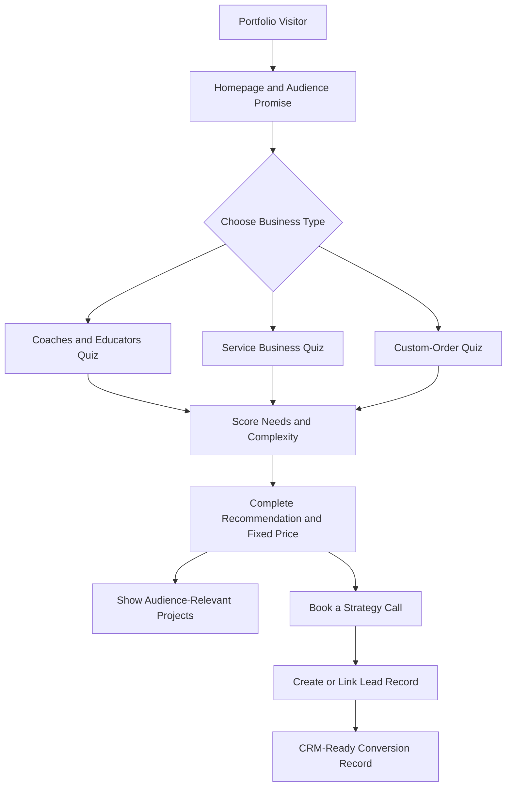
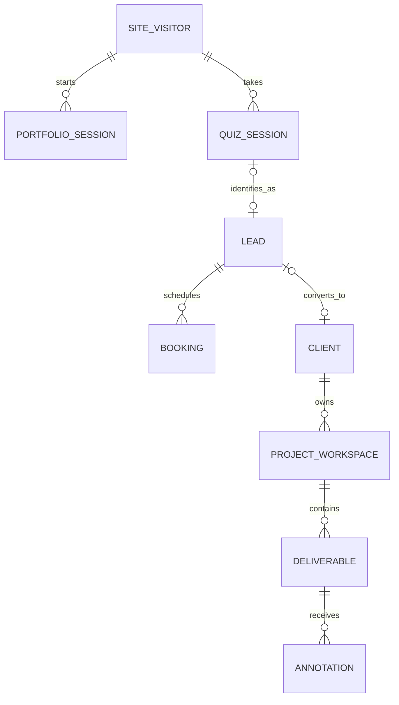

# Elysha Works Portfolio-First Master Blueprint

**Owner:** Elysha Dumpit  
**Brand:** `< elysha works />`  
**Current priority:** Launch the improved public portfolio and lead qualifier on Firebase.  
**Future modules:** Client Portal, Admin Portal, Visual Annotator, and CRM.

---

## 1. Project Objective

Build a conversion-focused Elysha Works portfolio that helps three specific audiences identify what their business needs, receive a personalized system recommendation with transparent fixed pricing, view relevant projects, and optionally book a strategy call.

The first live release includes only the public portfolio, qualifier, results, project filtering, and analytics. Its data model uses stable identifiers and reserved connection points so future modules can be attached without rebuilding the portfolio.

### Primary audiences

1. **Coaches & Educators** — coaches, tutors, course creators, trainers.
2. **Service-Based Businesses** — consultants, clinics, salons, agencies, and professional service providers.
3. **Custom-Order Businesses** — cake shops, custom-product sellers, and businesses that receive orders through messages.

### Core positioning

> I help coaches, educators, service-based businesses, and custom-order brands turn inquiries into booked clients, enrolled students, and organized customers through websites, funnels, automation, and custom systems.

### Primary conversion goal

Convert relevant visitors into qualified strategy-call bookings after giving them a complete recommendation and package price.

### Important experience rule

The result is **not gated**. Visitors see their complete diagnosis, recommendation, inclusions, and exact package price before being asked to book or share contact details.

---

## 2. Portfolio System Map



### Portfolio page order

1. Navbar
2. Hero
3. Audience Selector / Qualifier Entry
4. Multi-step Quiz
5. Personalized Result
6. Audience-Filtered Projects
7. Founder / About Elysha
8. Testimonial
9. FAQ
10. Final CTA
11. Footer

The result appears in the same journey after quiz completion. The visitor can review the result without submitting personal information.

---

## 3. Vision — View and Interface

### 3.1 Navbar

- Centered or visually prominent `< elysha works />` logo.
- Links: Work, About, FAQ.
- Primary CTA: **Find Your Best-Fit System**.
- Secondary CTA: **Book a Strategy Call**.
- On mobile, use a compact menu and keep one primary CTA visible.

### 3.2 Hero

**Eyebrow:** Websites · Funnels · Automation · Custom Systems  
**Headline:** Turn inquiries into booked clients, enrolled students, and organized customers.  
**Supporting copy:** Elysha Works designs the pages and connected systems behind your customer journey—built around how your business actually works.  
**Primary CTA:** Find Your Best-Fit System  
**Secondary CTA:** Explore Selected Work

Directly below the hero, introduce the qualifier with:

> Start with who you are. Answer a few questions and receive a complete recommendation with transparent package pricing.

### 3.3 Audience Selector

Three selectable cards:

| Audience | Short description | Result-focused label |
|---|---|---|
| Coaches & Educators | Sell expertise, enroll students, and deliver a smoother learning journey. | Book and Enroll |
| Service-Based Businesses | Turn inquiries into appointments and reduce repetitive admin work. | Attract and Book |
| Custom-Order Businesses | Simplify custom orders, payments, updates, and customer tracking. | Order and Organize |

Selecting a card:

1. Stores the chosen `audience_key`.
2. Loads the matching question set.
3. Activates the matching project filter.
4. Personalizes result copy and package inclusions.

### 3.4 Quiz Interface

- One question per screen.
- Six audience-specific questions followed by two universal platform/support questions.
- Progress indicator, e.g. `Question 2 of 6`.
- Back button without losing answers.
- Auto-save locally after every answer.
- Resume the active session after refresh when possible.
- Detect an unfinished quiz when the visitor returns using the same browser and device.
- Show a resume prompt with **Resume Quiz**, **Start Over**, and **Not Now** actions.
- Display the saved progress in the prompt, such as `Question 3 of 6`.
- Keep unfinished sessions available for 30 days from the last activity.
- Clear single-select and multi-select states.
- No name or email field before the result.

#### Returning Visitor Resume Prompt

Suggested interface copy:

> **Welcome back!**  
> You have an unfinished business system assessment at Question 3 of 6. Would you like to continue where you left off?

- **Resume Quiz** — restores the selected audience, saved answers, and last incomplete step.
- **Start Over** — closes the old attempt and creates a new quiz session.
- **Not Now** — dismisses the prompt without deleting the saved session.

The prompt should appear only when the saved session:

- belongs to the anonymous visitor ID stored in the current browser;
- has a status of `in_progress`;
- has at least one completed answer;
- has activity within the last 30 days; and
- does not already have a completed result.

Same-device recognition is not guaranteed after browser data is cleared, in private/incognito mode, when cookies or local storage are blocked, or when the visitor changes devices or browsers. Cross-device recovery can later be offered through an optional email resume link, but it is outside the first release.

### 3.5 Result Interface

The complete result displays:

1. **Your Business Snapshot** — summary of selected answers.
2. **What Is Holding Growth Back** — short diagnosis.
3. **Recommended System** — solution type and reason.
4. **Recommended Build Route and Platform** — Systeme.io, GoHighLevel, or Custom App.
5. **Recommended Base Offer** — Platform Launch/Growth/Scale or Custom Starter/Foundation/Growth/Complete.
6. **What Is Included** — exact base inclusions plus selected priced add-ons.
7. **Estimated Project Investment** — itemized base price, add-ons, and adjustments.
8. **Why This Fits** — answer-based explanation.
9. **Suggested Next Phase** — optional future enhancement, not an automatic charge.
10. **Relevant Projects** — projects tagged to the selected audience.
11. **Book a Strategy Call** — optional conversion CTA.

Pricing note:

> Your result is a planning recommendation based on your answers. Final scope is confirmed during the strategy call before any proposal or payment.

### 3.6 Projects

Projects are tagged by one or more audiences. Before the quiz, the section may show all selected projects. After audience selection, it defaults to the matching audience.

Each project card contains:

- Project name and client/business type.
- Audience tag.
- Problem.
- Solution built.
- Platforms or tools used.
- Outcome or intended business improvement.
- Case-study link or preview.

Do not invent performance metrics. Use honest project context, including beta or concept status where applicable.

### 3.7 Founder Section

**Heading:** Strategy first. Then the right system.  
**Suggested copy:**

> I’m Elysha Dumpit, the founder of Elysha Works. I design websites, funnels, automations, and custom systems around the way a business actually attracts, serves, and supports its customers. My goal is not to add more tools. It is to create a clearer journey—from first inquiry to an organized client experience.

### 3.8 Testimonial

- One strong testimonial is enough for the first release.
- Include client name/business only with permission.
- Provide context about what was delivered.
- Avoid a large empty carousel while proof is still growing.

### 3.9 FAQ

1. What does Elysha Works build?
2. Which businesses do you work with?
3. How does the system qualifier work?
4. Is the recommendation free?
5. Are the displayed prices final?
6. Can you work with WordPress, Shopify, Systeme.io, or GoHighLevel?
7. Do you also build custom portals and business systems?
8. What happens after I book a strategy call?

### 3.10 Footer

- `< elysha works />`
- Positioning line.
- Navigation.
- Facebook, Instagram, and LinkedIn.
- Privacy notice and terms.
- Final CTA: **Find Your Best-Fit System**.

---

## 4. Audience-Specific Quiz Flow

All paths measure the same six dimensions so the Cortex remains consistent:

1. Primary goal.
2. Current setup.
3. Main bottleneck.
4. Required workflow or capabilities.
5. Operational complexity.
6. Timeline/readiness.

### 4.1 Coaches & Educators

**Q1. What result matters most right now?**

- Book more discovery or coaching calls.
- Enroll more students in a course or program.
- Sell a workshop, membership, or digital offer.
- Give learners an organized place to access materials.

**Q2. How do people currently discover and join your offer?**

- Mostly through social media and direct messages.
- Through a website, but the path is unclear.
- Through a landing page or funnel that needs improvement.
- I have multiple tools, but they are disconnected.

**Q3. Where does the journey usually get stuck?**

- Not enough qualified inquiries.
- People ask questions but do not book or enroll.
- Follow-up is inconsistent or manual.
- Onboarding and content access are disorganized.

**Q4. What should the new system handle?** *(multi-select)*

- Offer or program page.
- Lead capture.
- Discovery-call booking.
- Enrollment and payment.
- Email follow-up.
- Student onboarding or portal.
- Progress or resource access.

**Q5. How complex is your offer setup?**

- One offer and one clear action.
- Multiple offers or audience segments.
- A program with enrollment, onboarding, and content access.
- A custom learning or client experience with integrations.

**Q6. When do you want to begin?**

- Ready now.
- Within 30 days.
- Within 1–2 months.
- Researching for later.

### 4.2 Service-Based Businesses

**Q1. What result matters most right now?**

- Receive more qualified inquiries.
- Book more appointments or consultations.
- Reduce no-shows and repetitive follow-up.
- Organize client intake and service delivery.

**Q2. How do clients currently contact or book you?**

- Social media, calls, or direct messages.
- A basic website and manual follow-up.
- A booking tool that is not connected to the rest of the workflow.
- Several tools and spreadsheets that do not work together.

**Q3. Where does the process usually break down?**

- Visitors do not understand the offer.
- Inquiries do not consistently become bookings.
- Intake, reminders, and follow-up take too much time.
- Client information and project status are difficult to track.

**Q4. What should the new system handle?** *(multi-select)*

- Professional service website.
- Lead qualification form.
- Appointment booking.
- Automated reminders and follow-up.
- Client intake and onboarding.
- CRM pipeline.
- Client portal or dashboard.

**Q5. How complex is your service workflow?**

- One service and a simple booking flow.
- Several services, locations, or team members.
- Multi-step intake, approval, or onboarding.
- Custom operations, permissions, or integrations.

**Q6. When do you want to begin?**

- Ready now.
- Within 30 days.
- Within 1–2 months.
- Researching for later.

### 4.3 Custom-Order Businesses

**Q1. What result matters most right now?**

- Receive more custom orders.
- Make ordering easier for customers.
- Reduce repetitive questions and order mistakes.
- Organize orders, payments, and customer updates.

**Q2. How do customers currently place orders?**

- Mostly through social media or messaging.
- Through a form, but confirmation is manual.
- Through an online store that does not support the full custom-order process.
- Through several disconnected tools or spreadsheets.

**Q3. Where does the process usually get stuck?**

- Customers do not know what options to choose.
- Quotes, deposits, and payment confirmation take too long.
- Order details are incomplete or scattered across messages.
- Production status, delivery, and customer updates are difficult to track.

**Q4. What should the new system handle?** *(multi-select)*

- Product or service catalog.
- Customization options.
- Quote or order request.
- Checkout, deposit, or payment instructions.
- Automated confirmation and updates.
- Order-management dashboard.
- Customer history or CRM.
- Inventory or production tracking.

**Q5. How complex is your order workflow?**

- A few products and simple options.
- Many options, add-ons, or pricing combinations.
- Deposits, approvals, production stages, and delivery coordination.
- Custom operations, staff roles, inventory, or integrations.

**Q6. When do you want to begin?**

- Ready now.
- Within 30 days.
- Within 1–2 months.
- Researching for later.

### 4.4 Universal Platform and Support Questions

These questions appear after the six audience-specific questions.

**Q7. Do you already have a preferred platform?**

- Systeme.io.
- GoHighLevel.
- I want a custom-built app.
- I am not sure—recommend the best fit for me.

Platform preference is considered, but it does not override technical fit. If the requested workflow cannot be supported properly by the chosen platform, the result explains why another route is recommended.

**Q8. What additional support do you need for this project?** *(multi-select)*

- Conversion copywriting.
- Image sourcing and selection.
- Image editing and optimization.
- Brand styling or mini visual direction.
- Additional pages or funnel steps.
- Appointment booking setup.
- Checkout or payment integration.
- Email or SMS follow-up automation.
- CRM or pipeline setup.
- Client/student onboarding.
- Client/student portal.
- Order-management workflow.
- Dashboard or reporting.
- Inventory or production tracking.
- Third-party integration.
- Data/content migration.
- I will provide final copy, images, and brand assets.

---

## 5. Offer Model and Dynamic Pricing

The qualifier uses two build routes. Systeme.io and GoHighLevel share the same project pricing when the requested setup and implementation effort are equivalent. Their recurring subscriptions are paid separately by the client. Custom App pricing is higher because it includes custom interface, database, authentication, and business logic.

### 5.1 Route A — Platform-Based Systems

The Cortex selects either Systeme.io or GoHighLevel according to platform fit. Price is based on scope, not on the platform brand.

#### Launch System — Base Price $1,500

Best for one offer, one audience, and one primary conversion action.

Included:

- Strategy and conversion-path planning for one offer.
- One landing page or compact conversion website of up to five core sections.
- Responsive desktop, tablet, and mobile setup.
- One lead form, application form, or inquiry form.
- One thank-you or confirmation page.
- One basic booking or checkout connection.
- One confirmation email and one basic follow-up sequence of up to three emails.
- Basic tags, contact fields, and simple segmentation.
- Basic analytics and conversion-event setup.
- Domain connection guidance.
- One revision round.
- Launch testing and handover.

#### Growth System — Base Price $2,500

Best for a connected lead-to-booking, enrollment, or order journey.

Included:

- Everything in Launch System where applicable.
- Multi-step funnel or conversion website of up to five primary pages/steps.
- Lead qualification or application flow.
- Booking, checkout, enrollment, or deposit connection.
- CRM pipeline with core stages.
- Automated confirmation, reminders, and follow-up sequence of up to seven emails/messages.
- Basic onboarding workflow.
- Audience or offer segmentation.
- Up to two standard third-party integrations.
- Funnel and pipeline testing.
- Two revision rounds.
- Recorded handover or training session.

#### Scale System — Base Price $4,000

Best for multiple offers, connected pipelines, and advanced platform-native automation.

Included:

- Everything in Growth System where applicable.
- Up to two offers, funnels, or audience paths.
- Advanced pipeline stages and opportunity automation.
- Conditional workflows using the selected platform's native capabilities.
- Extended email/SMS nurture of up to twelve messages.
- Client/student onboarding area using platform-native features where available.
- Up to four standard integrations.
- Basic reporting dashboard using available platform data.
- Team access and permissions supported by the client's subscription.
- End-to-end quality assurance.
- Two revision rounds.
- Training and 30-day post-launch technical support.

Platform boundary: features must remain within supported Systeme.io or GoHighLevel functionality. Requirements such as unique operational dashboards, advanced inventory, highly custom permissions, or specialized business logic trigger the Custom App route.

### 5.2 Route B — Custom Apps

Client Custom Apps use **Next.js, React, TypeScript, Tailwind CSS, and Supabase**. Supabase provides the client app's database, authentication, file storage, and backend services. Firebase remains the backend for the Elysha Works portfolio, qualifier, analytics, and pricing catalog only.

#### Custom Starter — Base Price $3,000

Best for a focused minimum viable product with one clear internal or customer-facing workflow.

Included:

- Discovery session and simplified workflow map.
- Custom responsive interface for one focused module.
- Supabase project, database, and basic security setup.
- Authentication for one primary user type.
- One core create, view, edit, and status workflow.
- Simple admin management view.
- Basic form validation and record search/filtering.
- One basic notification or confirmation workflow.
- Deployment and environment configuration.
- One revision round.
- Testing, handover, and 30-day technical support.

Boundary: Custom Starter does not include multiple portals, advanced role permissions, inventory, complex reporting, or several integrations.

#### Custom Foundation — Base Price $5,000

Best for a production-ready custom app with a connected admin and user experience.

Included:

- Everything in Custom Starter where applicable.
- Detailed workflow and data-model planning.
- Supabase database, authentication, storage, and access policies.
- Secure authentication for one primary user type plus admin.
- Up to two connected core workflows.
- Custom admin dashboard with operational status tracking.
- File or image upload capability.
- Expanded search, filtering, and record-management functions.
- Up to two standard third-party integrations.
- Basic analytics and activity history.
- Email notifications or workflow confirmations.
- Two revision rounds.
- Testing, handover, and 30-day technical support.

#### Custom Growth — Base Price $7,500

Best for several connected workflows, portals, roles, and dashboards.

Included:

- Everything in Custom Foundation where applicable.
- Up to three user roles with permission-based views.
- Client, student, customer, employee, or partner portal.
- Multiple connected business workflows.
- Advanced admin dashboard and status tracking.
- File upload or document-management capability.
- Search, filtering, and operational reporting.
- Up to three standard third-party integrations.
- Automated notifications and workflow triggers.
- Audit-friendly activity history for important actions.
- Supabase row-level security policies for each supported role.
- Two revision rounds.
- Training and 60-day technical support.

#### Complete Custom System — Base Price $10,000+

Best for complex operations, multiple departments, inventory, delivery, or specialized business rules.

Included:

- Everything in Custom Growth where applicable.
- Advanced roles and permission structure.
- Multiple portals or department-specific workspaces.
- Inventory, production, order, delivery, or resource-management modules as scoped.
- Custom approvals and multi-stage workflows.
- Advanced reporting and management dashboards.
- Complex calculations or business rules.
- Expanded integration requirements.
- Data migration plan where required.
- Advanced Supabase data relationships, storage policies, and server-side functions as required.
- Security review and extended quality assurance.
- Phased rollout plan.
- Three revision rounds.
- Training and 90-day technical support.

The final Complete Custom System price is confirmed after a strategy and technical scope review.

### 5.3 Add-On Catalog

Quiz selections add only the items that are not already included in the recommended base offer. The Cortex must prevent double charging.

| Add-on | Starting price | Pricing unit |
|---|---:|---|
| Conversion copywriting | $500 | Up to five core pages/steps |
| Additional copywriting | $150 | Per additional page/step |
| Image sourcing and selection | $200 | Per project set |
| Image editing and optimization | $300 | Up to 20 images |
| Mini brand direction | $400 | Colors, type, and basic visual guide |
| Additional landing/page step | $250 | Per standard page/step |
| Advanced booking setup | $350 | Per booking workflow |
| Checkout/payment integration | $400 | Per standard gateway/flow |
| Additional email automation | $300 | Per sequence of up to five emails |
| SMS automation setup | $350 | Per workflow; usage billed separately |
| Additional CRM pipeline | $500 | Per pipeline |
| Advanced onboarding workflow | $500 | Per workflow |
| Platform-native membership/course area | $750 | Per area/program |
| Basic custom portal module | $1,500 | Per module; Custom App route |
| Custom dashboard/reporting module | $1,500 | Per module; Custom App route |
| Custom order-management module | $2,000 | Per module; Custom App route |
| Inventory/production module | $2,500 | Starting price; Custom App route |
| Standard third-party integration | $350 | Per integration |
| Complex/custom API integration | $750+ | Per integration after review |
| Content or data migration | $500+ | Based on volume and cleanup |
| Additional revision round | $300 | Per round |

### 5.4 Costs Paid Separately by the Client

- Systeme.io or GoHighLevel subscription.
- Domain registration and renewal.
- Email/SMS sending usage.
- Payment-gateway transaction charges.
- Premium plugins, APIs, or third-party subscriptions.
- Supabase, deployment, storage, email, or usage costs beyond included free tiers.

### 5.5 Transparent Estimate

```text
estimated_project_investment =
recommended_base_offer
+ non_included_selected_addons
+ complexity_or_custom_integration_adjustments
+ urgency_adjustment_if_applicable
```

The result shows each part separately: build route, platform, base offer, included features, add-ons, adjustments, one-time estimated project investment, and separate recurring costs.

All prices and inclusions are stored in Firebase configuration documents and must not be hard-coded across multiple interface components.

---

## 6. Cortex — Recommendation Logic

### 6.1 Core principle

The Cortex first determines what system is needed, then recommends the best build route and platform, selects the correct base offer, adds only non-included requested capabilities, and produces a transparent planning estimate.

### 6.2 Scoring dimensions

Each answer contributes points to three diagnostic dimensions:

- `acquisition_need` — visibility, lead generation, booking, or enrollment.
- `automation_need` — follow-up, reminders, confirmations, or repetitive work.
- `system_complexity` — portals, dashboards, roles, operations, integrations.

Each answer also contributes to five solution scores:

- `website_score` — professional presence, credibility, content, navigation, and general discovery.
- `funnel_score` — lead generation, applications, booking, enrollment, checkout, and conversion paths.
- `automation_score` — confirmations, reminders, nurture, follow-up, and repetitive workflow reduction.
- `crm_score` — contact records, pipelines, follow-up status, customer tracking, and sales operations.
- `custom_app_score` — portals, dashboards, multiple roles, inventory, custom orders, approvals, and unique business rules.

Platform-fit scores are calculated separately:

- `systeme_fit` — simple funnels, email sequences, course delivery, and straightforward sales journeys.
- `ghl_fit` — booking, CRM pipelines, lead nurture, SMS, and service-business follow-up.
- `custom_build_fit` — custom roles, portals, dashboards, inventory, unique operations, and specialized logic requiring a Supabase-based app.

Each answer uses:

- `0` — no match.
- `1` — supporting match; the solution may help but is not central.
- `2` — strong match; the answer clearly supports the solution.
- `3` — direct/critical match; the requirement depends on this solution.

Example: “I need more qualified leads and want them to book a call” can add `+3` to Funnel, `+2` to Automation, `+1` to Website, and `+1` to CRM. “I need staff roles, inventory, approvals, and a production dashboard” adds `+3` to Custom App and `+3` to Custom Build Fit.

### 6.3 Build-route and offer selection

1. Score all answers against Website, Funnel, Automation, CRM, and Custom App.
2. Select the highest qualifying score as the **Primary Recommended Solution**.
3. Preserve other strong scores as **Supporting Components** instead of discarding them.
4. Use acquisition, automation, and complexity scores to explain the diagnosis.
5. Compare `systeme_fit`, `ghl_fit`, and `custom_build_fit` to select the best delivery platform.
6. Consider the visitor's platform preference without allowing it to override technical feasibility.
7. Choose **Platform-Based System** when the solution can be delivered reliably using Systeme.io or GoHighLevel.
8. Choose **Custom App with Supabase** when requirements include custom dashboards, portals, advanced roles, inventory, specialized operations, or business logic that platform-native tools cannot support properly.
9. Select the base offer: Platform Launch, Growth, or Scale; or Custom Starter, Foundation, Growth, or Complete.
10. Compare selected capabilities with the base inclusion list.
11. Add prices only for requested capabilities not already included.
12. Generate the recommendation, explanation, transparent estimate, and separate recurring-cost notice.

### 6.4 Solution recommendation rules

- Highest solution score becomes the primary recommendation when it exceeds the minimum qualification threshold.
- Scores within two points of the highest score become supporting components when they directly support the customer journey.
- A Website result focuses on presence, credibility, navigation, and content.
- A Funnel result focuses on one conversion journey such as lead capture, application, booking, enrollment, or checkout.
- An Automation result must be paired with the workflow it automates; it is not presented as an isolated collection of automations.
- A CRM result focuses on pipeline, lead/customer records, follow-up status, and relationship management.
- A Custom App result requires at least one genuine custom-operational signal such as roles, portal, dashboard, inventory, custom order states, approvals, or specialized business rules.
- When Funnel and Website scores are close, the primary business goal breaks the tie: credibility/information favors Website; conversion/action favors Funnel.
- When CRM and Automation scores are close, pipeline visibility favors CRM; repetitive actions and communication favor Automation.
- When Custom App scores highly, the result must state which requirements cannot be handled cleanly by Systeme.io or GoHighLevel.

### 6.5 Example combined recommendations

```text
Primary Solution: Enrollment Funnel
Supporting Components: Booking + Follow-Up Automation
Recommended Platform: Systeme.io
Recommended Offer: Platform Growth
```

```text
Primary Solution: Lead-to-Client System
Supporting Components: CRM + Booking + Follow-Up Automation
Recommended Platform: GoHighLevel
Recommended Offer: Platform Growth or Scale
```

```text
Primary Solution: Custom Order Management App
Supporting Components: Customer Portal + Payment Tracking + Operations Dashboard
Recommended Platform: Custom App using Supabase
Recommended Offer: Custom Growth
```

### 6.6 Guardrails

- Do not recommend a Custom App merely because it has a higher price; the recommendation must be justified by requirements.
- Do not force a platform build when core requirements exceed platform-native capabilities.
- Systeme.io and GoHighLevel use the same build price when scope and implementation effort are equal.
- Prevent double charging when an add-on is already included in the selected base offer.
- High-complexity answers must not return Launch System, Custom Starter, or Custom Foundation when the workflow requires advanced roles or modules.
- “Researching for later” affects lead readiness, not the package level.
- A result is a planning recommendation, not a binding quotation.

### 6.7 Generated recommendation output

```text
audience_key
recommended_build_route
recommended_platform
recommended_offer_key
primary_solution_type
supporting_solution_types[]
recommended_solution_title
diagnosis_summary
recommendation_reason
included_capabilities[]
selected_addons[]
priced_addons[]
future_phase_suggestions[]
acquisition_need_score
automation_need_score
system_complexity_score
website_score
funnel_score
automation_score
crm_score
custom_app_score
systeme_fit_score
ghl_fit_score
custom_build_fit_score
readiness_level
base_price_usd
addon_total_usd
adjustment_total_usd
estimated_project_investment_usd
estimated_recurring_costs[]
```

---

## 7. Portfolio State Management

### Client-side state

- Anonymous visitor ID.
- Quiz session ID.
- Selected audience.
- Current quiz step.
- Answers by question key.
- Scores and result.
- Project filter.
- UTM/referral parameters.
- Last active quiz session ID.
- Resume-prompt dismissed timestamp.

### Persistence behavior

- Store active answers locally during the quiz.
- Create a Firestore quiz-session document when meaningful engagement begins.
- Update progress after each completed step or in safe batches.
- Refresh `last_activity_at` whenever an answer or quiz step is saved.
- On return, restore only the current browser's latest eligible unfinished session.
- Keep an unfinished session resumable for 30 days after `last_activity_at`.
- When **Start Over** is selected, mark the previous attempt `restarted` and create a new quiz session instead of overwriting its analytics history.
- When an unfinished session passes 30 days, mark it `expired` and begin a new session.
- Mark the session completed when the result is generated.
- Never require personally identifiable information to show the result.
- Link the quiz session to a lead only after the visitor voluntarily books or submits contact details.

---

## 8. Firebase Memory — Portfolio-First Database Schema

Use Firestore collection names in plural `snake_case`. Use stable random document IDs. Store timestamps using Firebase server timestamps.

### 8.1 Phase 1 collections

#### `site_visitors/{visitor_id}`

Anonymous first-party visitor record.

```text
visitor_id
first_seen_at
last_seen_at
first_touch_source
first_touch_medium
first_touch_campaign
landing_path
referrer_domain
consent_status
quiz_started_count
quiz_completed_count
booking_click_count
latest_quiz_session_id (nullable)
```

Do not store raw IP addresses in this collection.

#### `portfolio_sessions/{session_id}`

One browsing/engagement session.

```text
session_id
visitor_id
started_at
last_activity_at
landing_path
audience_key
utm_source
utm_medium
utm_campaign
referrer_domain
device_category
result_viewed
booking_cta_clicked
converted_to_lead
lead_id (nullable)
```

#### `quiz_sessions/{quiz_session_id}`

```text
quiz_session_id
visitor_id
portfolio_session_id
lead_id (nullable)
audience_key
question_set_version
status (in_progress | completed | restarted | expired | abandoned)
current_step
last_completed_step
started_at
completed_at
last_activity_at
resume_expires_at
resumed_count
last_resumed_at (nullable)
answers (map)
acquisition_need_score
automation_need_score
system_complexity_score
website_score
funnel_score
automation_score
crm_score
custom_app_score
systeme_fit_score
ghl_fit_score
custom_build_fit_score
readiness_level
recommended_build_route
recommended_platform
recommended_offer_key
primary_solution_type
supporting_solution_types[]
selected_addon_keys[]
priced_addons[]
base_price_usd
addon_total_usd
adjustment_total_usd
estimated_project_investment_usd
result_snapshot (map)
result_viewed_at
```

`result_snapshot` preserves what the visitor saw even if prices or package content change later.

#### `leads/{lead_id}`

Created only after voluntary identification through booking or contact submission.

```text
lead_id
visitor_id (nullable)
first_name
last_name (nullable)
email
phone (nullable)
business_name (nullable)
business_url (nullable)
audience_key
source
source_session_id
source_quiz_session_id
crm_stage
lead_status
assigned_to_user_id (nullable)
created_at
updated_at
last_contact_at (nullable)
lost_reason (nullable)
notes_summary (nullable)
```

#### `bookings/{booking_id}`

```text
booking_id
lead_id
visitor_id (nullable)
portfolio_session_id (nullable)
quiz_session_id (nullable)
booking_provider
external_booking_id (nullable)
scheduled_start
scheduled_end
timezone
status (scheduled | completed | cancelled | no_show)
created_at
updated_at
```

#### `analytics_events/{event_id}`

```text
event_id
event_name
occurred_at
visitor_id
portfolio_session_id
quiz_session_id (nullable)
lead_id (nullable)
audience_key (nullable)
page_path
properties (map)
```

Keep event properties small. Use Firebase Analytics for aggregate reporting and Firestore only for business-critical funnel events that must connect to CRM records.

#### `projects/{project_id}`

```text
project_id
slug
title
client_display_name
summary
problem
solution
outcome
audience_keys[]
service_keys[]
platform_keys[]
cover_image_url
gallery[]
case_study_url (nullable)
project_status (concept | beta | live)
featured
display_order
published
created_at
updated_at
```

#### `package_catalog/{offer_key}`

Documents include `platform_launch`, `platform_growth`, `platform_scale`, `custom_starter`, `custom_foundation`, `custom_growth`, and `custom_complete`.

```text
offer_key
name
build_route
supported_platforms[]
base_price_usd
level
active
display_order
general_description
included_capability_keys[]
limits (map)
support_days
revision_rounds
created_at
updated_at
```

#### `addon_catalog/{addon_key}`

```text
addon_key
name
description
starting_price_usd
pricing_unit
allowed_build_routes[]
included_in_offer_keys[]
requires_scope_review
active
display_order
created_at
updated_at
```

#### `quiz_definitions/{question_set_id}`

```text
question_set_id
audience_key
version
active
questions[]
scoring_rules
created_at
updated_at
```

#### `site_content/{document_key}`

Editable content such as hero, founder, FAQ, testimonial, social links, and navigation.

```text
document_key
content
published
version
updated_at
updated_by_user_id (nullable)
```

### 8.2 Reserved future collections

These are documented now but do not need to be implemented for the first portfolio release.

| Collection | Future purpose |
|---|---|
| `users` | Admin and client identities linked to Firebase Auth UID |
| `clients` | Won-client business records |
| `client_members` | User-to-client membership and roles |
| `projects_workspace` | Active client projects and lifecycle stages |
| `project_members` | Access control for staff and clients |
| `deliverables` | Pages, designs, files, and reviewable outputs |
| `annotations` | Visual comments anchored to a deliverable |
| `annotation_threads` | Replies, resolution status, and revision discussion |
| `revision_rounds` | Revision limits and approval history |
| `crm_activities` | Calls, emails, notes, stage changes, and follow-ups |
| `proposals` | Scope, package, price, and proposal status |
| `contracts` | Contract metadata and signature status |
| `payments` | Deposit, balance, status, and external payment reference |
| `notifications` | In-app/email notification queue and read state |
| `audit_logs` | Sensitive admin and access events |

### 8.3 Stable relationships



The future modules should reference the existing `lead_id`, `client_id`, and `project_id`; they should not create duplicate client records.

---

## 9. Analytics and Conversion Measurement

### Required events

```text
portfolio_view
audience_selected
quiz_started
quiz_step_completed
quiz_resume_prompt_viewed
quiz_resumed
quiz_restarted
quiz_resume_dismissed
quiz_session_expired
quiz_abandoned
quiz_completed
result_viewed
package_recommended
project_viewed
strategy_call_clicked
contact_submitted
booking_started
booking_completed
lead_created
lead_qualified
proposal_sent
client_won
client_lost
```

### Core dashboard metrics

```text
Quiz start rate = unique quiz starters / unique portfolio visitors
Quiz completion rate = completed quizzes / started quizzes
Result-to-CTA rate = strategy call clicks / result views
Booking completion rate = completed bookings / booking starts
Visitor-to-lead rate = identified leads / unique portfolio visitors
Lead-to-client rate = won clients / identified leads
Visitor-to-client rate = won clients / unique portfolio visitors
```

All metrics should be filterable by date range, audience, traffic source, campaign, recommended package, and device category.

### Funnel attribution

Preserve first-touch and latest-session source data. When a visitor becomes a lead, attach the originating `visitor_id`, `portfolio_session_id`, and `quiz_session_id` so the CRM can show the full journey.

---

## 10. Firebase Security Boundaries

- Public visitors may read only published portfolio content, active question definitions, active packages, and published projects.
- Public visitors may create/update only their own anonymous session and quiz documents through constrained rules or trusted server endpoints.
- Public visitors cannot list other sessions, leads, or analytics events.
- Only authenticated admin users may read all leads, bookings, and conversion records.
- Client users will later read only projects and deliverables linked through `client_members` or `project_members`.
- Annotation writes will later require authenticated project membership.
- Prices and result snapshots must be validated by trusted server logic before being treated as official.
- Never place admin credentials or service-account keys in frontend code.

---

## 11. Recommended Firebase Services

| Service | Portfolio-first use |
|---|---|
| Firebase Hosting | Deploy the portfolio |
| Firestore | Content, quiz sessions, results, leads, bookings, CRM-ready events |
| Firebase Analytics | Aggregate traffic and behavior analytics |
| Firebase Storage | Project thumbnails and case-study media |
| Firebase Authentication | Admin login now; client login later |
| Cloud Functions or trusted server routes | Secure scoring, booking webhooks, and lead linking when required |

---

## 12. Delivery Phases

### Phase 1 — Portfolio View

- Build full homepage sections.
- Add audience selector.
- Build responsive project cards and filters.
- Add founder, testimonial, FAQ, final CTA, and footer.
- Connect published content and project data.

### Phase 2 — Quiz and Result

- Build the three audience-specific six-question paths plus two universal platform/support questions.
- Add state persistence and progress recovery.
- Implement recommendation scoring.
- Show the recommended platform/build route, detailed base offer, selected add-ons, and transparent estimate.
- Preserve complete result snapshots.

### Phase 3 — Analytics and Booking

- Track portfolio, quiz, result, CTA, and booking events.
- Connect booking completion to lead creation.
- Add basic admin reporting for portfolio funnel performance.

### Phase 4 — Existing-System Audit

- Verify whether the five existing applications use the same Firebase project, Auth, Firestore, and Storage.
- Inventory their collections and security rules.
- Detect duplicate users, clients, projects, or leads.
- Define the safest connection or migration sequence.

### Phase 5 — Future Modules

- CRM expansion.
- Client Portal connection.
- Admin Portal expansion.
- Visual Annotator connection.

---

## 13. Portfolio-First Acceptance Criteria

The first release is ready when:

- Visitors can clearly identify whether Elysha Works serves their business type.
- Each audience receives six relevant questions followed by the universal platform and support questions.
- The quiz survives back navigation and normal refresh behavior.
- Returning visitors on the same browser/device are offered the option to resume an eligible unfinished quiz.
- Resuming restores the selected audience, saved answers, and correct next step.
- Unfinished sessions expire after 30 days of inactivity.
- Starting over preserves the earlier attempt for analytics and creates a fresh quiz session.
- The complete result appears without requiring contact information.
- Results recommend a technically justified platform/build route and base offer starting at $1,500.
- Results itemize base inclusions, non-included add-ons, adjustments, and recurring costs paid separately by the client.
- Projects automatically filter to the selected audience.
- Strategy-call clicks and completed bookings can be attributed to the originating session and quiz.
- No personally identifiable information is collected before voluntary submission.
- Content, questions, package data, and projects can be updated without rewriting core scoring logic.
- Mobile, tablet, and desktop layouts are usable and visually consistent.

---

## 14. First Build Boundary

Build now:

- Public portfolio.
- Audience selection.
- Quiz.
- Complete result.
- Fixed package recommendation.
- Audience-filtered projects.
- Firebase portfolio data.
- Essential analytics and booking attribution.

Do not build yet:

- Full client portal rewrite.
- Full admin portal rewrite.
- Visual annotator integration.
- Full CRM interface.
- Supabase migration.

Those modules remain represented in the future-ready data relationships, but they do not block the portfolio launch.
