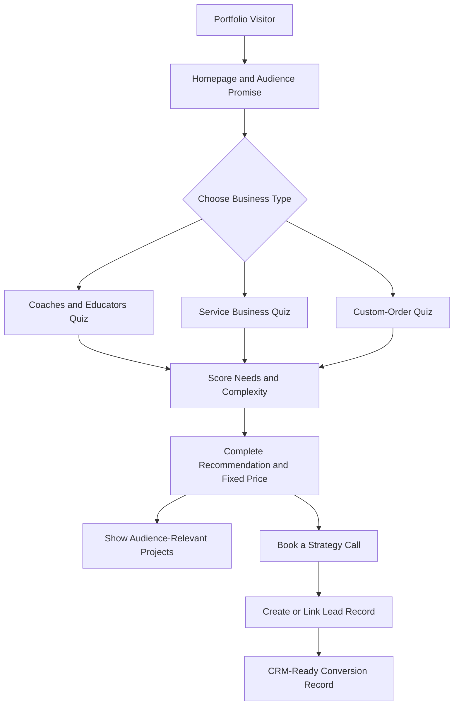
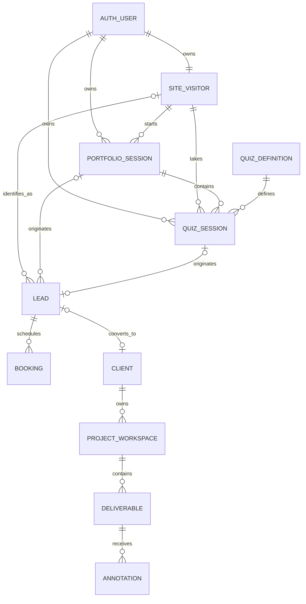

# Elysha Works Portfolio-First Master Blueprint

**Owner:** Elysha Dumpit  
**Brand:** `< elysha works />`  
**Current priority:** Launch the improved public portfolio and lead qualifier with Firebase Hosting for the frontend and Supabase for backend services.
**Future modules:** Client Portal, Admin Portal, Visual Annotator, and CRM.

---

## 1. Project Objective

Build a conversion-focused Elysha Works portfolio that helps three specific audiences identify what their business needs, receive a personalized system recommendation with transparent fixed pricing, view relevant projects, and optionally book a strategy call.

The first live release includes only the public portfolio, qualifier, results, project filtering, and analytics. Firebase Hosting remains responsible for the existing deployment, custom domain, and SSL. A dedicated Elysha Works Supabase project will provide PostgreSQL, authentication, Row Level Security (RLS), database functions, and storage when required. Its relational model uses stable identifiers and reserved connection points so future modules can be attached without rebuilding the portfolio.

Existing Firebase projects, Firestore databases, applications, `firebase.json`, and hosting targets are outside this change and remain untouched. Client custom applications must use their own separate Supabase projects, credentials, storage, and data; they must never share the Elysha Works internal Supabase database.

### Primary audiences

1. **Coaches & Educators** — coaches, tutors, course creators, trainers.
2. **Service-Based Businesses** — consultants, clinics, salons, agencies, and professional service providers.
3. **Custom-Order Businesses** — cake shops, custom-product sellers, and businesses that receive orders through messages.

### Core positioning

> I help coaches, educators, service-based businesses, and custom-order brands turn inquiries into booked clients, enrolled students, and organized customers through websites, funnels, automation, and custom systems.

### Primary conversion goal

Convert relevant visitors into qualified strategy-call bookings after giving them a complete recommendation and package price.

### Important experience rule

The result is **not gated**. Visitors see their complete diagnosis, recommendation, inclusions, and exact package price before being asked to book or share contact details.

---

## 2. Portfolio System Map



### Portfolio page order

1. Navbar
2. Hero
3. Audience Selector / Qualifier Entry
4. Multi-step Quiz
5. Personalized Result
6. Audience-Filtered Projects
7. Founder / About Elysha
8. Testimonial
9. FAQ
10. Final CTA
11. Footer

The result appears in the same journey after quiz completion. The visitor can review the result without submitting personal information.

---

## 3. Vision — View and Interface

### 3.1 Navbar

- Centered or visually prominent `< elysha works />` logo.
- Links: Work, About, FAQ.
- Primary CTA: **Find Your Best-Fit System**.
- Secondary CTA: **Book a Strategy Call**.
- On mobile, use a compact menu and keep one primary CTA visible.

### 3.2 Hero

**Eyebrow:** Websites · Funnels · Automation · Custom Systems  
**Headline:** Turn inquiries into booked clients, enrolled students, and organized customers.  
**Supporting copy:** Elysha Works designs the pages and connected systems behind your customer journey—built around how your business actually works.  
**Primary CTA:** Find Your Best-Fit System  
**Secondary CTA:** Explore Selected Work

Directly below the hero, introduce the qualifier with:

> Start with who you are. Answer a few questions and receive a complete recommendation with transparent package pricing.

### 3.3 Audience Selector

Three selectable cards:

| Audience | Short description | Result-focused label |
|---|---|---|
| Coaches & Educators | Sell expertise, enroll students, and deliver a smoother learning journey. | Book and Enroll |
| Service-Based Businesses | Turn inquiries into appointments and reduce repetitive admin work. | Attract and Book |
| Custom-Order Businesses | Simplify custom orders, payments, updates, and customer tracking. | Order and Organize |

Selecting a card:

1. Stores the chosen `audience_key`.
2. Loads the matching question set.
3. Activates the matching project filter.
4. Personalizes result copy and package inclusions.

### 3.4 Quiz Interface

- One question per screen.
- Six audience-specific questions followed by two universal platform/support questions.
- Progress indicator, e.g. `Question 2 of 6`.
- Back button without losing answers.
- Auto-save locally after every answer.
- Resume the active session after refresh when possible.
- Detect an unfinished quiz when the visitor returns using the same browser and device.
- Show a resume prompt with **Resume Quiz**, **Start Over**, and **Not Now** actions.
- Display the saved progress in the prompt, such as `Question 3 of 6`.
- Keep unfinished sessions available for 30 days from the last activity.
- Clear single-select and multi-select states.
- No name or email field before the result.

#### Returning Visitor Resume Prompt

Suggested interface copy:

> **Welcome back!**  
> You have an unfinished business system assessment at Question 3 of 6. Would you like to continue where you left off?

- **Resume Quiz** — restores the selected audience, saved answers, and last incomplete step.
- **Start Over** — closes the old attempt and creates a new quiz session.
- **Not Now** — dismisses the prompt without deleting the saved session.

The prompt should appear only when the saved session:

- belongs to the anonymous visitor ID stored in the current browser;
- has a status of `in_progress`;
- has at least one completed answer;
- has activity within the last 30 days; and
- does not already have a completed result.

Same-device recognition is not guaranteed after browser data is cleared, in private/incognito mode, when cookies or local storage are blocked, or when the visitor changes devices or browsers. Cross-device recovery can later be offered through an optional email resume link, but it is outside the first release.

### 3.5 Result Interface

The complete result displays:

1. **Your Business Snapshot** — summary of selected answers.
2. **What Is Holding Growth Back** — short diagnosis.
3. **Recommended System** — solution type and reason.
4. **Recommended Build Route and Platform** — Systeme.io, GoHighLevel, or Custom App.
5. **Recommended Base Offer** — Platform Launch/Growth/Scale or Custom Starter/Foundation/Growth/Complete.
6. **What Is Included** — exact base inclusions plus selected priced add-ons.
7. **Estimated Project Investment** — itemized base price, add-ons, and adjustments.
8. **Why This Fits** — answer-based explanation.
9. **Suggested Next Phase** — optional future enhancement, not an automatic charge.
10. **Relevant Projects** — projects tagged to the selected audience.
11. **Book a Strategy Call** — optional conversion CTA.

Pricing note:

> Your result is a planning recommendation based on your answers. Final scope is confirmed during the strategy call before any proposal or payment.

### 3.6 Projects

Projects are tagged by one or more audiences. Before the quiz, the section may show all selected projects. After audience selection, it defaults to the matching audience.

Each project card contains:

- Project name and client/business type.
- Audience tag.
- Problem.
- Solution built.
- Platforms or tools used.
- Outcome or intended business improvement.
- Case-study link or preview.

Do not invent performance metrics. Use honest project context, including beta or concept status where applicable.

### 3.7 Founder Section

**Heading:** Strategy first. Then the right system.  
**Suggested copy:**

> I’m Elysha Dumpit, the founder of Elysha Works. I design websites, funnels, automations, and custom systems around the way a business actually attracts, serves, and supports its customers. My goal is not to add more tools. It is to create a clearer journey—from first inquiry to an organized client experience.

### 3.8 Testimonial

- One strong testimonial is enough for the first release.
- Include client name/business only with permission.
- Provide context about what was delivered.
- Avoid a large empty carousel while proof is still growing.

### 3.9 FAQ

1. What does Elysha Works build?
2. Which businesses do you work with?
3. How does the system qualifier work?
4. Is the recommendation free?
5. Are the displayed prices final?
6. Can you work with WordPress, Shopify, Systeme.io, or GoHighLevel?
7. Do you also build custom portals and business systems?
8. What happens after I book a strategy call?

### 3.10 Footer

- `< elysha works />`
- Positioning line.
- Navigation.
- Facebook, Instagram, and LinkedIn.
- Privacy notice and terms.
- Final CTA: **Find Your Best-Fit System**.

---

## 4. Audience-Specific Quiz Flow

All paths measure the same six dimensions so the Cortex remains consistent:

1. Primary goal.
2. Current setup.
3. Main bottleneck.
4. Required workflow or capabilities.
5. Operational complexity.
6. Timeline/readiness.

### 4.1 Coaches & Educators

**Q1. What result matters most right now?**

- Book more discovery or coaching calls.
- Enroll more students in a course or program.
- Sell a workshop, membership, or digital offer.
- Give learners an organized place to access materials.

**Q2. How do people currently discover and join your offer?**

- Mostly through social media and direct messages.
- Through a website, but the path is unclear.
- Through a landing page or funnel that needs improvement.
- I have multiple tools, but they are disconnected.

**Q3. Where does the journey usually get stuck?**

- Not enough qualified inquiries.
- People ask questions but do not book or enroll.
- Follow-up is inconsistent or manual.
- Onboarding and content access are disorganized.

**Q4. What should the new system handle?** *(multi-select)*

- Offer or program page.
- Lead capture.
- Discovery-call booking.
- Enrollment and payment.
- Email follow-up.
- Student onboarding or portal.
- Progress or resource access.

**Q5. How complex is your offer setup?**

- One offer and one clear action.
- Multiple offers or audience segments.
- A program with enrollment, onboarding, and content access.
- A custom learning or client experience with integrations.

**Q6. When do you want to begin?**

- Ready now.
- Within 30 days.
- Within 1–2 months.
- Researching for later.

### 4.2 Service-Based Businesses

**Q1. What result matters most right now?**

- Receive more qualified inquiries.
- Book more appointments or consultations.
- Reduce no-shows and repetitive follow-up.
- Organize client intake and service delivery.

**Q2. How do clients currently contact or book you?**

- Social media, calls, or direct messages.
- A basic website and manual follow-up.
- A booking tool that is not connected to the rest of the workflow.
- Several tools and spreadsheets that do not work together.

**Q3. Where does the process usually break down?**

- Visitors do not understand the offer.
- Inquiries do not consistently become bookings.
- Intake, reminders, and follow-up take too much time.
- Client information and project status are difficult to track.

**Q4. What should the new system handle?** *(multi-select)*

- Professional service website.
- Lead qualification form.
- Appointment booking.
- Automated reminders and follow-up.
- Client intake and onboarding.
- CRM pipeline.
- Client portal or dashboard.

**Q5. How complex is your service workflow?**

- One service and a simple booking flow.
- Several services, locations, or team members.
- Multi-step intake, approval, or onboarding.
- Custom operations, permissions, or integrations.

**Q6. When do you want to begin?**

- Ready now.
- Within 30 days.
- Within 1–2 months.
- Researching for later.

### 4.3 Custom-Order Businesses

**Q1. What result matters most right now?**

- Receive more custom orders.
- Make ordering easier for customers.
- Reduce repetitive questions and order mistakes.
- Organize orders, payments, and customer updates.

**Q2. How do customers currently place orders?**

- Mostly through social media or messaging.
- Through a form, but confirmation is manual.
- Through an online store that does not support the full custom-order process.
- Through several disconnected tools or spreadsheets.

**Q3. Where does the process usually get stuck?**

- Customers do not know what options to choose.
- Quotes, deposits, and payment confirmation take too long.
- Order details are incomplete or scattered across messages.
- Production status, delivery, and customer updates are difficult to track.

**Q4. What should the new system handle?** *(multi-select)*

- Product or service catalog.
- Customization options.
- Quote or order request.
- Checkout, deposit, or payment instructions.
- Automated confirmation and updates.
- Order-management dashboard.
- Customer history or CRM.
- Inventory or production tracking.

**Q5. How complex is your order workflow?**

- A few products and simple options.
- Many options, add-ons, or pricing combinations.
- Deposits, approvals, production stages, and delivery coordination.
- Custom operations, staff roles, inventory, or integrations.

**Q6. When do you want to begin?**

- Ready now.
- Within 30 days.
- Within 1–2 months.
- Researching for later.

### 4.4 Universal Platform and Support Questions

These questions appear after the six audience-specific questions.

**Q7. Do you already have a preferred platform?**

- Systeme.io.
- GoHighLevel.
- I want a custom-built app.
- I am not sure—recommend the best fit for me.

Platform preference is considered, but it does not override technical fit. If the requested workflow cannot be supported properly by the chosen platform, the result explains why another route is recommended.

**Q8. What additional support do you need for this project?** *(multi-select)*

- Conversion copywriting.
- Image sourcing and selection.
- Image editing and optimization.
- Brand styling or mini visual direction.
- Additional pages or funnel steps.
- Appointment booking setup.
- Checkout or payment integration.
- Email or SMS follow-up automation.
- CRM or pipeline setup.
- Client/student onboarding.
- Client/student portal.
- Order-management workflow.
- Dashboard or reporting.
- Inventory or production tracking.
- Third-party integration.
- Data/content migration.
- I will provide final copy, images, and brand assets.

---

## 5. Offer Model and Dynamic Pricing

The qualifier uses two build routes. Systeme.io and GoHighLevel share the same project pricing when the requested setup and implementation effort are equivalent. Their recurring subscriptions are paid separately by the client. Custom App pricing is higher because it includes custom interface, database, authentication, and business logic.

### 5.1 Route A — Platform-Based Systems

The Cortex selects either Systeme.io or GoHighLevel according to platform fit. Price is based on scope, not on the platform brand.

#### Launch System — Base Price $1,500

Best for one offer, one audience, and one primary conversion action.

Included:

- Strategy and conversion-path planning for one offer.
- One landing page or compact conversion website of up to five core sections.
- Responsive desktop, tablet, and mobile setup.
- One lead form, application form, or inquiry form.
- One thank-you or confirmation page.
- One basic booking or checkout connection.
- One confirmation email and one basic follow-up sequence of up to three emails.
- Basic tags, contact fields, and simple segmentation.
- Basic analytics and conversion-event setup.
- Domain connection guidance.
- One revision round.
- Launch testing and handover.

#### Growth System — Base Price $2,500

Best for a connected lead-to-booking, enrollment, or order journey.

Included:

- Everything in Launch System where applicable.
- Multi-step funnel or conversion website of up to five primary pages/steps.
- Lead qualification or application flow.
- Booking, checkout, enrollment, or deposit connection.
- CRM pipeline with core stages.
- Automated confirmation, reminders, and follow-up sequence of up to seven emails/messages.
- Basic onboarding workflow.
- Audience or offer segmentation.
- Up to two standard third-party integrations.
- Funnel and pipeline testing.
- Two revision rounds.
- Recorded handover or training session.

#### Scale System — Base Price $4,000

Best for multiple offers, connected pipelines, and advanced platform-native automation.

Included:

- Everything in Growth System where applicable.
- Up to two offers, funnels, or audience paths.
- Advanced pipeline stages and opportunity automation.
- Conditional workflows using the selected platform's native capabilities.
- Extended email/SMS nurture of up to twelve messages.
- Client/student onboarding area using platform-native features where available.
- Up to four standard integrations.
- Basic reporting dashboard using available platform data.
- Team access and permissions supported by the client's subscription.
- End-to-end quality assurance.
- Two revision rounds.
- Training and 30-day post-launch technical support.

Platform boundary: features must remain within supported Systeme.io or GoHighLevel functionality. Requirements such as unique operational dashboards, advanced inventory, highly custom permissions, or specialized business logic trigger the Custom App route.

### 5.2 Route B — Custom Apps

Client Custom Apps use **Next.js, React, TypeScript, Tailwind CSS, and Supabase**. Each client application receives its own isolated Supabase project for its database, authentication, file storage, and backend services. The Elysha Works portfolio uses a separate internal Supabase project for its qualifier, CRM-connected analytics, pricing catalog, and future modules; client data and Elysha Works internal data must never be mixed. Firebase remains responsible only for hosting the existing portfolio frontend, custom domain, SSL, and deployment.

#### Custom Starter — Base Price $3,000

Best for a focused minimum viable product with one clear internal or customer-facing workflow.

Included:

- Discovery session and simplified workflow map.
- Custom responsive interface for one focused module.
- Supabase project, database, and basic security setup.
- Authentication for one primary user type.
- One core create, view, edit, and status workflow.
- Simple admin management view.
- Basic form validation and record search/filtering.
- One basic notification or confirmation workflow.
- Deployment and environment configuration.
- One revision round.
- Testing, handover, and 30-day technical support.

Boundary: Custom Starter does not include multiple portals, advanced role permissions, inventory, complex reporting, or several integrations.

#### Custom Foundation — Base Price $5,000

Best for a production-ready custom app with a connected admin and user experience.

Included:

- Everything in Custom Starter where applicable.
- Detailed workflow and data-model planning.
- Supabase database, authentication, storage, and access policies.
- Secure authentication for one primary user type plus admin.
- Up to two connected core workflows.
- Custom admin dashboard with operational status tracking.
- File or image upload capability.
- Expanded search, filtering, and record-management functions.
- Up to two standard third-party integrations.
- Basic analytics and activity history.
- Email notifications or workflow confirmations.
- Two revision rounds.
- Testing, handover, and 30-day technical support.

#### Custom Growth — Base Price $7,500

Best for several connected workflows, portals, roles, and dashboards.

Included:

- Everything in Custom Foundation where applicable.
- Up to three user roles with permission-based views.
- Client, student, customer, employee, or partner portal.
- Multiple connected business workflows.
- Advanced admin dashboard and status tracking.
- File upload or document-management capability.
- Search, filtering, and operational reporting.
- Up to three standard third-party integrations.
- Automated notifications and workflow triggers.
- Audit-friendly activity history for important actions.
- Supabase row-level security policies for each supported role.
- Two revision rounds.
- Training and 60-day technical support.

#### Complete Custom System — Base Price $10,000+

Best for complex operations, multiple departments, inventory, delivery, or specialized business rules.

Included:

- Everything in Custom Growth where applicable.
- Advanced roles and permission structure.
- Multiple portals or department-specific workspaces.
- Inventory, production, order, delivery, or resource-management modules as scoped.
- Custom approvals and multi-stage workflows.
- Advanced reporting and management dashboards.
- Complex calculations or business rules.
- Expanded integration requirements.
- Data migration plan where required.
- Advanced Supabase data relationships, storage policies, and server-side functions as required.
- Security review and extended quality assurance.
- Phased rollout plan.
- Three revision rounds.
- Training and 90-day technical support.

The final Complete Custom System price is confirmed after a strategy and technical scope review.

### 5.3 Add-On Catalog

Quiz selections add only the items that are not already included in the recommended base offer. The Cortex must prevent double charging.

| Add-on | Starting price | Pricing unit |
|---|---:|---|
| Conversion copywriting | $500 | Up to five core pages/steps |
| Additional copywriting | $150 | Per additional page/step |
| Image sourcing and selection | $200 | Per project set |
| Image editing and optimization | $300 | Up to 20 images |
| Mini brand direction | $400 | Colors, type, and basic visual guide |
| Additional landing/page step | $250 | Per standard page/step |
| Advanced booking setup | $350 | Per booking workflow |
| Checkout/payment integration | $400 | Per standard gateway/flow |
| Additional email automation | $300 | Per sequence of up to five emails |
| SMS automation setup | $350 | Per workflow; usage billed separately |
| Additional CRM pipeline | $500 | Per pipeline |
| Advanced onboarding workflow | $500 | Per workflow |
| Platform-native membership/course area | $750 | Per area/program |
| Basic custom portal module | $1,500 | Per module; Custom App route |
| Custom dashboard/reporting module | $1,500 | Per module; Custom App route |
| Custom order-management module | $2,000 | Per module; Custom App route |
| Inventory/production module | $2,500 | Starting price; Custom App route |
| Standard third-party integration | $350 | Per integration |
| Complex/custom API integration | $750+ | Per integration after review |
| Content or data migration | $500+ | Based on volume and cleanup |
| Additional revision round | $300 | Per round |

### 5.4 Costs Paid Separately by the Client

- Systeme.io or GoHighLevel subscription.
- Domain registration and renewal.
- Email/SMS sending usage.
- Payment-gateway transaction charges.
- Premium plugins, APIs, or third-party subscriptions.
- Supabase, deployment, storage, email, or usage costs beyond included free tiers.

### 5.5 Transparent Estimate

```text
estimated_project_investment =
recommended_base_offer
+ non_included_selected_addons
+ complexity_or_custom_integration_adjustments
+ urgency_adjustment_if_applicable
```

The result shows each part separately: build route, platform, base offer, included features, add-ons, adjustments, one-time estimated project investment, and separate recurring costs.

All prices and inclusions are stored in the Supabase `package_catalog` and `addon_catalog` tables and must not be hard-coded across multiple interface components. Public reads expose only active catalog records; pricing changes require authorized admin access.

---

## 6. Cortex — Recommendation Logic

### 6.1 Core principle

The Cortex first determines what system is needed, then recommends the best build route and platform, selects the correct base offer, adds only non-included requested capabilities, and produces a transparent planning estimate.

### 6.2 Scoring dimensions

Each answer contributes points to three diagnostic dimensions:

- `acquisition_need` — visibility, lead generation, booking, or enrollment.
- `automation_need` — follow-up, reminders, confirmations, or repetitive work.
- `system_complexity` — portals, dashboards, roles, operations, integrations.

Each answer also contributes to five solution scores:

- `website_score` — professional presence, credibility, content, navigation, and general discovery.
- `funnel_score` — lead generation, applications, booking, enrollment, checkout, and conversion paths.
- `automation_score` — confirmations, reminders, nurture, follow-up, and repetitive workflow reduction.
- `crm_score` — contact records, pipelines, follow-up status, customer tracking, and sales operations.
- `custom_app_score` — portals, dashboards, multiple roles, inventory, custom orders, approvals, and unique business rules.

Platform-fit scores are calculated separately:

- `systeme_fit` — simple funnels, email sequences, course delivery, and straightforward sales journeys.
- `ghl_fit` — booking, CRM pipelines, lead nurture, SMS, and service-business follow-up.
- `custom_build_fit` — custom roles, portals, dashboards, inventory, unique operations, and specialized logic requiring a Supabase-based app.

Each answer uses:

- `0` — no match.
- `1` — supporting match; the solution may help but is not central.
- `2` — strong match; the answer clearly supports the solution.
- `3` — direct/critical match; the requirement depends on this solution.

Example: “I need more qualified leads and want them to book a call” can add `+3` to Funnel, `+2` to Automation, `+1` to Website, and `+1` to CRM. “I need staff roles, inventory, approvals, and a production dashboard” adds `+3` to Custom App and `+3` to Custom Build Fit.

### 6.3 Build-route and offer selection

1. Score all answers against Website, Funnel, Automation, CRM, and Custom App.
2. Select the highest qualifying score as the **Primary Recommended Solution**.
3. Preserve other strong scores as **Supporting Components** instead of discarding them.
4. Use acquisition, automation, and complexity scores to explain the diagnosis.
5. Compare `systeme_fit`, `ghl_fit`, and `custom_build_fit` to select the best delivery platform.
6. Consider the visitor's platform preference without allowing it to override technical feasibility.
7. Choose **Platform-Based System** when the solution can be delivered reliably using Systeme.io or GoHighLevel.
8. Choose **Custom App with Supabase** when requirements include custom dashboards, portals, advanced roles, inventory, specialized operations, or business logic that platform-native tools cannot support properly.
9. Select the base offer: Platform Launch, Growth, or Scale; or Custom Starter, Foundation, Growth, or Complete.
10. Compare selected capabilities with the base inclusion list.
11. Add prices only for requested capabilities not already included.
12. Generate the recommendation, explanation, transparent estimate, and separate recurring-cost notice.

### 6.4 Solution recommendation rules

- Highest solution score becomes the primary recommendation when it exceeds the minimum qualification threshold.
- Scores within two points of the highest score become supporting components when they directly support the customer journey.
- A Website result focuses on presence, credibility, navigation, and content.
- A Funnel result focuses on one conversion journey such as lead capture, application, booking, enrollment, or checkout.
- An Automation result must be paired with the workflow it automates; it is not presented as an isolated collection of automations.
- A CRM result focuses on pipeline, lead/customer records, follow-up status, and relationship management.
- A Custom App result requires at least one genuine custom-operational signal such as roles, portal, dashboard, inventory, custom order states, approvals, or specialized business rules.
- When Funnel and Website scores are close, the primary business goal breaks the tie: credibility/information favors Website; conversion/action favors Funnel.
- When CRM and Automation scores are close, pipeline visibility favors CRM; repetitive actions and communication favor Automation.
- When Custom App scores highly, the result must state which requirements cannot be handled cleanly by Systeme.io or GoHighLevel.

### 6.5 Example combined recommendations

```text
Primary Solution: Enrollment Funnel
Supporting Components: Booking + Follow-Up Automation
Recommended Platform: Systeme.io
Recommended Offer: Platform Growth
```

```text
Primary Solution: Lead-to-Client System
Supporting Components: CRM + Booking + Follow-Up Automation
Recommended Platform: GoHighLevel
Recommended Offer: Platform Growth or Scale
```

```text
Primary Solution: Custom Order Management App
Supporting Components: Customer Portal + Payment Tracking + Operations Dashboard
Recommended Platform: Custom App using Supabase
Recommended Offer: Custom Growth
```

### 6.6 Guardrails

- Do not recommend a Custom App merely because it has a higher price; the recommendation must be justified by requirements.
- Do not force a platform build when core requirements exceed platform-native capabilities.
- Systeme.io and GoHighLevel use the same build price when scope and implementation effort are equal.
- Prevent double charging when an add-on is already included in the selected base offer.
- High-complexity answers must not return Launch System, Custom Starter, or Custom Foundation when the workflow requires advanced roles or modules.
- “Researching for later” affects lead readiness, not the package level.
- A result is a planning recommendation, not a binding quotation.

### 6.7 Generated recommendation output

```text
audience_key
recommended_build_route
recommended_platform
recommended_offer_key
primary_solution_type
supporting_solution_types[]
recommended_solution_title
diagnosis_summary
recommendation_reason
included_capabilities[]
selected_addons[]
priced_addons[]
future_phase_suggestions[]
acquisition_need_score
automation_need_score
system_complexity_score
website_score
funnel_score
automation_score
crm_score
custom_app_score
systeme_fit_score
ghl_fit_score
custom_build_fit_score
readiness_level
base_price_usd
addon_total_usd
adjustment_total_usd
estimated_project_investment_usd
estimated_recurring_costs[]
```

---

## 7. Portfolio State Management

### Client-side state

- Supabase anonymous user ID and owned visitor ID.
- Quiz session ID.
- Selected audience.
- Current quiz step.
- Answers by question key.
- Scores and result.
- Project filter.
- UTM/referral parameters.
- Last active quiz session ID.
- Resume-prompt dismissed timestamp.

### Persistence behavior

- Store active answers locally during the quiz.
- Silently establish a Supabase Anonymous Auth session, then create the owned Supabase visitor, portfolio-session, and quiz-session records when meaningful engagement begins.
- Update progress after each completed step or in safe batches.
- Refresh `last_activity_at` whenever an answer or quiz step is saved.
- On return, restore only the current browser's latest eligible unfinished session.
- Keep an unfinished session resumable for 30 days after `last_activity_at`.
- When **Start Over** is selected, mark the previous attempt `restarted` and create a new quiz session instead of overwriting its analytics history.
- When an unfinished session passes 30 days, mark it `expired` and begin a new session.
- Mark the session completed when the result is generated.
- Never require personally identifiable information to show the result.
- Link the quiz session to a lead only after the visitor voluntarily books or submits contact details.
- The frontend uses only public/publishable Supabase credentials and relies on tested RLS and narrowly scoped RPC functions; the `service_role` key never appears in browser code.
- Clearing browser data, signing out, using a different browser, or switching devices may make an anonymous session unrecoverable. Same-device recovery remains available for 30 days while the anonymous auth session and local session reference remain available.

---

## 8. Supabase/PostgreSQL Portfolio-First Relational Model

The Elysha Works portfolio frontend remains on Firebase Hosting and connects securely to one dedicated Elysha Works Supabase project. Supabase provides PostgreSQL, Anonymous Auth, future admin/client authentication, RLS, database functions/RPC, and Storage when required. Existing Firestore databases are not migrated, modified, or deleted by this blueprint.

Transactional records use `UUID` primary keys with `gen_random_uuid()`. Stable configuration records retain natural `TEXT` keys where useful. Timestamps use `TIMESTAMPTZ`, money uses `NUMERIC(12,2)`, structured payloads use `JSONB`, and simple stable-key lists use `TEXT[]`. Mutable tables receive `created_at` and `updated_at` where applicable; a shared `BEFORE UPDATE` trigger sets `updated_at = now()` rather than trusting browser input.

### 8.1 Phase 1 table summary

| Table | Responsibility | Browser path |
|---|---|---|
| `site_visitors` | Anonymous visitor identity, first-touch attribution, consent, and counters | Owned direct read/create; safe updates only |
| `portfolio_sessions` | One portfolio browsing and conversion-attribution session | Owned direct read/create; safe updates only |
| `quiz_sessions` | Quiz progress, scoring, recommendation, immutable result snapshot, and resume state | Owned direct read/create; constrained update/RPC |
| `leads` | Voluntarily submitted identity and CRM-controlled lead record | Restricted lead-submission/linking RPC only |
| `bookings` | Booking and original visitor/session/quiz attribution | Restricted RPC or trusted webhook only |
| `analytics_events` | CRM-connectable business-critical events | Restricted event RPC; no public listing |
| `projects` | Portfolio projects and case studies | Read published rows only |
| `package_catalog` | Stable package definitions and current pricing | Read active rows only |
| `addon_catalog` | Stable add-on definitions and pricing | Read active rows only |
| `quiz_definitions` | Versioned questions and scoring rules | Read active rows only |
| `site_content` | Versioned editable portfolio copy | Read published rows only |

### 8.2 Phase 1 tables

#### `site_visitors`

Purpose: one first-party anonymous visitor owned by a Supabase Anonymous Auth user. Raw IP addresses must not be stored.

| Column | PostgreSQL type | Required | Default | Relationship/constraint | Purpose |
|---|---|---:|---|---|---|
| `id` | `UUID` | Yes | `gen_random_uuid()` | Primary key | Stable visitor ID |
| `owner_user_id` | `UUID` | Yes | — | FK to `auth.users(id)`; unique; immutable | `auth.uid()` ownership identity |
| `first_seen_at` | `TIMESTAMPTZ` | Yes | `now()` | Must not be after `last_seen_at` | First activity |
| `last_seen_at` | `TIMESTAMPTZ` | Yes | `now()` | — | Latest activity |
| `first_touch_source` | `TEXT` | No | `NULL` | — | First acquisition source |
| `first_touch_medium` | `TEXT` | No | `NULL` | — | First acquisition medium |
| `first_touch_campaign` | `TEXT` | No | `NULL` | — | First campaign |
| `landing_path` | `TEXT` | Yes | — | Non-empty | First landing path |
| `referrer_domain` | `TEXT` | No | `NULL` | Domain only; no raw IP | Referrer |
| `consent_status` | `TEXT` | Yes | `'unknown'` | Approved consent values only | Consent state |
| `quiz_started_count` | `INTEGER` | Yes | `0` | `>= 0` | Started quizzes |
| `quiz_completed_count` | `INTEGER` | Yes | `0` | `>= 0` | Completed quizzes |
| `booking_cta_click_count` | `INTEGER` | Yes | `0` | `>= 0` | Booking CTA clicks |
| `latest_quiz_session_id` | `UUID` | No | `NULL` | FK to `quiz_sessions(id)` added after both tables; `ON DELETE SET NULL` | Resume lookup |
| `created_at` | `TIMESTAMPTZ` | Yes | `now()` | — | Creation time |
| `updated_at` | `TIMESTAMPTZ` | Yes | `now()` | Trigger maintained | Last mutation |

Indexes: unique `owner_user_id`; `last_seen_at`; `latest_quiz_session_id`. Access: owner can create/read the row and invoke safe activity/counter updates. RLS requires `auth.uid() = owner_user_id`; direct updates must not change owner, first-touch fields, counters, or latest-session links. Those database-controlled fields use restricted functions.

#### `portfolio_sessions`

Purpose: one browsing/engagement session with acquisition and conversion attribution.

| Column | PostgreSQL type | Required | Default | Relationship/constraint | Purpose |
|---|---|---:|---|---|---|
| `id` | `UUID` | Yes | `gen_random_uuid()` | Primary key | Session ID |
| `visitor_id` | `UUID` | Yes | — | FK to `site_visitors(id)`; `ON DELETE RESTRICT`; immutable | Owning visitor |
| `owner_user_id` | `UUID` | Yes | — | FK to `auth.users(id)`; immutable | Anonymous owner |
| `started_at` | `TIMESTAMPTZ` | Yes | `now()` | — | Start time |
| `last_activity_at` | `TIMESTAMPTZ` | Yes | `now()` | `>= started_at` | Latest activity |
| `landing_path` | `TEXT` | Yes | — | Non-empty | Entry path |
| `audience_key` | `TEXT` | No | `NULL` | Approved audience key when set | Selected audience |
| `utm_source` | `TEXT` | No | `NULL` | — | UTM source |
| `utm_medium` | `TEXT` | No | `NULL` | — | UTM medium |
| `utm_campaign` | `TEXT` | No | `NULL` | — | UTM campaign |
| `referrer_domain` | `TEXT` | No | `NULL` | — | Referrer |
| `device_category` | `TEXT` | No | `NULL` | Approved device values | Coarse device class |
| `result_viewed` | `BOOLEAN` | Yes | `false` | — | Result-view state |
| `booking_cta_clicked` | `BOOLEAN` | Yes | `false` | — | Booking intent |
| `converted_to_lead` | `BOOLEAN` | Yes | `false` | Set only by conversion RPC | Conversion state |
| `lead_id` | `UUID` | No | `NULL` | FK to `leads(id)` added after leads; `ON DELETE SET NULL` | Converted lead |
| `created_at` | `TIMESTAMPTZ` | Yes | `now()` | — | Creation time |
| `updated_at` | `TIMESTAMPTZ` | Yes | `now()` | Trigger maintained | Last mutation |

Indexes: `visitor_id`; `owner_user_id`; `last_activity_at`; `(audience_key, started_at)`. Access: owner can create/read and safely update owned rows. Insert/update policies also verify the referenced visitor is owned by the same `auth.uid()`. Conversion flags and `lead_id` are RPC-controlled.

#### `quiz_sessions`

Purpose: durable quiz progress, scores, recommendation, pricing, resume state, and the exact historical result shown.

| Column | PostgreSQL type | Required | Default | Relationship/constraint | Purpose |
|---|---|---:|---|---|---|
| `id` | `UUID` | Yes | `gen_random_uuid()` | Primary key | Quiz-session ID |
| `visitor_id` | `UUID` | Yes | — | FK to `site_visitors(id)`; `ON DELETE RESTRICT`; immutable | Visitor attribution |
| `owner_user_id` | `UUID` | Yes | — | FK to `auth.users(id)`; immutable | Anonymous owner |
| `portfolio_session_id` | `UUID` | Yes | — | FK to `portfolio_sessions(id)`; `ON DELETE RESTRICT`; immutable | Origin session |
| `question_set_id` | `UUID` | Yes | — | FK to `quiz_definitions(id)`; `ON DELETE RESTRICT`; immutable | Versioned definition |
| `lead_id` | `UUID` | No | `NULL` | FK to `leads(id)` added after leads; `ON DELETE SET NULL` | Later identity link |
| `audience_key` | `TEXT` | Yes | — | Must match definition audience | Quiz audience |
| `question_set_version` | `INTEGER` | Yes | — | `> 0`; historical version | Definition version |
| `status` | `TEXT` | Yes | `'in_progress'` | Check: `in_progress`, `completed`, `restarted`, `expired`, `abandoned` | Lifecycle |
| `current_step` | `INTEGER` | Yes | `0` | `>= 0` | Current UI step |
| `last_completed_step` | `INTEGER` | Yes | `0` | `>= 0` and `<= current_step` | Resume point |
| `started_at` | `TIMESTAMPTZ` | Yes | `now()` | — | Start time |
| `completed_at` | `TIMESTAMPTZ` | No | `NULL` | Required when completed | Completion time |
| `last_activity_at` | `TIMESTAMPTZ` | Yes | `now()` | `>= started_at` | Latest activity |
| `resume_expires_at` | `TIMESTAMPTZ` | Yes | `now() + interval '30 days'` | Later than activity while resumable | Resume expiry |
| `resume_count` | `INTEGER` | Yes | `0` | `>= 0` | Resume count |
| `last_resumed_at` | `TIMESTAMPTZ` | No | `NULL` | — | Latest resume |
| `answers` | `JSONB` | Yes | `'{}'::jsonb` | JSON object; bounded size | Answers by question key |
| `acquisition_need_score` | `INTEGER` | Yes | `0` | `>= 0` | Acquisition need |
| `automation_need_score` | `INTEGER` | Yes | `0` | `>= 0` | Automation need |
| `system_complexity_score` | `INTEGER` | Yes | `0` | `>= 0` | Complexity |
| `website_score` | `INTEGER` | Yes | `0` | `>= 0` | Website score |
| `funnel_score` | `INTEGER` | Yes | `0` | `>= 0` | Funnel score |
| `automation_score` | `INTEGER` | Yes | `0` | `>= 0` | Automation score |
| `crm_score` | `INTEGER` | Yes | `0` | `>= 0` | CRM score |
| `custom_app_score` | `INTEGER` | Yes | `0` | `>= 0` | Custom-app score |
| `systeme_fit_score` | `INTEGER` | Yes | `0` | `>= 0` | Systeme.io fit |
| `ghl_fit_score` | `INTEGER` | Yes | `0` | `>= 0` | GoHighLevel fit |
| `custom_build_fit_score` | `INTEGER` | Yes | `0` | `>= 0` | Custom-build fit |
| `readiness_level` | `TEXT` | No | `NULL` | Approved calculated value | Readiness result |
| `recommended_build_route` | `TEXT` | No | `NULL` | Approved route | Build route |
| `recommended_platform` | `TEXT` | No | `NULL` | Approved platform key | Platform result |
| `recommended_offer_key` | `TEXT` | No | `NULL` | FK to `package_catalog(offer_key)`; `ON DELETE SET NULL` | Offer result |
| `primary_solution_type` | `TEXT` | No | `NULL` | — | Main solution |
| `supporting_solution_types` | `TEXT[]` | Yes | `'{}'::text[]` | Stable keys | Supporting solutions |
| `selected_addon_keys` | `TEXT[]` | Yes | `'{}'::text[]` | Stable keys | Requested add-ons |
| `priced_addons` | `JSONB` | Yes | `'[]'::jsonb` | JSON array | Price/quantity snapshot |
| `base_price_usd` | `NUMERIC(12,2)` | Yes | `0` | `>= 0` | Base price shown |
| `addon_total_usd` | `NUMERIC(12,2)` | Yes | `0` | `>= 0` | Add-on total |
| `adjustment_total_usd` | `NUMERIC(12,2)` | Yes | `0` | — | Signed adjustment |
| `estimated_project_investment_usd` | `NUMERIC(12,2)` | Yes | `0` | `>= 0` | Total shown |
| `result_snapshot` | `JSONB` | No | `NULL` | Required on completion; immutable afterward | Exact result and price shown |
| `result_viewed_at` | `TIMESTAMPTZ` | No | `NULL` | — | Result-view time |
| `created_at` | `TIMESTAMPTZ` | Yes | `now()` | — | Creation time |
| `updated_at` | `TIMESTAMPTZ` | Yes | `now()` | Trigger maintained | Last mutation |

Indexes: `visitor_id`; `owner_user_id`; `portfolio_session_id`; `question_set_id`; `lead_id`; `(status, resume_expires_at)`; `(owner_user_id, last_activity_at DESC)`. Access: owner can create/read and save permitted progress fields only. Policies verify the visitor and portfolio session belong to the same `auth.uid()`. Calculated scores, official prices, result snapshot, status transitions, and lead linkage use constrained functions or column-level privileges. `result_snapshot` remains historically accurate after catalog changes.

#### `leads`

Purpose: a person who voluntarily submits contact details or completes a booking, plus CRM-controlled state.

| Column | PostgreSQL type | Required | Default | Relationship/constraint | Purpose |
|---|---|---:|---|---|---|
| `id` | `UUID` | Yes | `gen_random_uuid()` | Primary key | Lead ID |
| `visitor_id` | `UUID` | No | `NULL` | FK to `site_visitors(id)`; `ON DELETE SET NULL` | Anonymous origin |
| `first_name` | `TEXT` | Yes | — | Non-empty | Contact name |
| `last_name` | `TEXT` | No | `NULL` | — | Contact surname |
| `email` | `TEXT` | Yes | — | Normalized and validated | Contact email |
| `phone` | `TEXT` | No | `NULL` | Validated length/format | Contact phone |
| `business_name` | `TEXT` | No | `NULL` | — | Business name |
| `business_url` | `TEXT` | No | `NULL` | Valid URL when set | Business site |
| `audience_key` | `TEXT` | No | `NULL` | Approved audience key | Segment |
| `acquisition_source` | `TEXT` | No | `NULL` | — | Lead source |
| `source_portfolio_session_id` | `UUID` | No | `NULL` | FK to `portfolio_sessions(id)`; `ON DELETE SET NULL` | Origin portfolio session |
| `source_quiz_session_id` | `UUID` | No | `NULL` | FK to `quiz_sessions(id)`; `ON DELETE SET NULL`; unique when set | Canonical quiz attribution |
| `crm_stage` | `TEXT` | Yes | `'new'` | Database-controlled | Pipeline stage |
| `lead_status` | `TEXT` | Yes | `'open'` | Database-controlled | Lead status |
| `assigned_to_user_id` | `UUID` | No | `NULL` | FK to `auth.users(id)`; admin-controlled | Assigned admin |
| `last_contact_at` | `TIMESTAMPTZ` | No | `NULL` | — | Latest contact |
| `lost_reason` | `TEXT` | No | `NULL` | Admin-controlled | Loss reason |
| `notes_summary` | `TEXT` | No | `NULL` | Admin-controlled | Internal summary |
| `created_at` | `TIMESTAMPTZ` | Yes | `now()` | — | Creation time |
| `updated_at` | `TIMESTAMPTZ` | Yes | `now()` | Trigger maintained | Last mutation |

Indexes: `visitor_id`; `source_portfolio_session_id`; unique partial `source_quiz_session_id` where non-null; `(crm_stage, lead_status)`; `created_at DESC`; `assigned_to_user_id`. Access: no public list/read/update/delete and no unrestricted direct insert. A restricted lead-submission RPC accepts only approved public identity/business fields, verifies ownership of supplied attribution IDs, normalizes input, and assigns CRM defaults internally.

#### `bookings`

Purpose: a strategy-call booking linked to its lead and original journey without becoming a calendar platform.

| Column | PostgreSQL type | Required | Default | Relationship/constraint | Purpose |
|---|---|---:|---|---|---|
| `id` | `UUID` | Yes | `gen_random_uuid()` | Primary key | Booking ID |
| `lead_id` | `UUID` | Yes | — | FK to `leads(id)`; `ON DELETE RESTRICT` | Required lead |
| `visitor_id` | `UUID` | No | `NULL` | FK to `site_visitors(id)`; `ON DELETE SET NULL` | Visitor attribution |
| `portfolio_session_id` | `UUID` | No | `NULL` | FK to `portfolio_sessions(id)`; `ON DELETE SET NULL` | Session attribution |
| `quiz_session_id` | `UUID` | No | `NULL` | FK to `quiz_sessions(id)`; `ON DELETE SET NULL` | Quiz attribution |
| `booking_provider` | `TEXT` | Yes | — | Non-empty | Scheduling provider |
| `external_booking_id` | `TEXT` | No | `NULL` | Unique with provider when set | Provider identifier |
| `scheduled_start` | `TIMESTAMPTZ` | Yes | — | Before end | Start |
| `scheduled_end` | `TIMESTAMPTZ` | Yes | — | After start | End |
| `time_zone` | `TEXT` | Yes | — | IANA time-zone name | Display zone |
| `status` | `TEXT` | Yes | `'scheduled'` | Check: `scheduled`, `completed`, `cancelled`, `no_show` | Booking state |
| `meeting_url` | `TEXT` | No | `NULL` | Valid URL when set | Join link |
| `rescheduled_from_booking_id` | `UUID` | No | `NULL` | Self-FK; `ON DELETE SET NULL` | Reschedule chain |
| `cancellation_reason` | `TEXT` | No | `NULL` | — | Cancellation context |
| `created_at` | `TIMESTAMPTZ` | Yes | `now()` | — | Creation time |
| `updated_at` | `TIMESTAMPTZ` | Yes | `now()` | Trigger maintained | Last mutation |

Indexes: `lead_id`; `visitor_id`; `portfolio_session_id`; `quiz_session_id`; unique `(booking_provider, external_booking_id)` where external ID is non-null; `(scheduled_start, status)`. Access: no public table listing or arbitrary direct insert/update. Create through a restricted submission RPC or trusted booking webhook; status, meeting URL, external IDs, and reschedule data are server/admin-controlled.

#### `analytics_events`

Purpose: small, CRM-connectable business-critical funnel events, not unrestricted raw telemetry.

| Column | PostgreSQL type | Required | Default | Relationship/constraint | Purpose |
|---|---|---:|---|---|---|
| `id` | `UUID` | Yes | `gen_random_uuid()` | Primary key | Event ID |
| `owner_user_id` | `UUID` | No | `NULL` | FK to `auth.users(id)`; must equal caller when browser-created | Ownership where applicable |
| `event_name` | `TEXT` | Yes | — | Allowlisted event name | Event type |
| `occurred_at` | `TIMESTAMPTZ` | Yes | `now()` | Server-assigned for critical events | Event time |
| `visitor_id` | `UUID` | No | `NULL` | FK to `site_visitors(id)`; `ON DELETE SET NULL` | Visitor attribution |
| `portfolio_session_id` | `UUID` | No | `NULL` | FK to `portfolio_sessions(id)`; `ON DELETE SET NULL` | Session attribution |
| `quiz_session_id` | `UUID` | No | `NULL` | FK to `quiz_sessions(id)`; `ON DELETE SET NULL` | Quiz attribution |
| `lead_id` | `UUID` | No | `NULL` | FK to `leads(id)`; `ON DELETE SET NULL` | Lead attribution |
| `audience_key` | `TEXT` | No | `NULL` | Approved audience key | Segment |
| `page_path` | `TEXT` | No | `NULL` | — | Page context |
| `properties` | `JSONB` | Yes | `'{}'::jsonb` | JSON object with size/key allowlist | Small metadata |
| `created_at` | `TIMESTAMPTZ` | Yes | `now()` | — | Ingestion time |

Indexes: `owner_user_id`; `visitor_id`; `portfolio_session_id`; `quiz_session_id`; `lead_id`; `(event_name, occurred_at DESC)`; `occurred_at DESC`. Access: no public listing or updates/deletes. A restricted function validates owned attribution IDs and allowlists events/properties; trusted workflows may attach `lead_id`.

#### `projects`

Purpose: portfolio project and case-study content.

| Column | PostgreSQL type | Required | Default | Relationship/constraint | Purpose |
|---|---|---:|---|---|---|
| `id` | `UUID` | Yes | `gen_random_uuid()` | Primary key | Project ID |
| `slug` | `TEXT` | Yes | — | Unique; URL-safe | Stable route |
| `title` | `TEXT` | Yes | — | Non-empty | Project title |
| `client_display_name` | `TEXT` | No | `NULL` | — | Public client name |
| `summary` | `TEXT` | Yes | — | — | Card summary |
| `problem` | `TEXT` | Yes | — | — | Problem statement |
| `solution` | `TEXT` | Yes | — | — | Delivered solution |
| `outcome` | `TEXT` | No | `NULL` | — | Outcome |
| `audience_keys` | `TEXT[]` | Yes | `'{}'::text[]` | Stable keys | Audience filters |
| `service_keys` | `TEXT[]` | Yes | `'{}'::text[]` | Stable keys | Service tags |
| `platform_keys` | `TEXT[]` | Yes | `'{}'::text[]` | Stable keys | Platform tags |
| `cover_image_url` | `TEXT` | No | `NULL` | Valid URL/path | Cover media |
| `gallery` | `JSONB` | Yes | `'[]'::jsonb` | Structured media array | Gallery |
| `case_study_url` | `TEXT` | No | `NULL` | Valid URL/path | Detail link |
| `project_status` | `TEXT` | Yes | `'concept'` | Check: `concept`, `beta`, `live` | Delivery status |
| `featured` | `BOOLEAN` | Yes | `false` | — | Featured state |
| `display_order` | `INTEGER` | Yes | `0` | `>= 0` | Sort order |
| `published` | `BOOLEAN` | Yes | `false` | — | Public visibility |
| `created_at` | `TIMESTAMPTZ` | Yes | `now()` | — | Creation time |
| `updated_at` | `TIMESTAMPTZ` | Yes | `now()` | Trigger maintained | Last mutation |

Indexes: unique `slug`; `(published, display_order)`; partial featured/display index where published. Access: public frontend users can select only `published = true`; only authorized admins can create/update/delete. No visitor write path.

#### `package_catalog`

Purpose: stable definitions for `platform_launch`, `platform_growth`, `platform_scale`, `custom_starter`, `custom_foundation`, `custom_growth`, and `custom_complete`.

| Column | PostgreSQL type | Required | Default | Relationship/constraint | Purpose |
|---|---|---:|---|---|---|
| `offer_key` | `TEXT` | Yes | — | Primary key; stable immutable key | Offer identity |
| `name` | `TEXT` | Yes | — | Non-empty | Display name |
| `build_route` | `TEXT` | Yes | — | Approved route | Platform/custom route |
| `supported_platforms` | `TEXT[]` | Yes | `'{}'::text[]` | Stable keys | Supported platforms |
| `base_price_usd` | `NUMERIC(12,2)` | Yes | — | `>= 0` | Base price |
| `level` | `INTEGER` | Yes | — | `> 0` | Package tier |
| `active` | `BOOLEAN` | Yes | `true` | — | Public availability |
| `display_order` | `INTEGER` | Yes | `0` | `>= 0` | Sort order |
| `description` | `TEXT` | Yes | — | — | General description |
| `included_capability_keys` | `TEXT[]` | Yes | `'{}'::text[]` | Stable keys | Included capabilities |
| `limits` | `JSONB` | Yes | `'{}'::jsonb` | JSON object | Pages, workflows, roles, etc. |
| `support_days` | `INTEGER` | Yes | `0` | `>= 0` | Support period |
| `revision_rounds` | `INTEGER` | Yes | `0` | `>= 0` | Included revisions |
| `created_at` | `TIMESTAMPTZ` | Yes | `now()` | — | Creation time |
| `updated_at` | `TIMESTAMPTZ` | Yes | `now()` | Trigger maintained | Last mutation |

Indexes: `(active, display_order)`; `(build_route, level)`. Access: public frontend selects only `active = true`; only authorized admins modify pricing/inclusions. Direct read after anonymous sign-in; no visitor writes.

#### `addon_catalog`

Purpose: stable add-on definitions and pricing rules.

| Column | PostgreSQL type | Required | Default | Relationship/constraint | Purpose |
|---|---|---:|---|---|---|
| `addon_key` | `TEXT` | Yes | — | Primary key; stable immutable key | Add-on identity |
| `name` | `TEXT` | Yes | — | Non-empty | Display name |
| `description` | `TEXT` | Yes | — | — | Scope description |
| `starting_price_usd` | `NUMERIC(12,2)` | Yes | — | `>= 0` | Starting price |
| `pricing_unit` | `TEXT` | Yes | — | Non-empty | Unit text |
| `allowed_build_routes` | `TEXT[]` | Yes | `'{}'::text[]` | Stable route keys | Eligible routes |
| `included_in_offer_keys` | `TEXT[]` | Yes | `'{}'::text[]` | Validate against offers when seeded | Double-charge prevention |
| `requires_scope_review` | `BOOLEAN` | Yes | `false` | — | Manual quote flag |
| `active` | `BOOLEAN` | Yes | `true` | — | Public availability |
| `display_order` | `INTEGER` | Yes | `0` | `>= 0` | Sort order |
| `created_at` | `TIMESTAMPTZ` | Yes | `now()` | — | Creation time |
| `updated_at` | `TIMESTAMPTZ` | Yes | `now()` | Trigger maintained | Last mutation |

Indexes: `(active, display_order)`. Access: public frontend selects only `active = true`; only authorized admins modify. Direct read after anonymous sign-in; no visitor writes.

#### `quiz_definitions`

Purpose: versioned audience-specific questions and scoring rules.

| Column | PostgreSQL type | Required | Default | Relationship/constraint | Purpose |
|---|---|---:|---|---|---|
| `id` | `UUID` | Yes | `gen_random_uuid()` | Primary key | Definition ID |
| `audience_key` | `TEXT` | Yes | — | Unique with version | Audience |
| `version` | `INTEGER` | Yes | `1` | `> 0`; unique with audience | Definition version |
| `active` | `BOOLEAN` | Yes | `false` | At most one active version per audience recommended | Availability |
| `questions` | `JSONB` | Yes | `'[]'::jsonb` | Non-empty JSON array | Questions/options |
| `scoring_rules` | `JSONB` | Yes | `'{}'::jsonb` | JSON object | Scoring configuration |
| `created_at` | `TIMESTAMPTZ` | Yes | `now()` | — | Creation time |
| `updated_at` | `TIMESTAMPTZ` | Yes | `now()` | Trigger maintained | Last mutation |

Indexes: unique `(audience_key, version)`; `(audience_key, active, version DESC)`; optional partial unique index for one active version per audience. Access: public frontend selects only `active = true`; only authorized admins modify. Direct read after anonymous sign-in; no visitor writes.

#### `site_content`

Purpose: editable hero, founder, FAQ, testimonial, social-link, navigation, and other portfolio copy documents.

| Column | PostgreSQL type | Required | Default | Relationship/constraint | Purpose |
|---|---|---:|---|---|---|
| `document_key` | `TEXT` | Yes | — | Primary key; stable immutable key | Content identity |
| `content` | `JSONB` | Yes | `'{}'::jsonb` | JSON object | Structured copy |
| `published` | `BOOLEAN` | Yes | `false` | — | Public visibility |
| `version` | `INTEGER` | Yes | `1` | `> 0` | Content revision |
| `created_at` | `TIMESTAMPTZ` | Yes | `now()` | — | Creation time |
| `updated_at` | `TIMESTAMPTZ` | Yes | `now()` | Trigger maintained | Last update |
| `updated_by_user_id` | `UUID` | No | `NULL` | FK to `auth.users(id)`; `ON DELETE SET NULL` | Last admin editor |

Indexes: `(published, document_key)`; `updated_by_user_id`. Access: public frontend selects only `published = true`; only authorized admins create/update/delete. Direct read after anonymous sign-in; no visitor writes.

### 8.3 Reserved future CRM and portal tables

These are reserved design targets only and must not be created in the initial portfolio migration without separate approval.

| Reserved table | Future purpose |
|---|---|
| `profiles` | Admin/client profiles linked one-to-one with Supabase `auth.users` |
| `clients` | Won-client business records derived from leads |
| `client_members` | User-to-client membership and roles |
| `pipeline_stages` | Ordered CRM pipeline configuration |
| `lead_stage_history` | Auditable stage changes |
| `tasks` | CRM/admin work items |
| `follow_ups` | Scheduled lead/client follow-up |
| `projects_workspace` | Active client projects and lifecycle stages |
| `project_members` | Staff/client workspace access |
| `deliverables` | Pages, designs, files, and reviewable outputs |
| `annotations` | Visual comments anchored to deliverables |
| `annotation_threads` | Replies, resolution, and revision discussion |
| `revision_rounds` | Revision limits and approval history |
| `crm_activities` | Calls, emails, notes, stage changes, and follow-ups |
| `proposals` | Scope, package, price, and proposal state |
| `contracts` | Contract metadata and signature state |
| `payments` | Deposit/balance state and provider references |
| `notifications` | In-app/email notification queue and read state |
| `audit_logs` | Sensitive admin, authorization, and data-change events |

### 8.4 Stable relationships and circular-link sequence



To avoid the `quiz_sessions.lead_id` / `leads.source_quiz_session_id` creation cycle, migrations create `quiz_sessions` first without `lead_id`, create `leads` with `source_quiz_session_id`, then add `quiz_sessions.lead_id` afterward. `leads.source_quiz_session_id` is the canonical acquisition relationship and is unique when present; `quiz_sessions.lead_id` is a convenience back-link populated only by the safe conversion/linking RPC.

Required Phase 1 foreign keys:

```text
portfolio_sessions.visitor_id → site_visitors.id
quiz_sessions.visitor_id → site_visitors.id
quiz_sessions.portfolio_session_id → portfolio_sessions.id
quiz_sessions.question_set_id → quiz_definitions.id
quiz_sessions.lead_id → leads.id (nullable; added after leads)
leads.visitor_id → site_visitors.id (nullable)
leads.source_portfolio_session_id → portfolio_sessions.id (nullable)
leads.source_quiz_session_id → quiz_sessions.id (nullable; canonical acquisition link)
bookings.lead_id → leads.id
bookings.visitor_id → site_visitors.id (nullable)
bookings.portfolio_session_id → portfolio_sessions.id (nullable)
bookings.quiz_session_id → quiz_sessions.id (nullable)
analytics_events.visitor_id → site_visitors.id (nullable)
analytics_events.portfolio_session_id → portfolio_sessions.id (nullable)
analytics_events.quiz_session_id → quiz_sessions.id (nullable)
analytics_events.lead_id → leads.id (nullable)
```

Stable lifecycle:

```text
Anonymous Visitor
→ Portfolio Session
→ Quiz Session
→ Lead
→ Booking
→ Qualified Lead
→ Client
→ Project Workspace
→ Deliverables and Annotations
```

Future modules use the original `lead_id`, later `client_id`, and project/workspace relationships instead of duplicating records. They use the same internal Elysha Works Supabase project. Client custom applications remain isolated in their own Supabase projects.

### 8.5 Anonymous Auth ownership and cleanup

The browser silently calls Supabase Anonymous Auth before creating portfolio records. Supabase anonymous users operate under the PostgreSQL `authenticated` role, not `anon`; ownership uses `auth.uid() = owner_user_id` plus checks that referenced parent rows have the same owner. The JWT `is_anonymous` claim may distinguish anonymous visitors from permanent users where necessary. The unauthenticated `anon` role receives no table access by default; the normal flow signs in anonymously before reading configuration.

Anonymous identity is durable only while local auth state remains available. Clearing browser data, signing out, private browsing, or changing device/browser may prevent recovery. Owned incomplete quiz sessions remain recoverable on the same device for 30 days. No personal information is required for a result, and a lead exists only after voluntary contact submission or a successful booking. Later conversion links existing stable IDs rather than replacing them.

Abuse controls include CAPTCHA or Cloudflare Turnstile around anonymous-account creation, rate limits for sensitive submissions/RPCs, payload-size and allowlist validation, and scheduled cleanup of expired anonymous users and abandoned sessions. Mark eligible sessions `expired` after 30 days before later cleanup. Preserve completed result snapshots and conversion attribution under the approved retention policy. Portfolio tables never store raw IP addresses; legal/business retention periods must be approved before production rather than guessed here.

Foreign-key deletion conventions are explicit: required visitor/session/quiz lineage uses `ON DELETE RESTRICT`; optional attribution and convenience links use `ON DELETE SET NULL`; booking-to-lead uses `ON DELETE RESTRICT`; catalog/definition links used by historical results use `RESTRICT` or deactivation rather than deletion; admin/editor assignments use `ON DELETE SET NULL`. Required ownership links from `site_visitors`, `portfolio_sessions`, and `quiz_sessions` to `auth.users` use `ON DELETE RESTRICT` so removing an auth identity cannot silently erase business history. The trusted anonymous-user cleanup job deletes eligible unconverted dependent records in dependency order before deleting the auth user. `analytics_events.owner_user_id` uses `ON DELETE SET NULL` because event attribution can outlive an anonymous identity.

---

## 9. Analytics and Conversion Measurement

### Required events

```text
portfolio_view
audience_selected
quiz_started
quiz_step_completed
quiz_resume_prompt_viewed
quiz_resumed
quiz_restarted
quiz_resume_dismissed
quiz_session_expired
quiz_abandoned
quiz_completed
result_viewed
package_recommended
project_viewed
strategy_call_clicked
contact_submitted
booking_started
booking_completed
lead_created
lead_qualified
proposal_sent
client_won
client_lost
```

### Core dashboard metrics

```text
Quiz start rate = unique quiz starters / unique portfolio visitors
Quiz completion rate = completed quizzes / started quizzes
Result-to-CTA rate = strategy call clicks / result views
Booking completion rate = completed bookings / booking starts
Visitor-to-lead rate = identified leads / unique portfolio visitors
Lead-to-client rate = won clients / identified leads
Visitor-to-client rate = won clients / unique portfolio visitors
```

All metrics should be filterable by date range, audience, traffic source, campaign, recommended package, and device category.

### Funnel attribution

Preserve first-touch and latest-session source data. When a visitor becomes a lead, attach the originating `visitor_id`, `portfolio_session_id`, and `quiz_session_id` so the CRM can show the full journey.

---

## 10. Supabase Security Boundaries

RLS is enabled on every Phase 1 table. Migrations explicitly revoke broad default table, sequence, and function privileges from `anon` and `authenticated`, then grant only required operations. Public/publishable Supabase credentials are safe only with tested RLS; the `service_role` key is server-only and never appears in browser code.

| Table | Visitor/public behavior | Admin behavior | Browser write route |
|---|---|---|---|
| `site_visitors` | Owner create/read; safe owned updates only | Authorized management | Direct create/read; restricted activity/counter RPC or column-safe update |
| `portfolio_sessions` | Owner create/read; safe owned updates only | Authorized management | Direct create/read; constrained update/RPC |
| `quiz_sessions` | Owner create/read; safe owned progress updates only | Authorized management | Direct create/read; constrained autosave/result/link RPC |
| `leads` | No list/read/update/delete or arbitrary insert | Authorized CRM access | Lead-submission/linking RPC only |
| `bookings` | No list or arbitrary mutation | Authorized booking access | Submission RPC or trusted webhook |
| `analytics_events` | No listing/update/delete | Authorized reporting access | Restricted event RPC only |
| `projects` | Select only `published = true` | Full authorized management | Direct read only |
| `package_catalog` | Select only `active = true` | Full authorized pricing management | Direct read only |
| `addon_catalog` | Select only `active = true` | Full authorized pricing management | Direct read only |
| `quiz_definitions` | Select only `active = true` | Full authorized management | Direct read only |
| `site_content` | Select only `published = true` | Full authorized management | Direct read only |

Owner policies use both `USING` and `WITH CHECK`, prohibit owner/FK reassignment, and verify ownership of referenced parents. Table-level RLS is supplemented by column-level grants and restricted RPCs so an owner cannot forge counters, conversion flags, lead links, calculated scores, official prices, immutable result snapshots, or admin fields. Visitor deletes are rejected; retention cleanup is trusted maintenance work.

Phase 1 admin authorization uses a server-controlled JWT `app_metadata` role claim or equivalent server-managed authorization table. Policies must never trust user-editable `user_metadata`. A future `profiles` table can enrich identity without replacing `auth.users` as the authentication source. Client users later read only records allowed through `client_members`/`project_members`; annotation writes require project membership.

### 10.1 Restricted RPC/database functions

| Responsibility | Caller | Minimum behavior |
|---|---|---|
| Lead submission | Owned anonymous/permanent user | Accept approved contact/business and source IDs only; validate ownership; normalize input; set safe CRM defaults internally |
| Booking submission or webhook processing | Owned user for submission; trusted server for webhook | Link a lead, preserve visitor/session/quiz attribution, validate provider data, set status/provider fields internally |
| Business-critical analytics creation | Owned user or trusted server | Allowlist event names/properties, validate owned attribution IDs, assign owner/time internally, prevent arbitrary lead attachment |
| Quiz-to-lead conversion/linking | Owned user or trusted server | Verify quiz ownership/canonical source, set both relationship directions transactionally, reject conflicts/reassignment |

Every `SECURITY DEFINER` function sets a fixed minimal `search_path`, schema-qualifies objects, validates `auth.uid()`, accepts only minimum arguments, and assigns IDs, owners, statuses, prices, timestamps, and CRM fields internally. Revoke default `PUBLIC` execute privilege and grant `EXECUTE` only to roles that need each function. Edge Functions are reserved for external secrets, third-party APIs, advanced rate limiting, and webhooks—not every quiz autosave.

### 10.2 Required security tests

- Owner can create/read/update only permitted fields on their own visitor/session/quiz rows.
- Owner cannot read or mutate another owner's rows or attach another owner's parent IDs.
- Anonymous users cannot list leads, bookings, or analytics events.
- Published content and active configuration are visible; drafts and inactive records are hidden.
- Unauthorized updates and deletes are rejected, including owner/FK reassignment and forged calculated fields.
- Sensitive RPCs reject unexpected fields, foreign IDs, statuses, prices, owners, oversized payloads, and invalid transitions.
- Admin access succeeds only for a server-authorized admin role; `user_metadata` alone never authorizes it.

### 10.3 Recommended index summary

Index every foreign key used in joins unless an existing unique index already covers it. Prioritize `owner_user_id`, visitor/session/quiz/lead attribution IDs, visitor/session activity time, `(quiz status, resume_expires_at)`, lead CRM stage/status and creation time, booking start/status, analytics event name/time, project slug and `(published, display_order)`, active catalog display order, and `(audience_key, active, version)` for quiz definitions. Avoid speculative indexes without a known filter, sort, uniqueness rule, or join.

---

## 11. Firebase Hosting and Supabase Responsibilities

| Service | Portfolio responsibility |
|---|---|
| Firebase Hosting | Existing frontend hosting, custom domain, SSL, hosting targets, and deployment only |
| Supabase PostgreSQL | All 11 Phase 1 tables, relationships, pricing/configuration, quiz records, leads, bookings, and CRM-connected events |
| Supabase Anonymous Auth | Silent visitor identity and `auth.uid()` ownership |
| Supabase Auth | Future permanent admin and client authentication |
| Supabase RLS and grants | Row ownership, public visibility, admin boundaries, and least privilege |
| Supabase database functions/RPC | Restricted lead, booking, analytics, result, and linking writes |
| Supabase Storage | Portfolio or future-module files only when required and with bucket/object policies |
| Supabase Edge Functions | External-secret workflows, third-party API calls, advanced rate limiting, or webhooks when genuinely needed |

Existing Firebase projects, Firestore databases, applications, `firebase.json`, and hosting targets remain untouched. No production infrastructure is deployed, deleted, disconnected, or mutated by this blueprint update.

---

## 12. Delivery Phases

### Phase 1 — Existing hosting verification and backend preparation

1. Keep and verify existing Firebase Hosting, custom domain, SSL, `firebase.json`, hosting targets, projects, applications, and Firestore databases without changing them.
2. Create or select a dedicated Elysha Works Supabase project only when implementation is separately approved.
3. Generate version-controlled Supabase SQL migrations.
4. Create the 11 Phase 1 tables.
5. Add constraints, relationships, indexes, shared `updated_at` triggers, grants, RLS policies, and restricted RPC functions.
6. Seed only approved package, add-on, quiz-definition, project, and site-content configuration data.
7. Enable Supabase Anonymous Auth and the required CAPTCHA/Turnstile, rate-limiting, and cleanup protections.

### Phase 2 — Portfolio connection, quiz, and result

8. Connect the existing portfolio frontend to Supabase without changing its UI or quiz behavior.
9. Test visitor/session creation, quiz autosave, same-device 30-day resume, completion, results, voluntary lead submission, and booking attribution.
10. Test every RLS allow-and-deny case, RPC input boundary, and admin-role check.

### Phase 3 — Production verification and later modules

11. Verify production behavior before discontinuing any unused Firestore portfolio configuration.
12. Do not delete existing Firestore databases or other Firebase resources without separate explicit approval.
13. Add CRM, Client Portal, Admin Portal, and Visual Annotator tables/features only in later approved phases.

### Existing-system audit

- Inventory the five existing applications, their Firebase projects, Auth, Firestore, Storage, hosting targets, rules, and dependencies without modifying them.
- Identify whether any historic portfolio configuration is still consumed before declaring it unused.
- Detect duplicate users, clients, projects, or leads and define a separately approved connection/migration plan.
- Never mix client custom-application Supabase projects with the internal Elysha Works Supabase project.

---

## 13. Portfolio-First Acceptance Criteria

The first release is ready when:

- Visitors can clearly identify whether Elysha Works serves their business type.
- Each audience receives six relevant questions followed by the universal platform and support questions.
- The quiz survives back navigation and normal refresh behavior.
- Returning visitors on the same browser/device are offered the option to resume an eligible unfinished quiz.
- Resuming restores the selected audience, saved answers, and correct next step.
- Unfinished sessions expire after 30 days of inactivity.
- Starting over preserves the earlier attempt for analytics and creates a fresh quiz session.
- The complete result appears without requiring contact information.
- Results recommend a technically justified platform/build route and base offer starting at $1,500.
- Results itemize base inclusions, non-included add-ons, adjustments, and recurring costs paid separately by the client.
- Projects automatically filter to the selected audience.
- Strategy-call clicks and completed bookings can be attributed to the originating session and quiz.
- No personally identifiable information is collected before voluntary submission.
- Content, questions, package data, and projects can be updated without rewriting core scoring logic.
- Mobile, tablet, and desktop layouts are usable and visually consistent.
- Firebase Hosting continues to serve the existing frontend, custom domain, SSL, and deployments without changing existing hosting configuration.
- The frontend uses Supabase Anonymous Auth and cannot read or mutate another visitor's records.
- All 11 Phase 1 PostgreSQL tables, required foreign keys, constraints, indexes, triggers, grants, RLS policies, and restricted functions are covered by version-controlled migrations.
- Public users cannot enumerate leads, bookings, or analytics events, cannot see draft/inactive content, and cannot assign CRM/admin fields.
- Booking records retain their `lead_id` and original visitor, portfolio-session, and quiz-session attribution.
- Result snapshots preserve the exact recommendation and price shown even after catalog changes.
- Future CRM/portal records reuse stable lead, client, project, session, and quiz relationships rather than creating duplicate identities.
- Existing Firestore databases and other Firebase resources remain untouched unless a later explicit migration/deletion approval is given.

---

## 14. First Build Boundary

Build now:

- Public portfolio.
- Audience selection.
- Quiz.
- Complete result.
- Fixed package recommendation.
- Audience-filtered projects.
- Supabase-backed portfolio data using the 11 Phase 1 relational tables.
- Essential analytics and booking attribution.

Do not build yet:

- Full client portal rewrite.
- Full admin portal rewrite.
- Visual annotator integration.
- Full CRM interface.
- Reserved future CRM/portal tables.
- Any production deployment, Supabase-project creation, or destructive Firestore/Firebase migration.

Those modules remain represented in the future-ready data relationships, but they do not block the portfolio launch.

---

## 15. Migration and Implementation Notes

- This document finalizes the relational design; it does not contain executable production SQL and does not authorize deployment.
- Migrations must be reviewed and applied in the Section 12 order. Create base referenced tables first, then dependent tables, then the deferred back-links that resolve circular relationships.
- Seed data must preserve the pricing, package names, quiz questions, scoring decisions, copy, and project information already approved in this blueprint.
- Supabase Storage buckets are introduced only when a portfolio or future-module workflow actually requires files; bucket policies follow the same ownership/admin boundaries as database records.
- Edge Functions are optional integration boundaries, not a replacement for RLS or routine quiz persistence.
- Any discontinuation of old portfolio-specific Firestore configuration follows successful production verification and separate approval. Existing Firestore databases themselves are never deleted under this plan.
